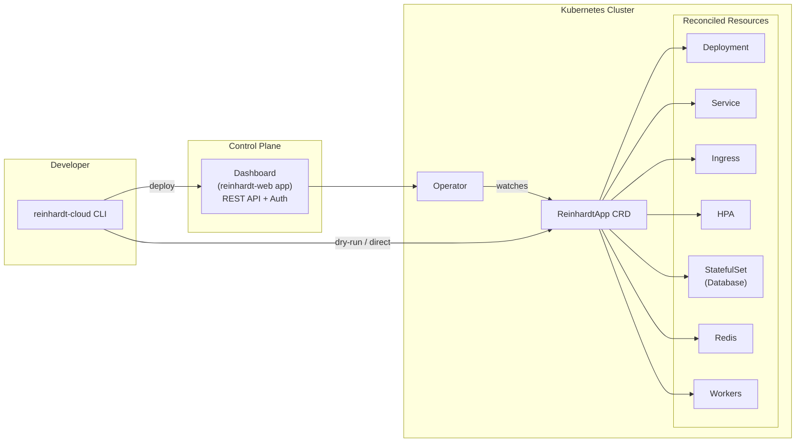

<div align="center">

  <h1>Reinhardt Cloud</h1>

  <h3>Convention-driven deployment for Reinhardt apps</h3>

  <p><strong>A Kubernetes-native PaaS</strong> — deploy
  <a href="https://github.com/kent8192/reinhardt-web">Reinhardt</a>
  web applications with zero infrastructure configuration.</p>
  <p>Named after Django Reinhardt's composition <em>Nuages</em> (French: "Clouds").</p>

[](https://github.com/kent8192/reinhardt-cloud/actions/workflows/ci.yml)
[](https://github.com/kent8192/reinhardt-cloud/actions/workflows/security-audit.yml)
[](https://codecov.io/gh/kent8192/reinhardt-cloud)
[](LICENSE)
[](https://deepwiki.com/kent8192/reinhardt-cloud)

</div>

---

## Quick Navigation

- [Who is Reinhardt Cloud For?](#who-is-reinhardt-cloud-for)
- [Quick Start](#quick-start)
- [Why Reinhardt Cloud?](#why-reinhardt-cloud)
- [Architecture](#architecture)
- [Key Features](#key-features)
- [CLI Reference](#cli-reference)
- [CRD Reference](#crd-reference)
- [Installation (Operator)](#installation)
- [Configuration](#configuration)
- [Workspace Crates](#workspace-crates)
- [Development](#development)
- [API Stability](#api-stability)

## Who is Reinhardt Cloud For?

**For App Developers** who:

- Build [Reinhardt](https://github.com/kent8192/reinhardt-web) web applications and want `git push`-style deployment
- Want automatic infrastructure provisioning (database, cache, storage) based on your app's feature flags
- Prefer convention over configuration for Kubernetes — no hand-written YAML

**For Platform Operators** who:

- Run Kubernetes clusters and want a PaaS layer for your team's Reinhardt apps
- Need multi-cloud support (AWS, GCP, on-prem) with Helm-based installation
- Want CRD-driven, GitOps-compatible application management

## Quick Start

> **Status:** v0.1.0 pre-release. CLI commands are functional but under active development.

### 1. Initialize from an existing Reinhardt project

```bash
cd my-reinhardt-app
reinhardt-cloud init        # Detects project structure, generates reinhardt-cloud.toml
```

This produces a `reinhardt-cloud.toml` based on your project's Cargo features and settings:

```toml
[app]
name = "my-app"
image = "my-app:latest"

[database]
engine = "postgresql"
storage_gb = 20
```

### 2. Preview and deploy

```bash
reinhardt-cloud deploy --dry-run   # Preview the generated ReinhardtApp CRD as YAML
reinhardt-cloud deploy             # Deploy to the platform
```

### 3. Check status

```bash
reinhardt-cloud status --name my-app
```

## Why Reinhardt Cloud?

Deploying a Reinhardt web application to Kubernetes typically means writing Deployments, Services, StatefulSets, Ingresses, and more — even though the framework already knows what the app needs.

Reinhardt Cloud takes a different approach: **convention-driven deployment**. The CLI runs `manage introspect` against your Reinhardt project, detects its feature flags (database, auth, cache, pages, etc.), and generates a single `ReinhardtApp` CRD. The operator reconciles that CRD into real Kubernetes resources.

| Inspiration | What We Borrowed | What We Added |
|---|---|---|
| **Vercel** | Three-plane architecture (CLI, Control Plane, Runtime) | Kubernetes-native, self-hosted |
| **Heroku** | Convention-driven deployment | CRD-based, GitOps-compatible |
| **Crossplane** | Composition Functions pattern | Reinhardt-specific inference |
| **Django `manage.py`** | Introspection-based tooling | Automatic infrastructure detection |

**Result**: A platform where `reinhardt-cloud deploy` is all you need — the framework tells the platform what infrastructure to provision.

## Architecture

Three-plane architecture inspired by Vercel:



| Plane | Crate | Role |
|---|---|---|
| **CLI** | `reinhardt-cloud-cli` | Developer-facing tool. Analyzes projects via `manage introspect`, generates CRDs, communicates with the control plane. |
| **Control Plane** | `dashboard` | A [reinhardt-web](https://github.com/kent8192/reinhardt-web) application providing REST API, authentication, and project management. |
| **Operator** | `reinhardt-cloud-operator` | Kubernetes controller that watches `ReinhardtApp` CRDs and reconciles them into infrastructure resources. |

**Supporting services:**

- **Agent** (`reinhardt-cloud-agent`) — Bidirectional gRPC communication between control plane and clusters.
- **gRPC layer** (`reinhardt-cloud-proto`, `reinhardt-cloud-grpc`) — Four gRPC services across five proto files: Agent, Build, Log, Plugin (plus Common shared types).

## Key Features

- **Convention-Driven Deployment** — CLI introspects your Reinhardt project and infers infrastructure needs from Cargo feature flags and settings
- **ReinhardtApp CRD** — Single custom resource (`paas.reinhardt-cloud.dev/v1alpha2`) that declares your entire application stack
- **Automatic Infrastructure** — PostgreSQL/MySQL database, Redis cache, S3/GCS/PVC object storage, SMTP mail, background workers
- **Autoscaling** — HPA-based scaling on CPU, memory, or requests-per-second with configurable thresholds
- **Workload Isolation** — gVisor, Kata Containers, network policies (Cilium), seccomp profiles, Pod Security Standards
- **Multi-Cloud Helm Charts** — AWS, GCP, and on-prem values out of the box
- **`reinhardt-cloud.toml`** — Human-readable project configuration that maps 1:1 to the CRD spec
- **`manage introspect` Integration** — Detects databases, routes, middleware, and feature flags from your Reinhardt project
- **Reinhardt Pages Support** — Automatic static asset serving configuration for WASM+SSR frontends
- **gRPC Microservices** — Build streaming, log ingestion/tailing, agent orchestration, and Crossplane-style plugin functions
- **Deletion Policy** — Retain or Delete cloud resources on app teardown

## CLI Reference

```
reinhardt-cloud [--server <URL>] <command>
```

| Command | Description | Key Flags |
|---|---|---|
| `init` | Generate `reinhardt-cloud.toml` from project analysis | `--dir` |
| `sync` | Re-synchronize `reinhardt-cloud.toml` with current project state | `--dir` |
| `deploy` | Build CRD and deploy to platform | `--name`, `--image`, `--replicas`, `--dir`, `--dry-run`, `--direct`, `--introspect-only`, `--namespace`, `--cluster` |
| `status` | Check deployment status | `--name` |
| `login` | Authenticate with the platform | `--username` |

**Global flag:** `--server <URL>` overrides the default API server endpoint.

### Deploy workflow example

```bash
# Preview what will be deployed (outputs YAML)
reinhardt-cloud deploy --dry-run --name myapp --image myapp:v1 --replicas 3

# Deploy directly to Kubernetes (skip control plane)
reinhardt-cloud deploy --direct --namespace production

# Only run introspection (no deploy)
reinhardt-cloud deploy --introspect-only
```

## CRD Reference

The `ReinhardtApp` custom resource is the single source of truth for your application's desired state.

```yaml
apiVersion: paas.reinhardt-cloud.dev/v1alpha2
kind: ReinhardtApp
metadata:
  name: my-app
  namespace: default
spec:
  image: my-app:v1
  replicas: 3
  database:
    engine: Postgresql
    storage_gb: 20
    version: "16"
  cache:
    backend: Redis
  auth:
    jwt: true
  scale:
    min_replicas: 1
    max_replicas: 10
    metric: Cpu
    target_value: 80
  health:
    path: /healthz
    port: 8080
  services:
    port: 80
    target_port: 8080
    ingress_host: myapp.example.com
  deletion_policy: Retain
```

### Spec fields

| Field | Type | Description |
|---|---|---|
| `image` | `String` | Docker image to deploy (required) |
| `replicas` | `i32?` | Number of replicas (default: 1) |
| `database` | `DatabaseSpec?` | PostgreSQL / MySQL provisioning |
| `cache` | `CacheSpec?` | Redis cache |
| `worker` | `WorkerSpec?` | Background worker processes |
| `auth` | `AuthSpec?` | JWT + OAuth configuration |
| `storage` | `StorageSpec?` | S3 / GCS / PVC object storage |
| `mail` | `MailSpec?` | SMTP configuration |
| `scale` | `ScaleSpec?` | HPA autoscaling (CPU, Memory, RPS) |
| `health` | `HealthSpec?` | Liveness / readiness probes |
| `services` | `ServicesSpec?` | Port + Ingress exposure |
| `pages` | `PagesSpec?` | WASM+SSR static asset config |
| `isolation` | `IsolationSpec?` | Runtime class, network policy, seccomp |
| `deletion_policy` | `DeletionPolicy` | `Retain` (default) or `Delete` |
| `features` | `Vec<String>` | Resolved reinhardt-web feature flags |
| `env` | `BTreeMap<String, String>` | Environment variables |
| `introspect` | `IntrospectOutput?` | Metadata from `manage introspect` |

### Status conditions

The operator reports the following conditions on the CRD status:

`Ready`, `Progressing`, `Degraded`, `DatabaseReady`, `CacheReady`, `WorkerReady`, `IngressReady`

## Installation

### Prerequisites

- Kubernetes 1.31+
- Helm 3

### Install the operator

```bash
helm install reinhardt-cloud-operator ./charts/reinhardt-cloud-operator \
  --namespace reinhardt-cloud-system \
  --create-namespace
```

### Cloud-specific installations

```bash
# AWS
helm install reinhardt-cloud-operator ./charts/reinhardt-cloud-operator \
  -f charts/reinhardt-cloud-operator/values-aws.yaml \
  --namespace reinhardt-cloud-system --create-namespace

# GCP
helm install reinhardt-cloud-operator ./charts/reinhardt-cloud-operator \
  -f charts/reinhardt-cloud-operator/values-gcp.yaml \
  --namespace reinhardt-cloud-system --create-namespace

# On-prem
helm install reinhardt-cloud-operator ./charts/reinhardt-cloud-operator \
  -f charts/reinhardt-cloud-operator/values-onprem.yaml \
  --namespace reinhardt-cloud-system --create-namespace
```

### Feature toggles

Enable or disable infrastructure components in your Helm values:

```yaml
features:
  database: true
  cache: false
  ingress: false
  autoscaling: false
  storage: false
  worker: false
```

### Isolation defaults

The operator ships with sensible security defaults:

```yaml
isolation:
  defaultLevel: "None"
  networkPolicy:
    enabled: true
    provider: cilium
    blockMetadataService: true
  podSecurityStandards:
    enabled: true
    enforceLevel: restricted
  seccomp:
    enabled: true
    profile: RuntimeDefault
```

> See `charts/reinhardt-cloud-operator/values.yaml` for all isolation settings including runtime classes, resource limits, and egress rules.

## Configuration

The `reinhardt-cloud.toml` file is the human-readable project configuration. It maps 1:1 to the `ReinhardtApp` CRD spec.

Generate it automatically:

```bash
reinhardt-cloud init    # from your Reinhardt project directory
```

### Full example

```toml
[app]
name = "my-app"
image = "my-app:v2"

[database]
engine = "postgresql"
instance_class = "db.t3.micro"
storage_gb = 50
version = "16"

[auth]
jwt = true

[health]
path = "/health"
port = 3000
interval_seconds = 15

[services]
port = 443
target_port = 3000
ingress_host = "app.example.com"

[replicas]
count = 3

[scale]
min_replicas = 2
max_replicas = 20
metric = "cpu"
target_value = 80

[cache]
backend = "redis"

[worker]
concurrency = 8

[storage]
backend = "s3"
bucket = "my-bucket"

[env]
CUSTOM_VAR = "custom_value"
```

## Workspace Crates

| Crate | Type | Description |
|---|---|---|
| `reinhardt-cloud-types` | Library | CRD types, config schema, validation, introspect types |
| `reinhardt-cloud-core` | Library | Business logic, plugin system, auth, pagination |
| `reinhardt-cloud-k8s` | Library | Kubernetes client helpers and resource builders |
| `reinhardt-cloud-proto` | Library | Protocol Buffers definitions (5 services) |
| `reinhardt-cloud-grpc` | Library | gRPC client/server implementations, SSE adapter |
| `reinhardt-cloud-operator` | Binary | Kubernetes operator (reconciler, resource management) |
| `reinhardt-cloud-cli` | Binary | `reinhardt-cloud` command-line tool |
| `reinhardt-cloud-agent` | Binary | Cluster agent for bidirectional control plane communication |
| `dashboard` | Application | Control Plane web app ([reinhardt-web](https://github.com/kent8192/reinhardt-web)) |
| `tests` | Integration Tests | Cross-crate integration test suite |

### gRPC services

| Proto | Service | Description |
|---|---|---|
| `cluster_agent.proto` | `AgentService` | Bidirectional streaming between control plane and cluster agents |
| `build.proto` | `BuildService` | Build lifecycle management with log streaming |
| `log.proto` | `LogService` | Log ingestion (client streaming) and tailing (server streaming) |
| `plugin.proto` | `PluginService` | Crossplane Composition Functions pattern for extensibility |
| `common.proto` | — | Shared pagination and status types |

## Development

### Prerequisites

- Rust (2024 Edition)
- Docker (required for TestContainers — not Podman)
- cargo-make, cargo-nextest

### Commands

```bash
# Build
cargo check --workspace --all-features
cargo build --workspace --all-features

# Test
cargo make test                                 # all tests
cargo nextest run --workspace --all-features    # with nextest

# Code quality
cargo make fmt-check
cargo make clippy-check
cargo make clippy-todo-check    # detect TODO/FIXME

# Full pre-PR check
cargo make pre-pr

# Run the dashboard (Control Plane)
cargo make runserver

# Run the operator locally
cargo run --bin reinhardt-cloud-operator
```

## API Stability

**Current status:** v0.1.0 (Alpha)

| Component | Stability | Notes |
|---|---|---|
| `ReinhardtApp` CRD (`v1alpha2`) | Alpha | Schema may change |
| CLI commands | Alpha | Flags and behavior may change |
| gRPC services | Alpha | Protobuf schema may change |
| Helm chart | Alpha | Values structure may change |
| `reinhardt-cloud.toml` | Alpha | Keys and format may change |

Breaking changes will be documented in release notes.

## Getting Help

- [GitHub Discussions](https://github.com/kent8192/reinhardt-cloud/discussions) — Ask questions and share ideas
- [GitHub Issues](https://github.com/kent8192/reinhardt-cloud/issues) — Report bugs
- [Security Policy](SECURITY.md) — Report vulnerabilities

## Contributing

We welcome contributions! See the [Development](#development) section to set up your environment.

**Quick links:**
- [Pull Request Template](.github/PULL_REQUEST_TEMPLATE.md)
- [GitHub Issues](https://github.com/kent8192/reinhardt-cloud/issues)

## Star History

<a href="https://star-history.com/#kent8192/reinhardt-cloud&Date">
 <picture>
   <source media="(prefers-color-scheme: dark)" srcset="https://api.star-history.com/svg?repos=kent8192/reinhardt-cloud&type=Date&theme=dark" />
   <source media="(prefers-color-scheme: light)" srcset="https://api.star-history.com/svg?repos=kent8192/reinhardt-cloud&type=Date" />
   
 </picture>
</a>

## Copyright

Copyright &copy; 2026 Tachyon Inc. All rights reserved.

Developed by Tachyon Inc.

## License

This project is licensed under the [Business Source License 1.1](LICENSE).
