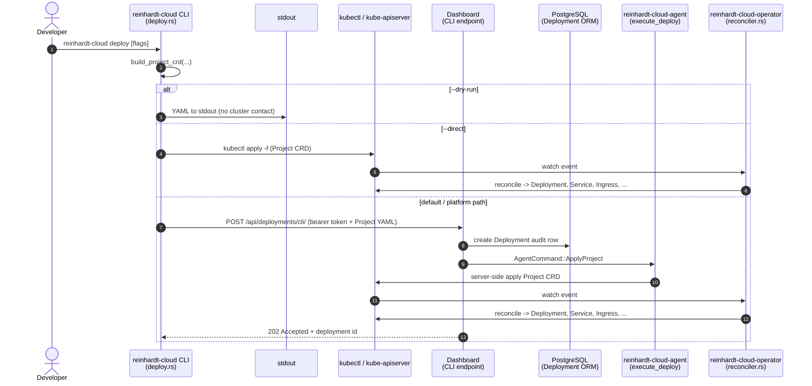

# Deployment Flow Architecture

> **Reading guide.** Throughout this doc, every behaviour is marked either
> **Current State** (what the code does today) or **Intended** (designed
> end-state, not yet implemented). The
> two often differ on the agent path — read the marker on each step before
> mapping the diagram to your mental model.

## Overview

Reinhardt Cloud has three control-plane components — the **CLI**
(`reinhardt-cloud-cli`), the **dashboard** (`dashboard`), and the
**operator** (`reinhardt-cloud-operator`) — plus an in-cluster **agent**
(`reinhardt-cloud-agent`) that executes commands relayed from the
dashboard. The `Project` CRD
(`paas.reinhardt-cloud.dev/v1alpha2`) is the single source of truth for
desired application state; the operator reconciles every owned Kubernetes
resource (Deployment, Service, Ingress, ConfigMap, JWT Secret, database
StatefulSet/Service/Secret, migration Job, build Job, HPA, NetworkPolicy)
from that CRD. The dashboard's `Deployment` ORM model is an **audit log of
deploy intent**, not a Kubernetes resource. The agent is a relay that
applies cluster mutations on behalf of the dashboard's POST flow.

## Concepts: Current State vs Intended Architecture

This doc uses two markers consistently:

> **Current State** — observable in the codebase today. Each Current State
> claim cites a `file:line` reference so you can verify it without
> re-reading the document.

> **Intended** — the designed end-state. Some Intended steps are not yet
> implemented; they are tracked as separate follow-up issues only when one
> exists.

The main divergence between legacy dashboard deploys and the declarative
operator path now lives at the **command boundary**: the legacy `Deploy`
command still applies a raw Kubernetes `Deployment`, while standard CLI
deploys and the GitHub repository import flow route explicit `ApplyProject`
commands to the selected cluster agent. See **Agent Path** below.

## Deployment Entry Points

### CLI Paths

The CLI's `execute_inner` function in
`crates/reinhardt-cloud-cli/src/commands/deploy.rs` always builds a
typed `ProjectSpec` from `reinhardt-cloud.toml`, CLI overrides, and
optional introspect output, then renders a `Project` CRD via
`build_project_crd` before branching on flags:

- **`--dry-run`** — Serialises the CRD to YAML and
  prints it to stdout. No cluster contact, no API contact. **Status:
  Current State.**
- **`--direct`** — Pipes the YAML to
  `kubectl apply -f -` against the operator's cluster. The operator's
  reconciler picks up the new `Project` resource via its watch and
  produces the owned Kubernetes resources. **Status: Current State.**
- **default / Dashboard mode** — submits the generated `Project` manifest to
  `/api/deployments/cli/` with bearer API-token authentication. The Dashboard
  resolves the current organization, resolves `--cluster` as a Dashboard
  cluster name, creates a `Deployment` audit record, and relays
  `AgentCommand::ApplyProject` to the connected agent. **Status: Current
  State.**

The function signature `build_project_crd(name, namespace, spec,
api_version) -> serde_yaml::Value` is the CLI's CRD rendering boundary.
The conversion from `reinhardt-cloud.toml` to `ProjectSpec` happens
before that boundary so typed TOML sections such as `health`, `services`,
`services.tls`, `scale`, `env`, `database`, `cache`, `worker`, `storage`,
and `mail` are not dropped during manifest construction.

### Dashboard Deployment Relay Paths

The CLI endpoint `POST /api/deployments/cli/` in
`dashboard/src/apps/deployments/server_urls.rs` does the following:

1. Authenticates the bearer API token as `CurrentUser<User>`.
2. Resolves the current organization and the submitted Dashboard cluster
   name.
3. Validates the submitted `Project` YAML, including `metadata.name`,
   `metadata.namespace`, and `spec.image` against the request fields.
4. Persists a `Deployment` ORM record. The model
   (`dashboard/src/apps/deployments/models/deployment.rs:9-40`) tracks:
   `id`, `organization`, `project_name`, `cluster`, `status` (one of
   `pending`/`running`/`failed`/`succeeded`), `image`, `project_yaml`,
   `created_at`, `updated_at`. Initial `status` is `pending`.
5. Forwards `AgentCommand::ApplyProject` to the registered agent via the gRPC
   bidirectional stream that the agent opened on startup.

The browser server function `create_deployment_for_current_org` still creates
or updates the Dashboard audit record for manual UI workflows. It reuses the
same `Project` manifest validator when a manifest is supplied, while preserving
the existing empty-manifest browser form behavior.

**Status: Current State.** The dashboard does **not** apply Kubernetes
resources directly. It does **not** import `kube` in its dashboard app
handlers.

The remaining deployment browser operations are server functions registered
from `dashboard/src/config/urls.rs`. They read from the dashboard DB or
proxy log/status streams via gRPC clients.

### Agent Path

This is the section where command variants matter. **Read both callouts
before drawing conclusions.**

> **Current State** —
> `crates/reinhardt-cloud-agent/src/main.rs`, function `execute_deploy`.
> On receipt of the legacy `Deploy` command via the gRPC stream, the
> agent constructs a minimal `apps/v1 Deployment` with labels
> `app.kubernetes.io/name=<name>` and
> `app.kubernetes.io/managed-by=reinhardt-cloud`, a single container with
> `containerPort: 8000`, and the requested replica count. That legacy path
> is not a `Project` CRD and therefore does not trigger operator
> reconciliation.
>
> **Current State: `ApplyProject` paths** — Standard CLI deploys submit a
> CLI-generated `Project` YAML to `/api/deployments/cli/`, and the dashboard
> routes `ApplyProject` to the selected cluster agent. The GitHub import path
> starts from a linked GitHub OAuth account. Its GitHub App installation URL
> sends users through
> GitHub App setup, and `/api/github/setup/` verifies the returned
> `installation_id` by listing installations visible to the encrypted OAuth
> user token before binding that installation to the current organization.
> The repository page then lists repositories visible to the GitHub App
> installation, obtains an installation access token, clones the selected
> repository into a temporary checkout, runs `manage introspect --format
> yaml`, embeds the introspect output in the generated `Project` YAML,
> and routes two agent commands to the selected cluster:
> `ApplyGitCredentialsSecret` for private repositories and
> `ApplyProject` for the CRD manifest. The agent applies both resources
> in-cluster using server-side apply, so the operator owns the derived
> workload reconciliation. When the manifest carries
> `reinhardt.dev/build-trigger`, the operator creates the Kaniko build Job
> and records the active build in `status.build`. The operator advances
> `spec.image` or the preview `Project` image only after the Kaniko Job
> reports success, so the running workload keeps its previous image while
> the build is pending or failed.

## Sequence Diagram

The diagram below traces a single `reinhardt-cloud deploy` invocation
through all three CLI branches. Notes inside the diagram restate the
Current-State / Intended distinction for the agent path so it is visible
even when the prose around the diagram is collapsed.

## Component Flow

The flowchart shows what the operator's reconciler produces *once* a
`Project` CRD is in the cluster — i.e., on the `--direct` path
and on the standard Dashboard path. Feature flags from
`IntrospectOutput` (defined in
`crates/reinhardt-cloud-types/src/introspect.rs:11-31`, with fields
`app`, `databases`, `routes`, `middleware`, `settings`, `features`) gate
the optional resources.

When `Project.spec.services.tls` is enabled, the operator materializes TLS on
the generated Ingress and reports `TlsReady` from the live Ingress and Secret
state. When `Project.spec.scale` is present with `cpu` or `memory`, the
operator materializes an `autoscaling/v2` HPA and reports `AutoscalerReady`
from the live HPA status conditions.

## Source of Truth

| Component | Owns | Does NOT own |
|---|---|---|
| CLI (`deploy.rs`) | `Project` CRD YAML construction (`build_project_crd`, lines 506-541) | Cluster state, deployment audit records |
| Dashboard CLI endpoint and server functions | `Deployment` ORM record + agent command relay for submitted manifests | Kubernetes resources, CRD YAML construction |
| Agent (`execute_deploy`, `ApplyProject`) | Legacy imperative `Deployment` apply for `Deploy`; server-side `Project` apply for `ApplyProject` | CRD schema, ORM records |
| Operator (`reconciler.rs`) | All Kubernetes resources derived from `Project` (Deployment, Service, Ingress, ConfigMap, JWT Secret, database StatefulSet/Service/Secret, migration Job, Kaniko build Job, HPA, NetworkPolicy) | Deploy trigger, ORM records |
| `Project` CRD | Desired application state — single source of truth for the operator | Deployment history, logs |

## Anti-Patterns to Avoid

Concrete, code-level rules that protect the source-of-truth split above:

1. **No `kube::Client` in dashboard app handlers.**
   `dashboard/src/apps/deployments/server_fn.rs` should only do ORM
   operations and gRPC calls. A `use kube` import inside the dashboard
   handler layer is the canary that this rule has been broken — the
   dashboard is no longer a relay, it is a kube client.
2. **No duplicate `build_project_crd`.** The CLI is the only
   caller today. If a second caller needs CRD construction (for
   example, an Intended agent that applies the CRD directly), extract
   the function into a shared crate (working name:
   `reinhardt-cloud-crd-builder`) rather than copy-pasting it. The
   extraction is itself a separate piece of work and should be filed as
   a follow-up issue when the second caller is in scope.
3. **No raw-Deployment persistence in the agent.** Once the agent
   migrates to applying `Project` CRDs (Intended Architecture), the
   imperative `Deployment` builder in `execute_deploy` must be removed —
   leaving it would create a stale duplicate code path that contradicts
   the operator's CRD-driven reconciliation.
4. **No kube-API polling from the dashboard.** Dashboard status server
   functions read from the PostgreSQL `Deployment` table. That table is
   updated from gRPC events sent by the agent. The dashboard must not poll
   the kube-apiserver directly to derive deployment status.

## Decision: When to Give the Dashboard a CRD Writer

The dashboard may submit `Project` CRDs only through explicit
agent-routed commands. It must not bypass the selected cluster agent and
write directly to a local kubeconfig from a dashboard handler.

- **Use case.** GitOps-style "create a new app from the dashboard UI"
  without dropping to the CLI — i.e., a user fills out a form in the
  dashboard and the dashboard itself constructs and applies a
  `Project` CRD.
- **Implementation sketch.** Dashboard view → construct or load a
  `Project` manifest → route an `ApplyProject` command through
  the registered agent stream → agent applies in-cluster.
- **Pre-conditions.** The target cluster must have a connected agent and
  the operator CRD installed.
- **Boundary.** Keep CRD construction and cluster application separate:
  dashboard handlers build or persist deployment intent, while the agent
  performs the in-cluster server-side apply.
