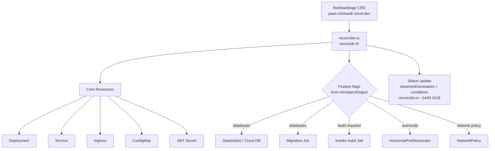

# Deployment Flow Architecture

> **Reading guide.** Throughout this doc, every behaviour is marked either
> **Current State** (what the code does today, on `main` at commit
> `22d9380f`) or **Intended** (designed end-state, not yet implemented). The
> two often differ on the agent path — read the marker on each step before
> mapping the diagram to your mental model.

## Overview

Reinhardt Cloud has three control-plane components — the **CLI**
(`reinhardt-cloud-cli`), the **dashboard** (`dashboard`), and the
**operator** (`reinhardt-cloud-operator`) — plus an in-cluster **agent**
(`reinhardt-cloud-agent`) that executes commands relayed from the
dashboard. The `ReinhardtApp` CRD
(`paas.reinhardt-cloud.dev/v1alpha2`) is the single source of truth for
desired application state; the operator reconciles every owned Kubernetes
resource (Deployment, Service, Ingress, ConfigMap, JWT Secret, database
StatefulSet/Service/Secret, migration Job, build Job, HPA, NetworkPolicy)
from that CRD. The dashboard's `Deployment` ORM model is an **audit log of
deploy intent**, not a Kubernetes resource. The agent is a relay that
applies cluster mutations on behalf of the dashboard's POST flow.

## Concepts: Current State vs Intended Architecture

This doc uses two markers consistently:

> **Current State** — observable in the codebase today. Each Current State
> claim cites a `file:line` reference so you can verify it without
> re-reading the document.

> **Intended** — the designed end-state. Some Intended steps are not yet
> implemented; they are tracked as separate follow-up issues only when one
> exists.

The single biggest divergence between Current State and Intended lives on
the **agent path**: the agent's `execute_deploy` function applies a raw
Kubernetes `Deployment` today, not a `ReinhardtApp` CRD. The intended
behaviour is for the agent to apply the CRD generated by the CLI so the
operator owns reconciliation end-to-end. See **Agent Path** below.

## Deployment Entry Points

### CLI Paths

The CLI's `execute_inner` function in
`crates/reinhardt-cloud-cli/src/commands/deploy.rs` always builds a
`ReinhardtApp` CRD via `build_reinhardt_app_crd` (lines 242-299), then
branches on flags:

- **`--dry-run`** (`deploy.rs:479-482`) — Serialises the CRD to YAML and
  prints it to stdout. No cluster contact, no API contact. **Status:
  Current State.**
- **`--direct`** (`deploy.rs:494-499`) — Pipes the YAML to
  `kubectl apply -f -` against the operator's cluster. The operator's
  reconciler picks up the new `ReinhardtApp` resource via its watch and
  produces the owned Kubernetes resources. **Status: Current State.**
- **default / API mode** (`deploy.rs:501-514`) — POSTs a JSON payload
  `{app_name, image, cluster_id}` to the dashboard at `/api/deployments/`
  via `ReinhardtCloudClient::deploy`. The dashboard then takes over.
  **Status: Current State.**

The function signature `build_reinhardt_app_crd(name, namespace, image,
replicas, introspect, api_version) -> serde_yaml::Value` is the *only*
place CRD YAML is constructed in the codebase today.

### Dashboard-Relay Path

The dashboard endpoint `POST /api/deployments/` (defined by
`create_deployment` in
`dashboard/src/apps/deployments/views/create_deployment.rs`, mounted under
the `deployments` app via `dashboard/src/apps/deployments/urls.rs`) does
the following:

1. Validates that the target cluster exists and is owned by the
   authenticated user.
2. Persists a `Deployment` ORM record. The model
   (`dashboard/src/apps/deployments/models/deployment.rs:9-40`) tracks:
   `id`, `user_id`, `app_name`, `cluster_id`, `status` (one of
   `pending`/`running`/`failed`/`succeeded`), `image`, `created_at`,
   `updated_at`. Initial `status` is `pending`.
3. Forwards a deploy command to the registered agent via the gRPC
   bidirectional stream that the agent opened on startup.

**Status: Current State.** The dashboard does **not** apply Kubernetes
resources directly. It does **not** import `kube` in its view layer.

The remaining deployment endpoints — `GET/PUT/DELETE /api/deployments/`,
`/api/deployments/<id>/logs`, `/api/deployments/<id>/status` — are
registered alongside `create_deployment` in `urls.rs` and read from the
dashboard DB or proxy log/status streams via gRPC clients
(`dashboard/src/apps/deployments/client.rs` uses `LogServiceClient`).

### Agent Path

This is the section where Current State and Intended diverge. **Read both
callouts before drawing conclusions.**

> **Current State** —
> `crates/reinhardt-cloud-agent/src/main.rs:311-364`, function
> `execute_deploy`. On receipt of a `Deploy` command via the gRPC stream
> (entrypoint at `main.rs:129`), the agent constructs a minimal
> `apps/v1 Deployment` with labels `app.kubernetes.io/name=<name>` and
> `app.kubernetes.io/managed-by=reinhardt-cloud`, a single container with
> `containerPort: 8000`, and the requested replica count. It applies via
> `PatchParams::apply("reinhardt-cloud-agent")` to the `default`
> namespace. The operator does **not** see this Deployment as a
> reconciler input because it is not a `ReinhardtApp` CRD — there is no
> reconciliation, no derived Service or Ingress, no CRD-status tracking.

> **Intended** — The agent receives the `ReinhardtApp` CRD YAML built by
> the CLI's `build_reinhardt_app_crd` (passed through the dashboard) and
> applies it as a `ReinhardtApp` resource. The operator reconciler then
> owns the rest of the reconciliation, producing all derived resources
> consistently with the `--direct` CLI path. This Intended behaviour is
> consistent with the source-of-truth claim in the Overview.

No follow-up issue is filed for this Current-to-Intended transition in
this PR. That decision belongs with whoever picks up the agent rework, in
combination with the optional `build_reinhardt_app_crd` extraction
discussed in the **Decision** section below.

## Sequence Diagram

The diagram below traces a single `reinhardt-cloud deploy` invocation
through all three CLI branches. Notes inside the diagram restate the
Current-State / Intended distinction for the agent path so it is visible
even when the prose around the diagram is collapsed.

```mermaid
sequenceDiagram
    autonumber
    actor Dev as Developer
    participant CLI as reinhardt-cloud CLI<br/>(deploy.rs)
    participant Stdout as stdout
    participant Kubectl as kubectl / kube-apiserver
    participant Dashboard as Dashboard<br/>(POST /api/deployments/)
    participant PG as PostgreSQL<br/>(Deployment ORM)
    participant Agent as reinhardt-cloud-agent<br/>(execute_deploy)
    participant Operator as reinhardt-cloud-operator<br/>(reconciler.rs)

    Dev->>CLI: reinhardt-cloud deploy [flags]
    CLI->>CLI: build_reinhardt_app_crd(...)

    alt --dry-run (deploy.rs:479-482)
        CLI->>Stdout: YAML to stdout (no cluster contact)
    else --direct (deploy.rs:494-499)
        CLI->>Kubectl: kubectl apply -f (ReinhardtApp CRD)
        Kubectl->>Operator: watch event
        Operator->>Kubectl: reconcile -> Deployment, Service, Ingress, ...
    else default / platform path (deploy.rs:501-514)
        CLI->>Dashboard: POST /api/deployments/ {app_name, image, cluster_id}
        Dashboard->>PG: INSERT Deployment (status=pending)
        Dashboard->>Agent: gRPC stream command (main.rs:129)
        Note over Agent: Current State: execute_deploy applies a raw Deployment<br/>(NOT a ReinhardtApp CRD) -- main.rs:311-364
        Note over Agent: Intended: agent applies ReinhardtApp CRD; operator reconciles
        Agent->>Kubectl: server-side apply (raw Deployment, today)
        Kubectl-->>Agent: status
        Agent-->>Dashboard: gRPC stream status update
        Dashboard->>PG: UPDATE Deployment.status (running|failed|succeeded)
    end
```

## Component Flow

The flowchart shows what the operator's reconciler produces *once* a
`ReinhardtApp` CRD is in the cluster — i.e., on the `--direct` path
today, and on the Intended dashboard path. Feature flags from
`IntrospectOutput` (defined in
`crates/reinhardt-cloud-types/src/introspect.rs:11-31`, with fields
`app`, `databases`, `routes`, `middleware`, `settings`, `features`) gate
the optional resources.



## Source of Truth

| Component | Owns | Does NOT own |
|---|---|---|
| CLI (`deploy.rs`) | `ReinhardtApp` CRD YAML construction (`build_reinhardt_app_crd`, lines 242-299) | Cluster state, deployment audit records |
| Dashboard (`/api/deployments/`) | `Deployment` ORM record + relay status to UI | Kubernetes resources, CRD YAML construction |
| Agent (`execute_deploy`) | Imperative cluster apply (**Current State: raw Deployment**; **Intended: `ReinhardtApp` CRD**) | CRD schema, ORM records |
| Operator (`reconciler.rs`) | All Kubernetes resources derived from `ReinhardtApp` (Deployment, Service, Ingress, ConfigMap, JWT Secret, database StatefulSet/Service/Secret, migration Job, Kaniko build Job, HPA, NetworkPolicy) | Deploy trigger, ORM records |
| `ReinhardtApp` CRD | Desired application state — single source of truth for the operator | Deployment history, logs |

## Anti-Patterns to Avoid

Concrete, code-level rules that protect the source-of-truth split above:

1. **No `kube::Client` in dashboard view code.**
   `dashboard/src/apps/deployments/views/` should only do ORM operations
   and gRPC calls. A `use kube` import inside the view layer is the
   canary that this rule has been broken — the dashboard is no longer a
   relay, it is a kube client.
2. **No duplicate `build_reinhardt_app_crd`.** The CLI is the only
   caller today. If a second caller needs CRD construction (for
   example, an Intended agent that applies the CRD directly), extract
   the function into a shared crate (working name:
   `reinhardt-cloud-crd-builder`) rather than copy-pasting it. The
   extraction is itself a separate piece of work and should be filed as
   a follow-up issue when the second caller is in scope.
3. **No raw-Deployment persistence in the agent.** Once the agent
   migrates to applying `ReinhardtApp` CRDs (Intended Architecture), the
   imperative `Deployment` builder in `execute_deploy` must be removed —
   leaving it would create a stale duplicate code path that contradicts
   the operator's CRD-driven reconciliation.
4. **No kube-API polling from the dashboard.** The endpoint
   `GET /api/deployments/<id>/status` reads from the dashboard's
   PostgreSQL `Deployment` table. That table is updated from gRPC events
   sent by the agent. The dashboard must not poll the kube-apiserver
   directly to derive deployment status.

## Decision: When to Give the Dashboard a CRD Writer

The dashboard does not write `ReinhardtApp` CRDs today, and that is a
deliberate design choice. The conditions under which it would make sense
to add one:

- **Use case.** GitOps-style "create a new app from the dashboard UI"
  without dropping to the CLI — i.e., a user fills out a form in the
  dashboard and the dashboard itself constructs and applies a
  `ReinhardtApp` CRD.
- **Implementation sketch.** Dashboard view → call
  `build_reinhardt_app_crd()` (extracted into a shared crate per
  Anti-Pattern #2 above) → POST to the registered agent's gRPC `Apply`
  endpoint → agent applies in-cluster.
- **Pre-conditions.** Both must hold: (a) the agent already accepts and
  applies CRD YAML (Intended Architecture path on the agent side); and
  (b) `build_reinhardt_app_crd` is in a shared crate to avoid
  duplication.
- **Today.** This is **not a current ask**. File a separate feature
  issue if and when the use case materialises; do not add the writer
  speculatively.
