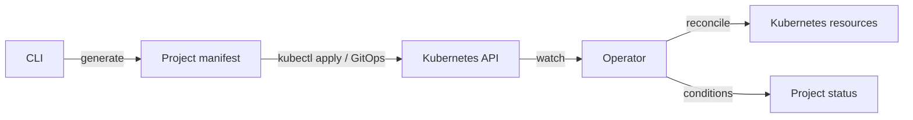

# Deployment Flow Architecture

## Workspace Components

The workspace contains the CLI, Kubernetes operator, cluster agent, shared
libraries, and integration tests. A dashboard application is not included.
The `Project` CRD (`paas.reinhardt-cloud.dev/v1alpha2`) declares the desired
application state and is the operator's reconciliation input.

## CLI Entry Points

The CLI builds a typed `ProjectSpec` from `reinhardt-cloud.toml`, CLI
arguments, and optional `manage introspect` output before rendering a
`Project` manifest in `crates/reinhardt-cloud-cli/src/commands/deploy.rs`.

- `--dry-run` prints the generated manifest without contacting a cluster.
- `--direct` submits the manifest with `kubectl apply -f -`. `--cluster`
  selects a kubeconfig context in this mode.
- Deployment without either flag still targets the control-plane HTTP API.
  This requires a separately provided compatible server and API token;
  this repository does not ship that server.

Generated manifests can also be applied through GitOps tooling.

```mermaid
flowchart LR
    CLI -->|generate| Project[Project manifest]
    Project -->|kubectl apply / GitOps| API[Kubernetes API]
    API -->|watch| Operator
    Operator -->|reconcile| Resources[Kubernetes resources]
    Operator -->|conditions| Status[Project status]
```

## Operator Reconciliation

`crates/reinhardt-cloud-operator/src/reconciler.rs` watches `Project`
resources and materializes owned workloads, services, ingress, storage,
database, cache, migration Jobs, build Jobs, and autoscalers. Status
conditions expose progress and failures on the `Project` resource.
Finalizers handle external-resource cleanup according to deletion policy.

Source-build and preview lifecycle tests remain in
`tests/e2e/source_build.rs` and `tests/e2e/preview.rs`. Run them against a
local Kubernetes cluster with `cargo make source-pipeline-e2e`.

## Agent and Shared gRPC Services

The agent connects to a separately provided compatible control plane.
`AgentCommand::ApplyProject` applies a `Project` manifest in the cluster;
the operator then performs infrastructure reconciliation. The agent's
command implementations live in
`crates/reinhardt-cloud-agent/src/main.rs`.

The protocol definitions, server/client components, and cross-crate gRPC
tests remain available independently of a dashboard application.
