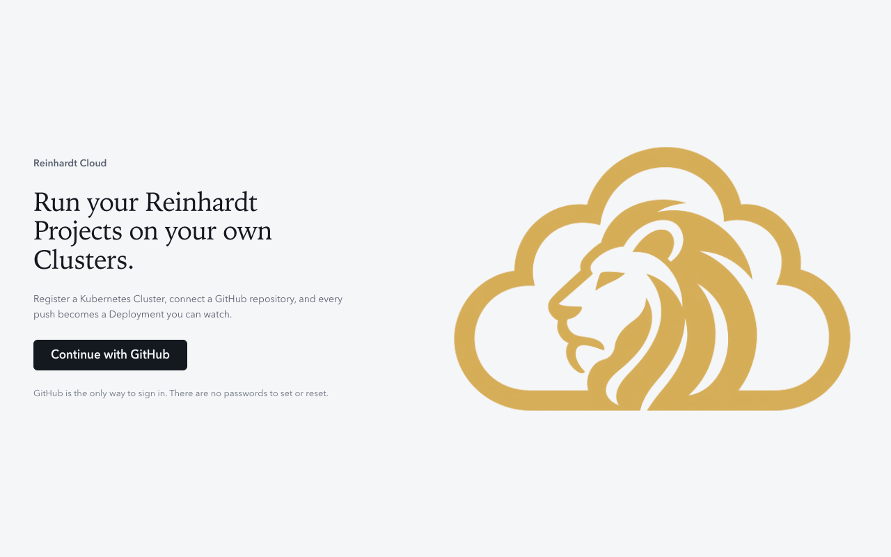
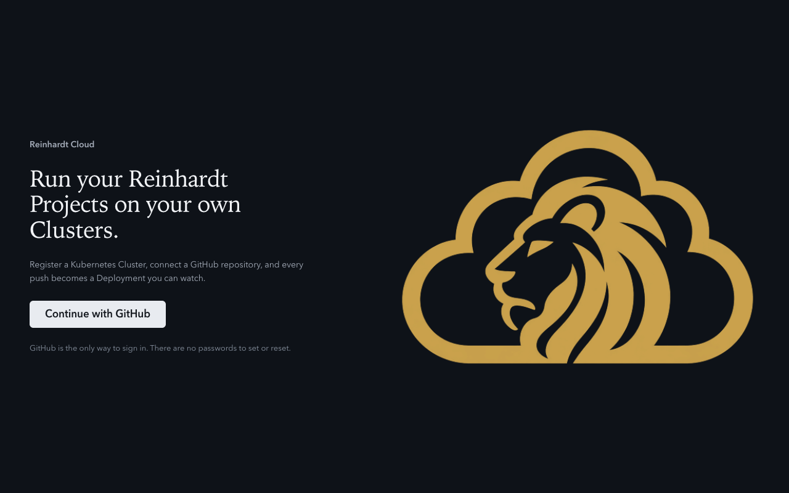
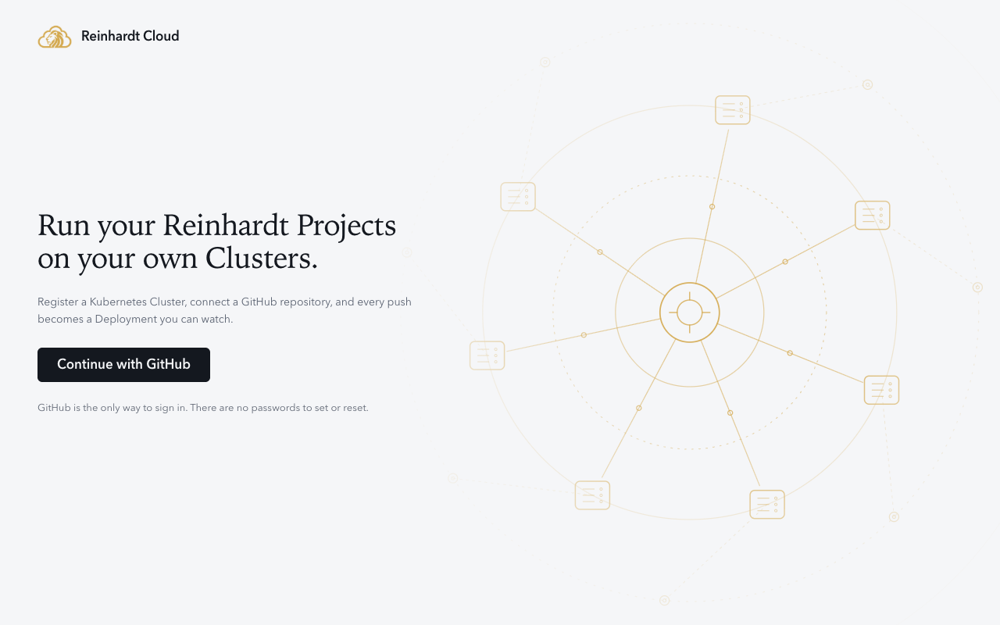
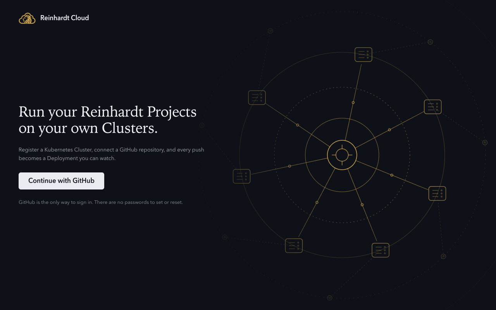
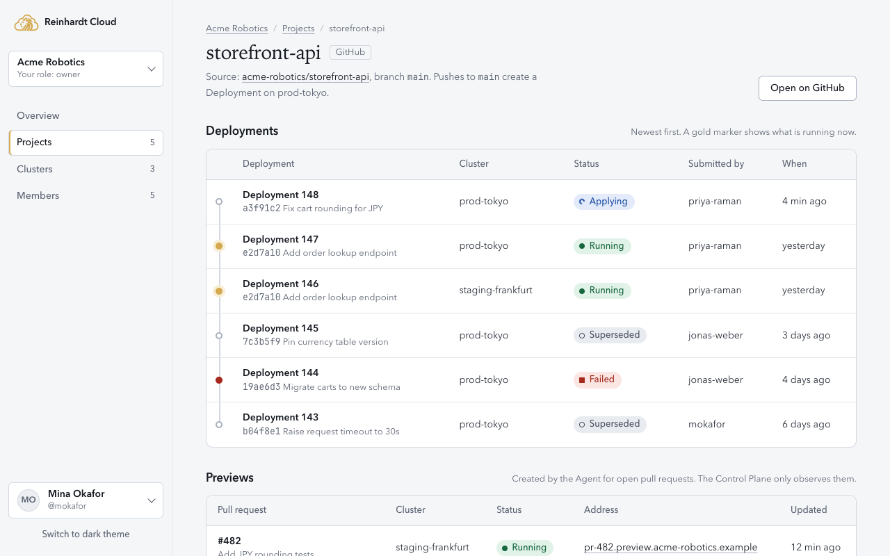
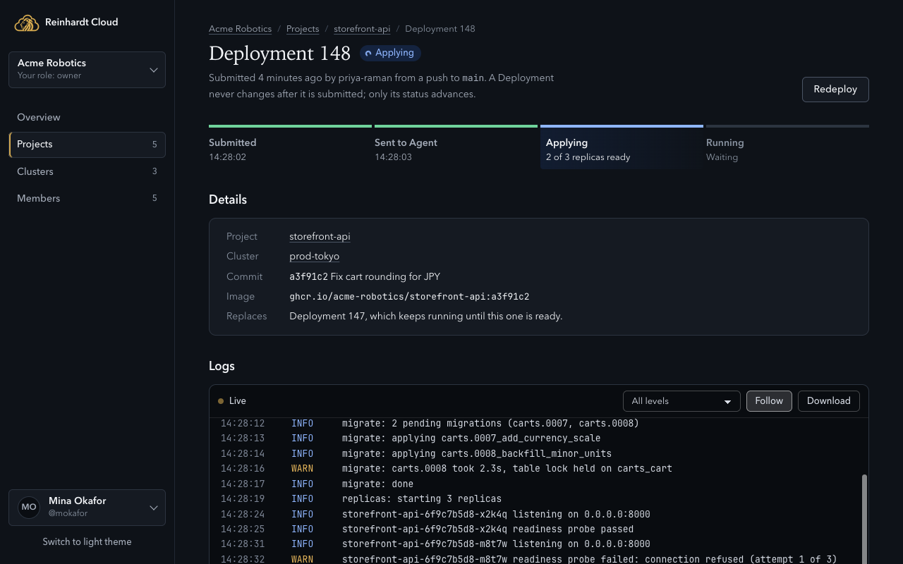

# Control Plane Dashboard design prototype

A static HTML and CSS prototype of the key Dashboard screens. It has no build step, loads nothing from a CDN, and uses sample data only. The Pages implementation starts from this design once it is approved.

## Viewing it

Open `index.html` in a browser, or serve the directory:

```bash
cd docs/design/control-plane-prototype
python3 -m http.server 8000
# then open http://localhost:8000/
```

The theme follows the system setting. The "Switch to dark theme" button overrides it and remembers the choice in `localStorage`.

## Screens

| File | Screen |
|------|--------|
| `index.html` | Entry page that links every screen |
| `sign-in.html` | Variant A (recommended): GitHub-only sign-in beside a decorative product preview (Deployment progress, live logs, Project and Cluster chips) built from the prototype's own components; `#not-invited` shows the state for a GitHub account without an Invitation |
| `sign-in-alt.html` | Variant B: the same sign-in copy and action over thin gold line art of Clusters connected to the Control Plane, with no product UI |
| `organization.html` | Organization overview with the Organization switcher open |
| `clusters.html` | Clusters list; "Register Cluster" opens a dialog |
| `cluster-register.html` | Client ID and client secret shown once, then Agent install steps |
| `cluster-detail.html` | A Cluster with a disconnected Agent, its Projects, and an empty Previews list |
| `projects.html` | Projects list with GitHub and manual sources |
| `project-detail.html` | Deployment ledger and observed Previews |
| `deployment-detail.html` | Progress, Deployment details, live log viewer, read-only submitted configuration |
| `members.html` | Members, roles, and Invitations |
| `api-keys.html` | API Keys, with a newly created key shown once |
| `components.html` | Component inventory (colors, type, controls, badges, empty state, toast, dialog, code block, log viewer) |

## Design direction

The Dashboard is a place where people watch Deployments land on their own Clusters, so the design is quiet, operation-focused, and spends its single bold gesture on the sign-in page. Two sign-in variants are provided so the owner can choose; both show the logo mark small beside the product name rather than enlarging it.

- **One accent, from the logo.** The lion mark's gold (`--gold-500`) is the only accent. It fills primary actions, marks the live Deployment on the ledger, and highlights one-time secrets. Gold used as text is the deeper ochre (`--accent-text`) so it meets contrast requirements. Everything else is a cool neutral so status colors stay legible.
- **The ledger.** A Deployment never changes after submission, so Deployments are shown as a chronological rail rather than an editable list. A gold marker shows what is running now.
- **Status is never color alone.** Each Deployment and Agent status pairs a color with its own shape (circle, spinning ring, triangle, square, hollow circle) and a text label.
- **Serif for titles, system sans for work, monospace only for data.** Page titles use a system serif stack for a calm, editorial anchor. Interface text uses the system sans stack. Monospace is reserved for identifiers, commands, secrets, and logs.
- **The log viewer is a dark instrument in both themes**, so log colors keep the same meaning regardless of theme.
- **Left-aligned, generous measure.** Content sits in a 68rem column, body prose is capped near 62 characters, and structure comes from spacing and thin borders rather than card chrome.

## Tokens

`tokens.css` is the only place visual values are declared. Components read custom properties and never hard-code colors. Small text meets WCAG AA (4.5:1) on every surface it is used on, in both themes.

| Group | Tokens |
|-------|--------|
| Brand | `--gold-300`, `--gold-500`, `--gold-600`, `--gold-800` |
| Surfaces | `--surface-page`, `--surface-raised`, `--surface-sunken`, `--surface-hover`, `--surface-inverse` |
| Borders | `--border-subtle`, `--border-default`, `--border-strong` |
| Ink | `--ink-strong`, `--ink-default`, `--ink-muted`, `--ink-subtle`, `--ink-inverse` |
| Accent | `--accent-fill`, `--accent-fill-hover`, `--accent-on-fill`, `--accent-text`, `--accent-wash`, `--focus-ring` |
| Status | `--status-{success,progress,warning,danger,neutral}-{fg,bg}` |
| Log viewer | `--log-bg`, `--log-ink`, `--log-muted`, `--log-info`, `--log-warn`, `--log-error`, `--log-border`, `--log-control-*`, `--log-line-hover`, `--log-focus` |
| Other | `--toast-control-hover` |
| Type | `--font-sans`, `--font-display`, `--font-mono`; sizes `--text-xs` to `--text-3xl` (1.2 ratio from a 14px base); `--leading-*`; `--weight-*`; `--measure-prose`, `--measure-page` |
| Spacing | `--space-1` to `--space-9` on a 4px base |
| Radius | `--radius-sm` (4px), `--radius-md` (6px, controls), `--radius-lg` (10px, containers), `--radius-xl` (16px, dialogs), `--radius-full` |
| Elevation | `--elevation-0`, `--elevation-1` (popovers), `--elevation-2` (dialogs), `--scrim` |
| Motion | `--duration-fast/base/slow` (120, 200, 360 ms), `--ease-standard`, `--ease-enter`; durations drop to 0 under `prefers-reduced-motion` |

Themes are two sets of values for the same names. The system setting is the default; `data-theme="light"` or `data-theme="dark"` on `<html>` overrides it. The dark values appear twice in `tokens.css` (media query and attribute) and must stay identical. Fonts are system stacks only; no web fonts are loaded.

## Component inventory

Styles live in `components.css`. Selectors are single classes so one component cannot outrank another.

| Component | Classes | Notes |
|-----------|---------|-------|
| App shell | `.app`, `.sidebar`, `.main`, `.page`, `.page-head` | Sidebar collapses above the content below 62rem |
| Organization switcher, User menu | `.switcher`, `.user-menu`, `.menu-item` | Built on `<details>`; closes on Escape or outside click |
| Navigation | `.nav`, `.nav-link`, `.breadcrumb` | Current page uses `aria-current="page"` |
| Buttons | `.btn`, `.btn-primary`, `.btn-quiet`, `.btn-danger`, `.btn-github`, `.btn-sm` | Buttons use visible text; row actions in tables add an `aria-label` that names the target |
| Fields | `.field`, `.label`, `.input`, `.select`, `.check`, `.hint`, `.field-error` | Labels are always associated; errors use `aria-invalid` and `aria-describedby` |
| Badges and chips | `.badge-{success,progress,warning,danger,neutral}`, `.chip` | Badges are for states, chips for facts such as role and source |
| Tables | `.table-wrap`, `.table`, `.cell-primary`, `.cell-meta` | Every table has a visually hidden `<caption>` and `scope` on headers |
| Deployment ledger | `.ledger`, `.ledger-live`, `.ledger-failed` | Adds a timeline rail to a table |
| Deployment progress | `.phases`, `.phase-{done,current,failed}` | `aria-current="step"` on the active phase |
| Notices and alerts | `.notice-list`, `.notice`, `.alert` | "Needs attention" list and inline alerts |
| Empty state | `.empty`, `.empty-title` | Says what appears here and what to do next |
| Code block | `.code`, `.code-bar` | Optional Copy button |
| One-time secret | `.secret`, `.secret-title`, `.secret-note` | Used for client secrets and API Keys |
| Log viewer | `.log`, `.log-bar`, `.log-body`, `.log-line` | `role="log"`, focusable for keyboard scrolling, Follow toggle uses `aria-pressed` |
| Dialog | `.dialog`, `.dialog-actions` | Native `<dialog>`; focus is trapped by the browser |
| Toast | `.toast-region`, `.toast` | `role="status"`, with a dismiss button |
| Steps | `.steps` | Numbered only where the content is a real sequence (Agent install) |
| Definition list | `.dl`, `.dl-panel` | Facts about one Cluster or Deployment |
| Disclosure | `.disclosure` | Read-only technical detail |

## Accessibility

- Skip link, landmarks, one `<h1>` per page, labelled navigation regions.
- Visible `:focus-visible` ring in both themes (`--focus-ring`).
- Every control has an accessible name; the logo beside the product name has an empty `alt` because the text already names it, and the decorative sign-in preview and line art are `aria-hidden`.
- Status never relies on color alone.
- Motion is limited to the spinning Applying badge, the pulsing Live indicator, the sweeping current phase, and dialog entry. All of it stops under `prefers-reduced-motion`.

## Notes for the Pages implementation

- `prototype.js` exists only so the prototype is reviewable: theme switching, Copy buttons, dialogs, toast dismissal, menu dismissal, and the Follow toggle. It is not part of the design contract; the Pages components own this behavior.
- Deployment statuses shown here (Submitted, Applying, Running, Failed, Superseded) and the phase names are placeholders to be settled with the Deployment model in the projects and deployments milestone. Keep one vocabulary across badges, tables, and detail pages.
- Agent install commands and chart values are illustrative; the Cluster registration milestone defines the final shape.
- UI text should go through the i18n catalog. The copy in these pages is the English source text and follows the terms defined in `CONTEXT.md`.
- Every Deployment link opens the single Deployment detail screen (Deployment 148); the prototype has one detail page per entity type.
- Controls are plain buttons, inputs, selects, tables, badges, and dialogs on purpose, so each can be a small composable component.

## Assets

`assets/logo-mark.png` is `branding/logo.png` cropped to the mark, downscaled, and converted to a transparent background so it works on both themes. The color is unchanged. `assets/logo-mark-small.png` is the same mark area-averaged to 142x98 px for the 44px-wide sign-in brand line, so it is never upscaled.

`screenshots/` holds small previews of both sign-in variants (both themes), the Project detail page, and the Deployment detail page in dark theme.







