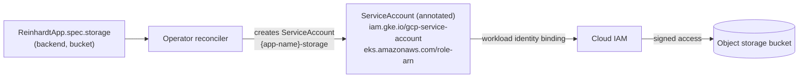
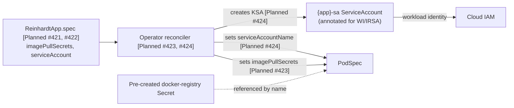

# Private Registry & Workload Identity

> **Status legend** — every CRD field below is marked **Available** or
> **Planned (#N)**. "Planned" surfaces are tracked in linked GitHub issues
> and not yet wired into the operator.

## Overview

Self-hosted Reinhardt Cloud installations frequently sit behind a private
container registry and need cloud workload identity to call AWS, GCP, or
Azure APIs. This page covers two related concerns: how the kubelet
authenticates to a private registry to pull container images, and how a
running Pod assumes a federated cloud identity. Operator-level workload
identity (GKE Workload Identity / EKS IRSA) is fully wired today via the
Helm chart. Per-app workload identity is currently surfaced only through
the storage-backend integration; broader per-app identity and
`imagePullSecrets` plumbing are tracked as **Planned** features below.

## Concepts

### Private Registry Access

In Kubernetes, the kubelet authenticates to a private registry by
attaching one or more `imagePullSecrets` (each of type
`kubernetes.io/dockerconfigjson`) to the PodSpec. The Secret must live in
the same namespace as the consuming Pod. When the kubelet pulls an image,
it tries each referenced Secret's credentials against the registry
hostname embedded in the image reference until one succeeds.

**Status: Planned (#421, #423)** — the `ReinhardtApp` CRD does not yet
expose a `spec.imagePullSecrets` field, and the operator does not inject
pull secrets into the PodSpec it generates in
`crates/reinhardt-cloud-operator/src/resources/deployment.rs`. Until that
work lands, see the [Pre-Creating a Pull Secret](#pre-creating-a-pull-secret)
section for the cluster-side preparation that the operator will consume
once #421 and #423 ship.

### Workload Identity

Cloud workload identity federates a Kubernetes ServiceAccount (KSA) to a
cloud-provider IAM identity, so Pods can call cloud APIs without
long-lived static credentials. The two mainstream implementations are:

- **GKE Workload Identity** — annotate the KSA with
  `iam.gke.io/gcp-service-account` and bind the GCP ServiceAccount with
  `roles/iam.workloadIdentityUser` for the
  `<project>.svc.id.goog[<namespace>/<ksa>]` member.
- **EKS IRSA** (IAM Roles for Service Accounts) — annotate the KSA with
  `eks.amazonaws.com/role-arn` and configure the IAM role's trust policy
  to accept the cluster's OIDC provider and the KSA subject claim.

Operator-level workload identity is fully supported via the Helm chart's
`serviceAccount.annotations` (see
[charts/reinhardt-cloud-operator/values-gcp.yaml](../charts/reinhardt-cloud-operator/values-gcp.yaml)
and
[charts/reinhardt-cloud-operator/values-aws.yaml](../charts/reinhardt-cloud-operator/values-aws.yaml)).
**Per-app** workload identity is **Planned (#422, #424)**: the
`ReinhardtApp` CRD does not yet expose a `spec.serviceAccount` field, and
the operator does not yet create a per-app KSA or set
`serviceAccountName` on the PodSpec for the general case. The single
exception is the storage-backend KSA documented below.

## What Works Today

### Operator Identity (GKE Workload Identity)

These steps configure the `reinhardt-cloud-operator` ServiceAccount in
`reinhardt-cloud-system` to assume a GCP IAM identity. The role you
attach depends on which cloud APIs the operator must call; for managed
storage backends (S3 / GCS) the operator reconciles per-app KSAs but does
not itself call cloud storage APIs — see the
[Storage Backend IAM (per-app)](#storage-backend-iam-per-app) section
below.

1. Create a GCP ServiceAccount for the operator:

   ```bash
   gcloud iam service-accounts create reinhardt-cloud-operator \
     --project=PROJECT
   ```

2. Grant the GSA the IAM roles your environment requires (the exact role
   set depends on which cloud APIs the operator drives in your
   deployment):

   ```bash
   gcloud projects add-iam-policy-binding PROJECT \
     --member="serviceAccount:reinhardt-cloud-operator@PROJECT.iam.gserviceaccount.com" \
     --role="roles/<role>"
   ```

3. Bind the Kubernetes ServiceAccount
   `reinhardt-cloud-system/reinhardt-cloud-operator` to the GSA via
   Workload Identity:

   ```bash
   gcloud iam service-accounts add-iam-policy-binding \
     reinhardt-cloud-operator@PROJECT.iam.gserviceaccount.com \
     --role="roles/iam.workloadIdentityUser" \
     --member="serviceAccount:PROJECT.svc.id.goog[reinhardt-cloud-system/reinhardt-cloud-operator]"
   ```

4. Install the chart with the GCP overlay, which sets
   `serviceAccount.annotations."iam.gke.io/gcp-service-account"`:

   ```bash
   helm install reinhardt-cloud-operator charts/reinhardt-cloud-operator \
     --namespace reinhardt-cloud-system \
     --create-namespace \
     -f charts/reinhardt-cloud-operator/values-gcp.yaml
   ```

### Operator Identity (EKS IRSA)

These steps configure the operator ServiceAccount on EKS to assume an
IAM role via IRSA.

1. Ensure the EKS cluster has an associated IAM OIDC provider. If it
   does not, create one:

   ```bash
   eksctl utils associate-iam-oidc-provider \
     --cluster CLUSTER --approve
   ```

2. Create an IAM role whose trust policy allows the cluster's OIDC
   provider to assume the role for the
   `system:serviceaccount:reinhardt-cloud-system:reinhardt-cloud-operator`
   subject claim. (Refer to the AWS IRSA documentation for the exact
   trust policy JSON; the role ARN produced here goes into the
   annotation in step 3.)

3. Apply the chart with the AWS overlay (which writes
   `eks.amazonaws.com/role-arn` to the ServiceAccount). The
   [`values-aws.yaml`](../charts/reinhardt-cloud-operator/values-aws.yaml)
   overlay accepts a placeholder role ARN, or you can override the
   annotation directly:

   ```bash
   helm install reinhardt-cloud-operator charts/reinhardt-cloud-operator \
     --namespace reinhardt-cloud-system \
     --create-namespace \
     -f charts/reinhardt-cloud-operator/values-aws.yaml \
     --set serviceAccount.annotations."eks\.amazonaws\.com/role-arn"="arn:aws:iam::ACCOUNT:role/reinhardt-cloud-operator"
   ```

### Storage Backend IAM (per-app)

This is the **only per-app IAM-bound ServiceAccount** the operator
manages today. When `spec.storage.backend` is set to `s3` (with a role
ARN) or `gcs` (with a GCP ServiceAccount email), the operator creates a
ServiceAccount named `{app-name}-storage` in the application's namespace
and writes the appropriate cloud annotation:

- `s3` + role ARN → `eks.amazonaws.com/role-arn`
- `gcs` + GSA email → `iam.gke.io/gcp-service-account`

The implementation lives in
[`crates/reinhardt-cloud-operator/src/resources/storage.rs`](../crates/reinhardt-cloud-operator/src/resources/storage.rs)
and is exercised by `build_storage_service_account`. Backends without an
IAM identity (for example `pvc`) skip the ServiceAccount entirely.



*Diagram: Current — Storage Backend IAM Wiring.*

Worked example — a `ReinhardtApp` configured with the S3 backend (the
operator will create a `myapp-storage` ServiceAccount with the
`eks.amazonaws.com/role-arn` annotation; binding the role ARN to that
ServiceAccount is the platform operator's responsibility):

```yaml
apiVersion: paas.reinhardt-cloud.dev/v1alpha2
kind: ReinhardtApp
metadata:
  name: myapp
  namespace: default
spec:
  image: ghcr.io/example/myapp:v1
  storage:
    backend: s3
    bucket: myapp-uploads
```

Note: the present `StorageSpec` shape only carries `backend` and `bucket`
fields. The IAM identity (role ARN for S3, GSA email for GCS) is
supplied to `build_storage_service_account` via a separate platform-side
resolution path; it is not yet a first-class CRD field.

### Pre-Creating a Pull Secret

Until #421 and #423 land, app images are pulled using whatever pull
credentials are already attached at the namespace or default
ServiceAccount level. Pre-creating a `kubernetes.io/dockerconfigjson`
Secret in the target namespace is the cluster-side prerequisite the
operator will consume once `spec.imagePullSecrets` is wired through.

> **Cluster-side prerequisite.** The CRD wiring that lets a
> `ReinhardtApp` reference a Secret created here is tracked in #421
> (CRD field) and #423 (operator PodSpec injection).

#### Google Artifact Registry

```bash
gcloud auth configure-docker REGION-docker.pkg.dev
gcloud artifacts print-settings docker --project=PROJECT \
  --location=REGION --repository=REPO
kubectl create secret docker-registry myapp-registry-pull \
  --namespace=default \
  --docker-server=REGION-docker.pkg.dev \
  --docker-username=oauth2accesstoken \
  --docker-password="$(gcloud auth print-access-token)"
```

#### AWS ECR

```bash
ACCOUNT=123456789012
REGION=us-east-1
aws ecr get-login-password --region "${REGION}" \
  | kubectl create secret docker-registry myapp-registry-pull \
      --namespace=default \
      --docker-server="${ACCOUNT}.dkr.ecr.${REGION}.amazonaws.com" \
      --docker-username=AWS \
      --docker-password-stdin
```

ECR tokens expire every 12 hours. For long-lived workloads, prefer
attaching IRSA to a node group (or to a per-app ServiceAccount once #422
and #424 land) rather than pre-creating a static Secret.

#### GHCR (private)

Generate a Personal Access Token with the `read:packages` scope
(classic) or use a fine-grained token with package read permission:

```bash
kubectl create secret docker-registry myapp-registry-pull \
  --namespace=default \
  --docker-server=ghcr.io \
  --docker-username=GITHUB_USERNAME \
  --docker-password=GITHUB_PAT \
  --docker-email=user@example.com
```

#### Self-hosted Harbor / Distribution

Use a Harbor robot account (or any registry account scoped to read the
target project) rather than a human user:

```bash
kubectl create secret docker-registry myapp-registry-pull \
  --namespace=default \
  --docker-server=harbor.internal.example.com \
  --docker-username='robot$myapp+pull' \
  --docker-password=ROBOT_TOKEN
```

## Planned Features

| Surface | CRD field | Issue | Status |
|---|---|---|---|
| Pull-secret declaration | `spec.imagePullSecrets` | #421 | Planned (CRD) |
| App ServiceAccount | `spec.serviceAccount` | #422 | Planned (CRD) |
| Operator PodSpec injection | (operator code) | #423 | Planned (operator) |
| Per-app KSA wiring | (operator code) | #424 | Planned (operator) |
| Documentation update once landed | this doc | #425 | Planned (docs) |



*Diagram: Planned — Per-App Identity & Pull-Secret Wiring.*

The intended end-state YAML, once #421 through #424 land — **preview
only, not yet supported**:

```yaml
apiVersion: paas.reinhardt-cloud.dev/v1alpha2
kind: ReinhardtApp
metadata:
  name: my-app
spec:
  image: gar-host/project/my-app:v1
  # Planned (#421, #423) — wires kubelet pull credentials
  imagePullSecrets:
    - name: my-app-registry-pull
  # Planned (#422, #424) — wires per-app workload identity
  serviceAccount:
    create: true
    name: my-app
    annotations:
      iam.gke.io/gcp-service-account: my-app@PROJECT.iam.gserviceaccount.com
```

## CRD Field Reference

| Field | Type | Status | Notes |
|---|---|---|---|
| `spec.image` | `String` | Available | Plain image reference; pull-secret wiring tracked in #421/#423 |
| `spec.replicas` | `Option<i32>` | Available | — |
| `spec.env` | `BTreeMap<String, String>` | Available | — |
| `spec.isolation` | `Option<IsolationSpec>` | Available | Workload sandbox / network isolation |
| `spec.storage.backend` | `Option<StorageBackend>` (`s3` / `gcs` / `pvc`) | Available | Drives `{app}-storage` KSA annotation when an IAM identity is supplied |
| `spec.storage.bucket` | `Option<String>` | Available | Bucket / volume name |
| `spec.imagePullSecrets` | `[{name}]` | **Planned (#421)** | Not yet on `ReinhardtAppSpec` |
| `spec.serviceAccount.create` | `bool` | **Planned (#422)** | Not yet on `ReinhardtAppSpec` |
| `spec.serviceAccount.name` | `String` | **Planned (#422)** | Not yet on `ReinhardtAppSpec` |
| `spec.serviceAccount.annotations` | `map<string, string>` | **Planned (#422)** | Not yet on `ReinhardtAppSpec` |

## Troubleshooting

### `ImagePullBackOff` on app Pods

- Confirm the `Secret` is in the same namespace as the consuming Pod.
- Confirm the Secret type is `kubernetes.io/dockerconfigjson` (not
  `Opaque` and not the legacy `kubernetes.io/dockercfg`):

  ```bash
  kubectl get secret myapp-registry-pull -n NS -o jsonpath='{.type}'
  ```

- Confirm the `docker-server` in the Secret matches the registry
  hostname embedded in `spec.image` exactly (for example, `ghcr.io`, not
  `https://ghcr.io`).
- **Workaround until #421/#423 land:** attach the pre-created Secret to
  the namespace's default ServiceAccount so the kubelet picks it up
  automatically:

  ```bash
  kubectl patch serviceaccount default -n NS \
    -p '{"imagePullSecrets":[{"name":"myapp-registry-pull"}]}'
  ```

### GKE Workload Identity not propagating

- Verify the `gke-metadata-server` DaemonSet is healthy in `kube-system`.
- Verify the GSA email in the KSA annotation matches the GSA you bound
  exactly (no typos, correct project ID).
- Verify the KSA name in the workload-identity binding's `member`
  matches the KSA the Pod actually uses.
- Confirm Workload Identity is enabled on the cluster and the node pool.

### EKS IRSA not propagating

- Verify the cluster has an IAM OIDC provider associated.
- Confirm the IAM role's trust policy `Condition` matches the OIDC
  issuer URL and references the correct
  `system:serviceaccount:NAMESPACE:KSA` subject claim.
- Confirm the `eks.amazonaws.com/role-arn` annotation on the KSA is
  present and references a role the cluster's OIDC provider can assume.

### `denied: permission_denied` from registry

- The cloud IAM principal (operator GSA / IRSA role, or a robot account)
  is missing read access on the registry. Grant the registry-read role
  or scope on the appropriate principal and retry:
  - GAR: `roles/artifactregistry.reader` on the repository or project.
  - ECR: `ecr:GetAuthorizationToken` plus
    `ecr:BatchGetImage` / `ecr:GetDownloadUrlForLayer` on the repository.
  - GHCR: ensure the PAT has `read:packages` (classic) or the
    fine-grained equivalent.
