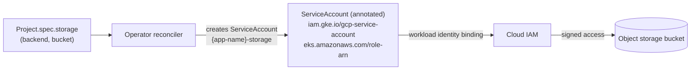
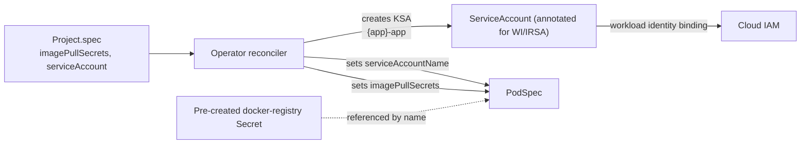

# Private Registry & Workload Identity

## Overview

Self-hosted Reinhardt Cloud installations frequently sit behind a private
container registry and need cloud workload identity to call AWS, GCP, or
Azure APIs. This page covers two related concerns: how the kubelet
authenticates to a private registry to pull container images, and how a
running Pod assumes a federated cloud identity. All four surfaces — the
operator's own ServiceAccount, the per-app `spec.imagePullSecrets`, the
per-app `spec.serviceAccount`, and the storage-backend `{app-name}-storage`
KSA — are now wired through the operator and exposed on the `Project`
CRD. The sections below walk through each in turn.

## Concepts

### Private Registry Access

In Kubernetes, the kubelet authenticates to a private registry by
attaching one or more `imagePullSecrets` (each of type
`kubernetes.io/dockerconfigjson`) to the PodSpec. The Secret must live in
the same namespace as the consuming Pod. When the kubelet pulls an image,
it tries each referenced Secret's credentials against the registry
hostname embedded in the image reference until one succeeds.

The `Project` CRD exposes a `spec.imagePullSecrets` field that
mirrors the upstream `corev1.PodSpec.imagePullSecrets` shape. The
operator copies the references straight into every PodSpec it
materializes (main Deployment, worker Deployment, migration init Job,
Kaniko build Job, and preview environments), so a single CRD-level
declaration covers every Pod the operator owns for that app:

```yaml
apiVersion: paas.reinhardt-cloud.dev/v1alpha2
kind: Project
metadata:
  name: orders-api
  namespace: tenant-acme
spec:
  image: ghcr.io/myorg/orders-api:v1.2.3
  imagePullSecrets:
    - name: ghcr-pull
```

The Secret named here must already exist in the same namespace and be of
type `kubernetes.io/dockerconfigjson`. See
[Per-App Pull Secrets](#per-app-pull-secrets) below for the cluster-side
recipes that produce such a Secret for the major registries.

### Workload Identity

Cloud workload identity federates a Kubernetes ServiceAccount (KSA) to a
cloud-provider IAM identity, so Pods can call cloud APIs without
long-lived static credentials. The two mainstream implementations are:

- **GKE Workload Identity** — annotate the KSA with
  `iam.gke.io/gcp-service-account` and bind the GCP ServiceAccount with
  `roles/iam.workloadIdentityUser` for the
  `<project>.svc.id.goog[<namespace>/<ksa>]` member.
- **EKS IRSA** (IAM Roles for Service Accounts) — annotate the KSA with
  `eks.amazonaws.com/role-arn` and configure the IAM role's trust policy
  to accept the cluster's OIDC provider and the KSA subject claim.

Operator-level workload identity is supported via the Helm chart's
`serviceAccount.annotations` (see
[charts/reinhardt-cloud-operator/values-gcp.yaml](../charts/reinhardt-cloud-operator/values-gcp.yaml)
and
[charts/reinhardt-cloud-operator/values-aws.yaml](../charts/reinhardt-cloud-operator/values-aws.yaml)).
Per-app workload identity is now driven by `spec.serviceAccount` on the
`Project` CRD. The operator can either create a managed KSA (when
`create: true`) or wire an existing user-managed KSA into the workload
PodSpec (when `create: false, name: <existing>`).

**GKE Workload Identity flavor:**

```yaml
apiVersion: paas.reinhardt-cloud.dev/v1alpha2
kind: Project
metadata:
  name: orders-api
  namespace: tenant-acme
spec:
  image: gcr.io/PROJECT/orders-api:v1.2.3
  serviceAccount:
    create: true
    annotations:
      iam.gke.io/gcp-service-account: orders-api@PROJECT.iam.gserviceaccount.com
```

**AWS IRSA flavor:**

```yaml
apiVersion: paas.reinhardt-cloud.dev/v1alpha2
kind: Project
metadata:
  name: orders-api
  namespace: tenant-acme
spec:
  image: 123456789012.dkr.ecr.us-east-1.amazonaws.com/orders-api:v1.2.3
  serviceAccount:
    create: true
    annotations:
      eks.amazonaws.com/role-arn: arn:aws:iam::123456789012:role/orders-api
```

**Naming rules.** `spec.serviceAccount` accepts three independent fields
(`create`, `name`, `annotations`); the operator resolves the effective
KSA name as follows:

| `create` | `name`        | KSA the operator manages | `serviceAccountName` set on PodSpec |
|---------:|---------------|--------------------------|-------------------------------------|
| `true`   | unset         | creates `{app-name}-app` | `{app-name}-app`                    |
| `true`   | `Some("foo")` | creates `foo`            | `foo`                               |
| `false`  | `Some("foo")` | none (user pre-creates)  | `foo`                               |
| `false`  | unset         | none                     | unset (Pod uses namespace `default`)|

The `-app` suffix on the auto-generated name is deliberate: it keeps the
workload's KSA distinct from the storage-backend KSA (`{app-name}-storage`)
and from any user-managed KSA that happens to share the bare app name.

## What Works Today

### Operator Identity (GKE Workload Identity)

These steps configure the `reinhardt-cloud-operator` ServiceAccount in
`reinhardt-cloud-system` to assume a GCP IAM identity. The role you
attach depends on which cloud APIs the operator must call; for managed
storage backends (S3 / GCS) the operator reconciles per-app KSAs but does
not itself call cloud storage APIs — see the
[Storage Backend IAM (per-app)](#storage-backend-iam-per-app) section
below.

1. Create a GCP ServiceAccount for the operator:

   ```bash
   gcloud iam service-accounts create reinhardt-cloud-operator \
     --project=PROJECT
   ```

2. Grant the GSA the IAM roles your environment requires (the exact role
   set depends on which cloud APIs the operator drives in your
   deployment):

   ```bash
   gcloud projects add-iam-policy-binding PROJECT \
     --member="serviceAccount:reinhardt-cloud-operator@PROJECT.iam.gserviceaccount.com" \
     --role="roles/<role>"
   ```

3. Bind the Kubernetes ServiceAccount
   `reinhardt-cloud-system/reinhardt-cloud-operator` to the GSA via
   Workload Identity:

   ```bash
   gcloud iam service-accounts add-iam-policy-binding \
     reinhardt-cloud-operator@PROJECT.iam.gserviceaccount.com \
     --role="roles/iam.workloadIdentityUser" \
     --member="serviceAccount:PROJECT.svc.id.goog[reinhardt-cloud-system/reinhardt-cloud-operator]"
   ```

4. Install the chart with the GCP overlay, which sets
   `serviceAccount.annotations."iam.gke.io/gcp-service-account"`:

   ```bash
   helm install reinhardt-cloud-operator charts/reinhardt-cloud-operator \
     --namespace reinhardt-cloud-system \
     --create-namespace \
     -f charts/reinhardt-cloud-operator/values-gcp.yaml
   ```

### Operator Identity (EKS IRSA)

These steps configure the operator ServiceAccount on EKS to assume an
IAM role via IRSA.

1. Ensure the EKS cluster has an associated IAM OIDC provider. If it
   does not, create one:

   ```bash
   eksctl utils associate-iam-oidc-provider \
     --cluster CLUSTER --approve
   ```

2. Create an IAM role whose trust policy allows the cluster's OIDC
   provider to assume the role for the
   `system:serviceaccount:reinhardt-cloud-system:reinhardt-cloud-operator`
   subject claim. (Refer to the AWS IRSA documentation for the exact
   trust policy JSON; the role ARN produced here goes into the
   annotation in step 3.)

3. Apply the chart with the AWS overlay (which writes
   `eks.amazonaws.com/role-arn` to the ServiceAccount). The
   [`values-aws.yaml`](../charts/reinhardt-cloud-operator/values-aws.yaml)
   overlay accepts a placeholder role ARN, or you can override the
   annotation directly:

   ```bash
   helm install reinhardt-cloud-operator charts/reinhardt-cloud-operator \
     --namespace reinhardt-cloud-system \
     --create-namespace \
     -f charts/reinhardt-cloud-operator/values-aws.yaml \
     --set serviceAccount.annotations."eks\.amazonaws\.com/role-arn"="arn:aws:iam::ACCOUNT:role/reinhardt-cloud-operator"
   ```

### Storage Backend IAM (per-app)

This is the storage-only KSA the operator manages alongside the
per-app workload KSA configured by `spec.serviceAccount`. The two are
**distinct**:

- **`{app-name}-storage`** — operator-managed. Used solely for storage
  backend access (the ObjectStore CRD / `spec.storage` flow). Created
  whenever `spec.storage.backend` resolves to a backend that needs an
  IAM identity (`s3`, `gcs`).
- **`{app-name}-app`** (or any `spec.serviceAccount.name` you supply) —
  the workload's own KSA. Optional; configured via `spec.serviceAccount`
  as documented in [Workload Identity](#workload-identity) above. Wired
  into the PodSpec's `serviceAccountName` so the application Pods inherit
  cloud-API access via Workload Identity / IRSA.

When `spec.storage.backend` is set to `s3` (with a role ARN) or `gcs`
(with a GCP ServiceAccount email), the operator creates a ServiceAccount
named `{app-name}-storage` in the application's namespace and writes the
appropriate cloud annotation:

- `s3` + role ARN → `eks.amazonaws.com/role-arn`
- `gcs` + GSA email → `iam.gke.io/gcp-service-account`

The implementation lives in
[`crates/reinhardt-cloud-operator/src/resources/storage.rs`](../crates/reinhardt-cloud-operator/src/resources/storage.rs)
and is exercised by `build_storage_service_account`. Backends without an
IAM identity (for example `pvc`) skip the ServiceAccount entirely.



*Diagram: Current — Storage Backend IAM Wiring.*

Worked example — a `Project` configured with the S3 backend (the
operator will create a `myapp-storage` ServiceAccount with the
`eks.amazonaws.com/role-arn` annotation; binding the role ARN to that
ServiceAccount is the platform operator's responsibility):

```yaml
apiVersion: paas.reinhardt-cloud.dev/v1alpha2
kind: Project
metadata:
  name: myapp
  namespace: default
spec:
  image: ghcr.io/example/myapp:v1
  storage:
    backend: s3
    bucket: myapp-uploads
```

Note: the present `StorageSpec` shape only carries `backend` and `bucket`
fields. The IAM identity (role ARN for S3, GSA email for GCS) is
supplied to `build_storage_service_account` via a separate platform-side
resolution path; it is not yet a first-class CRD field.

### Per-App Pull Secrets

`spec.imagePullSecrets` lets a `Project` declare which
`kubernetes.io/dockerconfigjson` Secret(s) the kubelet should use when
pulling the workload's container images. The operator copies the
references into every PodSpec it materializes for the app — main
Deployment, worker Deployment, migration init Job, Kaniko build Job,
and preview environments — so a single CRD-level declaration covers
every Pod the operator owns for that app.

#### 1. Pre-create the dockerconfigjson Secret

The Secret must already exist in the same namespace as the
`Project`. The recipes below cover the major registries:

##### Google Artifact Registry

```bash
gcloud auth configure-docker REGION-docker.pkg.dev
gcloud artifacts print-settings docker --project=PROJECT \
  --location=REGION --repository=REPO
kubectl create secret docker-registry myapp-registry-pull \
  --namespace=tenant-acme \
  --docker-server=REGION-docker.pkg.dev \
  --docker-username=oauth2accesstoken \
  --docker-password="$(gcloud auth print-access-token)"
```

##### AWS ECR

```bash
ACCOUNT=123456789012
REGION=us-east-1
aws ecr get-login-password --region "${REGION}" \
  | kubectl create secret docker-registry myapp-registry-pull \
      --namespace=tenant-acme \
      --docker-server="${ACCOUNT}.dkr.ecr.${REGION}.amazonaws.com" \
      --docker-username=AWS \
      --docker-password-stdin
```

ECR tokens expire every 12 hours. For long-lived workloads, prefer
attaching IRSA to a node group (or to a per-app ServiceAccount via
`spec.serviceAccount` — see [Per-App Workload Identity](#per-app-workload-identity)
below) rather than pre-creating a static Secret.

##### GHCR (private)

Generate a Personal Access Token with the `read:packages` scope
(classic) or use a fine-grained token with package read permission:

```bash
kubectl create secret docker-registry myapp-registry-pull \
  --namespace=tenant-acme \
  --docker-server=ghcr.io \
  --docker-username=GITHUB_USERNAME \
  --docker-password=GITHUB_PAT \
  --docker-email=user@example.com
```

##### Self-hosted Harbor / Distribution

Use a Harbor robot account (or any registry account scoped to read the
target project) rather than a human user:

```bash
kubectl create secret docker-registry myapp-registry-pull \
  --namespace=tenant-acme \
  --docker-server=harbor.internal.example.com \
  --docker-username='robot$myapp+pull' \
  --docker-password=ROBOT_TOKEN
```

#### 2. Reference the Secret from the `Project`

```yaml
apiVersion: paas.reinhardt-cloud.dev/v1alpha2
kind: Project
metadata:
  name: orders-api
  namespace: tenant-acme
spec:
  image: ghcr.io/myorg/orders-api:v1.2.3
  imagePullSecrets:
    - name: myapp-registry-pull
```

Multiple Secret references are supported; the kubelet tries each in turn
until one authenticates against the registry hostname embedded in
`spec.image`.

#### 3. Verify

After the operator reconciles, the Pod should carry the pull-secret
reference:

```bash
kubectl -n tenant-acme get pod \
  -l app.kubernetes.io/name=orders-api \
  -o jsonpath='{.items[0].spec.imagePullSecrets}'
# → [{"name":"myapp-registry-pull"}]
```

### Per-App Workload Identity

`spec.serviceAccount` configures the application workload's own KSA so
the Pods can call cloud APIs via Workload Identity (GKE) or IRSA (EKS)
without long-lived static credentials. The operator either creates a
managed KSA (`create: true`) or wires an existing user-managed KSA into
the PodSpec (`create: false, name: <existing>`).

The flow has three steps. The first is cloud-side IAM setup, the second
is the `Project` declaration, and the third is verification.

#### 1. Cloud-side IAM setup

##### GKE Workload Identity

```bash
# Create the GCP ServiceAccount the workload will assume.
gcloud iam service-accounts create orders-api \
  --project=PROJECT

# Grant the GSA whatever cloud-API roles the workload needs.
gcloud projects add-iam-policy-binding PROJECT \
  --member="serviceAccount:orders-api@PROJECT.iam.gserviceaccount.com" \
  --role="roles/<your-app-role>"

# Bind the to-be-created KSA tenant-acme/orders-api-app to the GSA.
# (orders-api-app is the default name when create=true and name is unset.)
gcloud iam service-accounts add-iam-policy-binding \
  orders-api@PROJECT.iam.gserviceaccount.com \
  --role="roles/iam.workloadIdentityUser" \
  --member="serviceAccount:PROJECT.svc.id.goog[tenant-acme/orders-api-app]"
```

##### AWS IRSA

Create an IAM role whose trust policy allows the EKS cluster's OIDC
provider to assume the role for the
`system:serviceaccount:tenant-acme:orders-api-app` subject claim, then
grant that role whatever cloud-API permissions the workload needs.

#### 2. Reference the KSA from the `Project`

GKE Workload Identity flavor:

```yaml
apiVersion: paas.reinhardt-cloud.dev/v1alpha2
kind: Project
metadata:
  name: orders-api
  namespace: tenant-acme
spec:
  image: gcr.io/PROJECT/orders-api:v1.2.3
  serviceAccount:
    create: true
    annotations:
      iam.gke.io/gcp-service-account: orders-api@PROJECT.iam.gserviceaccount.com
```

AWS IRSA flavor:

```yaml
apiVersion: paas.reinhardt-cloud.dev/v1alpha2
kind: Project
metadata:
  name: orders-api
  namespace: tenant-acme
spec:
  image: 123456789012.dkr.ecr.us-east-1.amazonaws.com/orders-api:v1.2.3
  serviceAccount:
    create: true
    annotations:
      eks.amazonaws.com/role-arn: arn:aws:iam::123456789012:role/orders-api
```

If you prefer to manage the KSA yourself (for example, because Terraform
already owns it), set `create: false` and supply `name`:

```yaml
spec:
  serviceAccount:
    create: false
    name: orders-api-team-managed
```

In that mode the operator does not touch the KSA — it only writes
`serviceAccountName: orders-api-team-managed` into the PodSpec.

#### 3. Verify

```bash
# The operator-managed KSA carries the cloud annotation:
kubectl -n tenant-acme get sa orders-api-app \
  -o jsonpath='{.metadata.annotations}'
# → {"iam.gke.io/gcp-service-account":"orders-api@PROJECT.iam.gserviceaccount.com"}

# And the workload Pod uses it:
kubectl -n tenant-acme get pod \
  -l app.kubernetes.io/name=orders-api \
  -o jsonpath='{.items[0].spec.serviceAccountName}'
# → orders-api-app
```



*Diagram: Per-App Identity & Pull-Secret Wiring.*

## CRD Field Reference

| Field | Type | Status | Notes |
|---|---|---|---|
| `spec.image` | `String` | Available | Plain image reference; pull credentials supplied via `spec.imagePullSecrets` |
| `spec.replicas` | `Option<i32>` | Available | — |
| `spec.env` | `BTreeMap<String, String>` | Available | — |
| `spec.isolation` | `Option<IsolationSpec>` | Available | Workload sandbox / network isolation |
| `spec.storage.backend` | `Option<StorageBackend>` (`s3` / `gcs` / `pvc`) | Available | Drives `{app}-storage` KSA annotation when an IAM identity is supplied |
| `spec.storage.bucket` | `Option<String>` | Available | Bucket / volume name |
| `spec.imagePullSecrets` | `Option<Vec<LocalObjectReference>>` | Available | Mirrors `corev1.PodSpec.imagePullSecrets`; copied into every PodSpec the operator materializes |
| `spec.serviceAccount.create` | `bool` | Available | When `true`, operator creates the per-app KSA |
| `spec.serviceAccount.name` | `Option<String>` | Available | Optional KSA name. Defaults to `{app-name}-app` when `create: true` and unset |
| `spec.serviceAccount.annotations` | `BTreeMap<String, String>` | Available | Annotations applied to the KSA (typically Workload Identity / IRSA bindings) |

## Troubleshooting

### `ImagePullBackOff` on app Pods

- Confirm the `Secret` is in the same namespace as the consuming Pod.
- Confirm the Secret type is `kubernetes.io/dockerconfigjson` (not
  `Opaque` and not the legacy `kubernetes.io/dockercfg`):

  ```bash
  kubectl get secret myapp-registry-pull -n NS -o jsonpath='{.type}'
  ```

- Confirm the `docker-server` in the Secret matches the registry
  hostname embedded in `spec.image` exactly (for example, `ghcr.io`, not
  `https://ghcr.io`).
- Confirm `spec.imagePullSecrets[].name` on the `Project` references
  the Secret you created. The operator only injects pull-secret
  references that are listed there — it does not fall back to the
  namespace's default ServiceAccount.

### GKE Workload Identity not propagating

- Verify the `gke-metadata-server` DaemonSet is healthy in `kube-system`.
- Verify the GSA email in the KSA annotation matches the GSA you bound
  exactly (no typos, correct project ID).
- Verify the KSA name in the workload-identity binding's `member`
  matches the KSA the Pod actually uses.
- Confirm Workload Identity is enabled on the cluster and the node pool.

### EKS IRSA not propagating

- Verify the cluster has an IAM OIDC provider associated.
- Confirm the IAM role's trust policy `Condition` matches the OIDC
  issuer URL and references the correct
  `system:serviceaccount:NAMESPACE:KSA` subject claim.
- Confirm the `eks.amazonaws.com/role-arn` annotation on the KSA is
  present and references a role the cluster's OIDC provider can assume.

### `denied: permission_denied` from registry

- The cloud IAM principal (operator GSA / IRSA role, or a robot account)
  is missing read access on the registry. Grant the registry-read role
  or scope on the appropriate principal and retry:
  - GAR: `roles/artifactregistry.reader` on the repository or project.
  - ECR: `ecr:GetAuthorizationToken` plus
    `ecr:BatchGetImage` / `ecr:GetDownloadUrlForLayer` on the repository.
  - GHCR: ensure the PAT has `read:packages` (classic) or the
    fine-grained equivalent.
