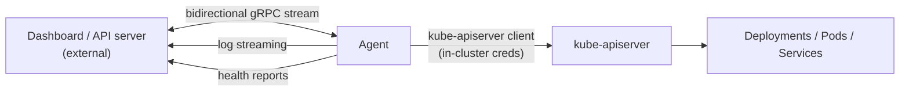

# reinhardt-cloud-agent (Cluster Agent)

> **Last verified**: commit `84d08ad` on 2026-04-18
> **Source of truth**: this file. `crates/reinhardt-cloud-agent/README.md` is a summary (added in a later task).
> **Audience**: primarily Platform Operators; App-Developer notes near the bottom explain when to engage platform ops.

## Overview

`reinhardt-cloud-agent` is a per-cluster binary that dials out to the Reinhardt Cloud control plane and maintains a persistent authenticated bidirectional gRPC stream. Through this stream the control plane can push operator-mediated Project apply commands, rollback, scale, and restart commands to the cluster; the agent executes them against the local kube-apiserver and streams results and heartbeats back. The agent also periodically reports health metrics (CPU, memory, pod count) and pushes log entries to the control plane's `LogService`.

Platform operators install the agent when they manage a **multi-cluster fleet** with a central Dashboard, or when clusters sit behind a NAT or firewall that prevents the control plane from reaching the kube-apiserver directly. For a **single-cluster Helm-only** deployment — where the control plane runs in the same cluster or has direct kube-apiserver access — the agent is optional and need not be installed.

### Architecture



The agent always **dials out** from the cluster to the control plane's gRPC endpoint. The control plane never needs an inbound network path into the cluster. This outbound-only connection model is what makes the agent useful for clusters behind NAT or corporate firewalls — only egress TCP to the control plane's port is required.

### Agent vs Operator

| Dimension | Operator | Agent |
|---|---|---|
| Where it runs | In-cluster | In-cluster |
| Interface | Watches Project CRDs (declarative) | Accepts commands over gRPC (imperative) |
| Decision owner | Operator itself (reconciles toward spec) | External control plane |
| Required for single-cluster deploy | Yes | No |
| Required for multi-cluster fleet | — | Yes |
| Trigger | CRD create/update | Control-plane RPC |

Operator and Agent are **complementary**, not alternatives. A typical production setup runs both: the Operator handles in-cluster CRD reconciliation; the Agent relays commands and telemetry between the cluster and a central Dashboard.

---

## Reference

### CLI arguments

All flags can also be set via the corresponding environment variable.

| Flag | Env var | Default | Required | Description |
|---|---|---|---|---|
| `--control-plane-url` | `CONTROL_PLANE_URL` | `http://127.0.0.1:50051` | No | gRPC endpoint of the control plane |
| `--cluster-name` | `CLUSTER_NAME` | _(none)_ | **Yes** | Logical name for this cluster; sent in `AgentConnected` and every heartbeat |
| `--node-name` | `NODE_NAME` | `unknown` | No | Node where the agent pod is scheduled; included in startup log |
| `--heartbeat-interval` | _(none)_ | `30` | No | Seconds between `AgentHeartbeat` messages |
| `--auth-token` | `AUTH_TOKEN` | _(none)_ | **Yes** | JWT token attached as a `Bearer` `Authorization` header on every gRPC request |

### Capabilities

**Deploy operations** (triggered by `AgentCommand` messages on the authenticated `AgentStream` stream):

- **Deploy** — legacy direct Deployment commands are rejected. Use **ApplyProject** so workload changes flow through Project CRD validation and operator reconciliation.
- **ApplyProject** — server-side apply of a Reinhardt Cloud Project manifest. The operator validates the Project and materializes the Deployment, namespace placement, resource policy, network policy, runtime class, and security contexts.
- **Rollback** — strategic merge patch that replaces `spec.template` with the pod template from the ReplicaSet matching the requested `deployment.kubernetes.io/revision` annotation; mirrors `kubectl rollout undo --to-revision`.
- **Scale** — strategic merge patch of `spec.replicas`; rejects values exceeding `i32::MAX`.
- **Restart** — sets `spec.template.metadata.annotations["kubectl.kubernetes.io/restartedAt"]` to the current RFC 3339 timestamp; same mechanism as `kubectl rollout restart`.

**Telemetry (events sent to control plane)**:

- `AgentConnected` — emitted once at stream open; carries `agent_id` (UUIDv7) and `cluster_name`.
- `AgentHeartbeat` — emitted every `--heartbeat-interval` seconds; carries `agent_id` and UTC timestamp.
- `AgentDeployStatus` — result of a Deploy command (`success`, `message`).
- `AgentCommandStatus` — result of Rollback, Scale, or Restart commands; includes `command_type` string.
- `AgentError` — reserved in the proto for agent-side error reporting.

**Health reporting** (separate unary RPCs):

- `ReportHealth` — sends CPU usage percent, memory usage percent, and pod count.
- `ReportDeployStatus` — alternate unary path for deployment status (complementing the stream event).

**Log streaming**:

- `LogService.PushLogs` (client-streaming) — the agent acts as a log producer pushing `PushLogsRequest` frames to the control plane.

### Connection protocol

Service: `reinhardt.cloud.cluster_agent.AgentService`  
Source: `crates/reinhardt-cloud-proto/proto/cluster_agent.proto`

| RPC | Stream direction | Agent sends | Agent receives |
|---|---|---|---|
| `AgentStream` | bidirectional | `stream AgentEvent` | `stream AgentCommand` |
| `ReportHealth` | unary | `AgentHealthReport` | `common.StatusResponse` |
| `ReportDeployStatus` | unary | `AgentDeployStatus` | `common.StatusResponse` |

`AgentEvent` oneof variants: `AgentConnected`, `AgentDeployStatus`, `AgentHeartbeat`, `AgentError`, `AgentCommandStatus`.

`AgentCommand` oneof variants: `DeployCommand`, `RollbackCommand`, `ScaleCommand`, `RestartCommand`.

`AgentHealthReport` fields: `agent_id`, `healthy`, `cpu_usage_percent`, `memory_usage_percent`, `pod_count`, `reported_at`.

The agent also uses `reinhardt.cloud.log.LogService.PushLogs` (client-streaming) as a log producer. The `BuildService` and `PluginService` are used by the Dashboard, not by the agent.

### Heartbeat and reconnect

- **Heartbeat interval**: controlled by `--heartbeat-interval` (default 30 s). A background `tokio::spawn` task wakes on that interval and sends an `AgentHeartbeat` on the shared channel. The task exits silently if the event sender is closed.
- **Reconnect backoff**: the outer `loop` in `main` calls `run_agent`; on any return (clean or error) it sleeps a **fixed 5 seconds** and then retries. There is no exponential backoff or jitter.
- **On disconnect**: the agent logs the error and reconnects. The in-progress command (if any) is abandoned at the transport level — no retry of the individual command occurs. The control plane must re-issue the command if needed.
- **Agent identity**: the UUIDv7 `agent_id` is generated once at process startup and reused across reconnect cycles.

---

## Installation

### Prerequisites

- Cluster with outbound TCP to the control plane's gRPC port (default 50051 or whatever the operator configures).
- `CLUSTER_NAME` that matches the name registered in the Dashboard.
- Optional: TLS CA certificate if the control plane endpoint uses a custom CA (see TLS section in [Troubleshooting](#troubleshooting)).
- A cluster token issued by the control plane (see Enrollment flow below).

### Enrollment flow

1. **Platform operator** registers the cluster in the Dashboard admin interface (Clusters → Add cluster). Enter the cluster's logical name; this becomes `CLUSTER_NAME`.
2. The Dashboard issues a **cluster token** and displays the control plane's gRPC endpoint URL.
3. Platform operator creates a Kubernetes `Secret` in the cluster holding the token:

   ```bash
   kubectl create secret generic reinhardt-cloud-agent \
     --namespace reinhardt-cloud-system \
     --from-literal=auth-token=<TOKEN_FROM_DASHBOARD>
   ```

4. Deploy the agent pod referencing that secret. See the raw manifest below.
5. The agent dials the control plane; after a successful `AgentConnected` event, the Dashboard shows the cluster status as **Online**.

**No Helm chart for the agent exists** (`charts/` contains only `reinhardt-cloud-operator`). Use the following raw manifest:

```yaml
apiVersion: apps/v1
kind: Deployment
metadata:
  name: reinhardt-cloud-agent
  namespace: reinhardt-cloud-system
spec:
  replicas: 1
  selector:
    matchLabels:
      app.kubernetes.io/name: reinhardt-cloud-agent
  template:
    metadata:
      labels:
        app.kubernetes.io/name: reinhardt-cloud-agent
        app.kubernetes.io/managed-by: reinhardt-cloud
    spec:
      serviceAccountName: reinhardt-cloud-agent
      containers:
        - name: agent
          image: ghcr.io/kent8192/reinhardt-cloud-agent:latest
          args:
            - --cluster-name=$(CLUSTER_NAME)
            - --control-plane-url=$(CONTROL_PLANE_URL)
            - --node-name=$(NODE_NAME)
          env:
            - name: CLUSTER_NAME
              value: "my-cluster"           # replace with your cluster name
            - name: CONTROL_PLANE_URL
              value: "https://cp.example.com:50051"
            - name: NODE_NAME
              valueFrom:
                fieldRef:
                  fieldPath: spec.nodeName
            - name: AUTH_TOKEN
              valueFrom:
                secretKeyRef:
                  name: reinhardt-cloud-agent
                  key: auth-token
            - name: RUST_LOG
              value: "info"
```

### RBAC

No packaged RBAC manifest exists for the agent. The agent uses in-cluster credentials (`kube::Client::try_default()`) to apply `apps/v1 Deployments` and read `apps/v1 ReplicaSets` in the `default` namespace.

Recommended `ClusterRole` (least-privilege based on `main.rs` usage):

```yaml
apiVersion: rbac.authorization.k8s.io/v1
kind: ClusterRole
metadata:
  name: reinhardt-cloud-agent
rules:
  - apiGroups: ["apps"]
    resources: ["deployments"]
    verbs: ["get", "list", "patch", "create"]
  - apiGroups: ["apps"]
    resources: ["replicasets"]
    verbs: ["get", "list"]
  - apiGroups: [""]
    resources: ["pods"]
    verbs: ["get", "list"]
  - apiGroups: [""]
    resources: ["pods/log"]
    verbs: ["get"]
---
apiVersion: rbac.authorization.k8s.io/v1
kind: ClusterRoleBinding
metadata:
  name: reinhardt-cloud-agent
roleRef:
  apiGroup: rbac.authorization.k8s.io
  kind: ClusterRole
  name: reinhardt-cloud-agent
subjects:
  - kind: ServiceAccount
    name: reinhardt-cloud-agent
    namespace: reinhardt-cloud-system
---
apiVersion: v1
kind: ServiceAccount
metadata:
  name: reinhardt-cloud-agent
  namespace: reinhardt-cloud-system
```

> The agent must **not** be granted `cluster-admin` or any `create`/`update` permissions on Project CRDs — those are the operator's domain.

### Multi-cluster enrollment

Repeat the enrollment flow for each cluster. Each cluster gets its own token and its own `reinhardt-cloud-agent` Secret. The `--cluster-name` must be unique across the fleet; the Dashboard's cluster list shows per-cluster connection status.

---

## Operations

### Monitoring

The agent does not currently emit Prometheus metrics or an OpenTelemetry endpoint. Connection health is visible via the Dashboard's cluster list (Online / Offline derived from `AgentConnected` and heartbeat timeout). For infrastructure-level monitoring, use:

- `kube-state-metrics` to track agent pod readiness and restarts.
- Dashboard cluster status page for gRPC stream liveness.

### Log format

The agent initialises `tracing_subscriber::fmt` with default settings. Log output is plain text lines on stdout, controlled by `RUST_LOG`. Structured fields appear inline in the message. Examples from representative `tracing::info!` calls:

```
INFO reinhardt_cloud_agent: Starting Reinhardt Cloud Agent agent_id=018f... cluster=my-cluster node=node-1
INFO reinhardt_cloud_agent: Received deploy command app=myapp image=ghcr.io/org/myapp:v1.2 replicas=3
INFO reinhardt_cloud_agent: Deployment applied successfully app=myapp
INFO reinhardt_cloud_agent: Agent stream ended, reconnecting...
ERROR reinhardt_cloud_agent: Agent error: transport error, reconnecting in 5s... error=...
```

Set `RUST_LOG=debug` for verbose kube client output; `RUST_LOG=warn` for production quiet mode.

### Troubleshooting

**Agent pod is `Ready` but Dashboard shows cluster Offline**

The gRPC connection may have failed silently. Check:
1. `CONTROL_PLANE_URL` is reachable from inside the cluster: `kubectl exec -n reinhardt-cloud-system deploy/reinhardt-cloud-agent -- curl -v <CONTROL_PLANE_URL>`.
2. `AUTH_TOKEN` matches the token stored in the Dashboard for this cluster (token mismatch causes an `Unauthenticated` status that reconnects immediately in a tight loop).
3. Cluster egress rules allow outbound TCP to the control plane port.

**Connection drops and the agent reconnects every ~5 seconds**

Fixed 5-second backoff is normal after a transport error. If it cycles continuously, check:
- Control plane rate-limit or connection cap.
- Heartbeat interval versus any proxy timeout between agent and control plane (see "Stream silently stalls" below).
- Control plane logs for `AgentConnected` events arriving in rapid succession.

**Agent cannot list pods or ReplicaSets**

RBAC is missing for the `reinhardt-cloud-agent` ServiceAccount. Verify: `kubectl auth can-i list replicasets --as=system:serviceaccount:reinhardt-cloud-system:reinhardt-cloud-agent`.

**TLS handshake failure**

If `CONTROL_PLANE_URL` uses `https://`, the system trust store must include the control plane's CA. Mount a custom CA and set `SSL_CERT_FILE` in the agent container, or use a control plane endpoint with a publicly trusted certificate.

**Stream silently stalls (no heartbeats reach the Dashboard)**

A Kubernetes ingress controller or L4 proxy may be dropping long-lived idle TCP connections. Enable HTTP/2 keepalive at the gRPC level by configuring the proxy to pass through gRPC traffic without idle-connection pruning. The agent itself does not configure `tcp_keepalive` — this must be addressed at the proxy layer.

**Agent and control plane version skew**

The agent and control plane share proto definitions from `reinhardt-cloud-proto`. Run the same release tag on both; the proto contract does not currently include a version negotiation handshake. See [operator.md](operator.md#upgrade) for the compatibility matrix concept that applies to the broader stack.

---

## Security

**Least privilege**: the agent's `ClusterRole` grants only the permissions required for deploy, rollback, scale, and restart operations on `Deployments` and `ReplicaSets`. It must never be granted `cluster-admin` or write access to Project CRDs.

**Secret rotation**: to rotate the `AUTH_TOKEN` without downtime:
1. Issue a new token in the Dashboard for the cluster (old token remains valid until revoked).
2. Update the `reinhardt-cloud-agent` Secret: `kubectl create secret generic reinhardt-cloud-agent --namespace reinhardt-cloud-system --from-literal=auth-token=<NEW_TOKEN> --dry-run=client -o yaml | kubectl apply -f -`.
3. Rolling-restart the agent pod: `kubectl rollout restart deployment/reinhardt-cloud-agent -n reinhardt-cloud-system`.
4. Confirm the Dashboard shows the cluster Online with the new connection, then revoke the old token.

**Network**: only outbound TCP to the control plane is required. No inbound ports are opened by the agent.

---

## For App Developers

The agent is infrastructure managed by Platform Ops. You should be aware of its impact only in these situations:

- **Dashboard log streaming stops**: if the agent is disconnected, real-time log tailing in the Dashboard will be unavailable. Escalate to Platform Ops to check agent pod health (`kubectl get pod -n reinhardt-cloud-system -l app.kubernetes.io/name=reinhardt-cloud-agent`).
- **`reinhardt-cloud status` still works**: the CLI falls back to `kubectl` because dashboard REST status is unsupported, so deployment status queries can still succeed even when the agent is down.
- **Application pods keep running**: an agent outage does not affect running workloads. Only the cluster-to-control-plane synchronization (remote deploy commands and live telemetry) is interrupted. If you deployed via `reinhardt-cloud deploy` before the outage, your pods are unaffected.
- **Remote deploy commands will queue or fail**: if Platform Ops uses the Dashboard to push a new deploy while the agent is offline, the command cannot reach the cluster. Coordinate with Platform Ops before expecting a Dashboard-initiated rollout to take effect.
