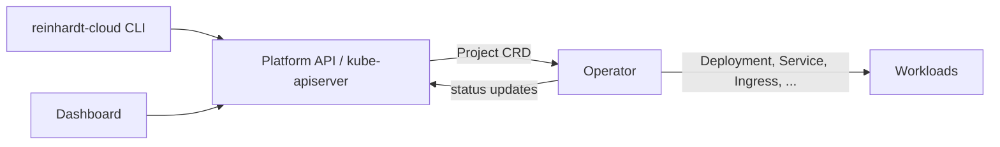
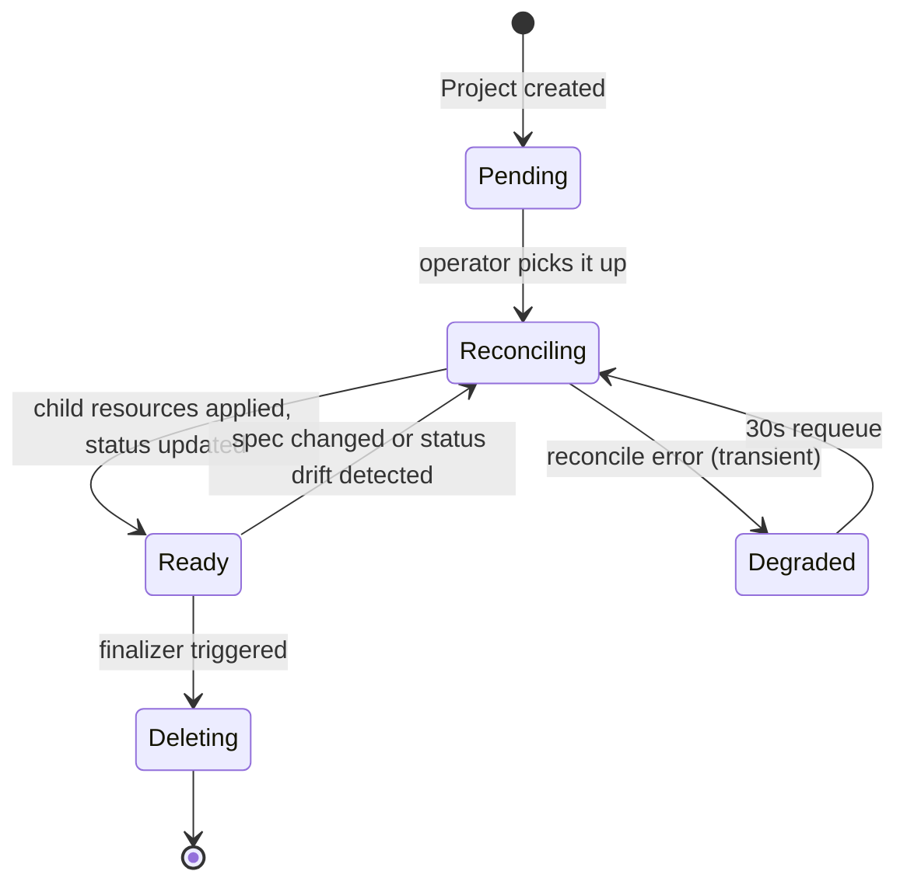

# reinhardt-cloud-operator

> **Last verified**: commit `84d08ad` on 2026-04-18
> **Source of truth**: this file. `crates/reinhardt-cloud-operator/README.md` is a summary.
> **Audience**: primarily Platform Operators; App-Developer notes live in a dedicated section near the bottom.

## Overview

`reinhardt-cloud-operator` is a Kubernetes operator that watches `Project` custom resources and
reconciles them into the standard Kubernetes workloads that run an application. When a `Project`
is created or updated, the operator computes the desired infrastructure — Deployment, Service, ConfigMap,
database StatefulSet or cloud-managed DB object, Ingress, cache Deployment, worker Deployment, build Job,
and so on — and applies each resource to the cluster via server-side apply. It maintains a finalizer
(`paas.reinhardt-cloud.dev/cleanup`) so that externally-provisioned resources are cleaned up when a
`Project` is deleted.

The operator runs as a single Deployment in the `reinhardt-cloud-system` namespace (by default) and
processes `Project` objects across all namespaces. Its only runtime inputs are the in-cluster
service account credentials, the `RUST_LOG` environment variable, and the platform and feature values
baked in at Helm install time via `PlatformConfig`. There are no operator-specific CLI flags; all
tuning is done through Helm values at deploy time.

### Placement in the architecture



The CLI and Dashboard submit `Project` objects (either directly via `kubectl apply` or via the
Dashboard's API layer) to the kube-apiserver. The operator's controller loop watches these objects
and reconciles the desired state into concrete Kubernetes resources. Status fields and conditions are
written back to the `Project` object so the CLI and Dashboard can surface current state to users.

For the primary app `Deployment` and `Service`, reconciliation is intentionally non-adopting:
if an object with the target name already exists, it must already have a controller owner reference
for the same `Project` UID before the operator applies changes. This prevents a `Project` author
from using the operator's elevated permissions to overwrite or garbage-collect an unrelated workload
or service in the namespace.

### Supported environments

- **Kubernetes**: no `kubeVersion` constraint in `Chart.yaml`; tested against mainstream releases.
- **Cloud overlays**: `values-aws.yaml` (EKS / ACK / ALB), `values-gcp.yaml` (GKE / Config Connector / GCE ingress), `values-onprem.yaml` (bare-metal / private registry).
- **Default overlay**: `values.yaml` is set to `platform: onpremise` and serves as the base for all environments.

### Relationship with `reinhardt-cloud-agent`

The operator runs inside the target cluster and watches `Project` CRDs declaratively; it does
not communicate with any external control plane. The agent (documented in `agent.md`) is a separate
process that connects a cluster to an external control plane and handles deploy/rollback/scale commands
imperatively. The operator alone is sufficient for single-cluster deployments driven by the CLI or a
GitOps tool such as ArgoCD or Flux.

---

## Reference

### Helm chart

- **Chart**: `charts/reinhardt-cloud-operator`
- **Values**: canonical defaults in `charts/reinhardt-cloud-operator/values.yaml`. Per-environment overlays: `values-aws.yaml`, `values-gcp.yaml`, `values-onprem.yaml`.
- **Versioning**: `Chart.yaml` sets both `version` (chart version) and `appVersion` (operator binary version) to `0.1.0-alpha.1`. The chart version and app version are kept in sync; both advance together on each release.

Common top-level value keys (summarized from `values.yaml`):

`values.yaml` still has only partial inline explanatory comments, so use this table as a quick reference rather than assuming every key in the file is self-documented.

| Key path | Purpose | Default |
|---|---|---|
| `replicaCount` | Number of operator Deployment replicas | `1` |
| `image.repository` | Operator container image repository | `reinhardt-cloud-operator` |
| `image.pullPolicy` | Image pull policy | `IfNotPresent` |
| `image.tag` | Image tag; empty string uses the chart's `appVersion` | `""` |
| `imagePullSecrets` | List of pull-secret references | `[]` |
| `namespace` | Kubernetes namespace the operator is installed into | `reinhardt-cloud-system` |
| `platform` | Target platform (`onpremise` / `aws` / `gcp`); drives `PlatformConfig` and RBAC rules | `onpremise` |
| `features.database` | Enable database inference and RBAC rules | `true` |
| `features.cache` | Enable Redis cache inference | `false` |
| `features.ingress` | Enable Ingress inference and RBAC rules | `false` |
| `features.autoscaling` | Enable HPA inference and RBAC rules | `false` |
| `features.storage` | Enable cloud storage ServiceAccount | `false` |
| `features.worker` | Enable background-worker Deployment inference | `false` |
| `serviceAccount.create` | Create a ServiceAccount for the operator | `true` |
| `serviceAccount.annotations` | Annotations on the ServiceAccount (e.g. IRSA / Workload Identity) | `{}` |
| `serviceAccount.name` | Override ServiceAccount name; empty uses the Helm release name | `""` |
| `operator.args` | Command-line arguments passed to the operator binary | `["run"]` |
| `operator.env.RUST_LOG` | Log filter directive; see `tracing_subscriber` docs | `info` |
| `operator.extraEnv` | Additional environment variables (map) | `{}` |
| `podSecurityContext.runAsNonRoot` | Run pod as non-root | `true` |
| `podSecurityContext.runAsUser` | UID for the operator process | `1000` |
| `securityContext.allowPrivilegeEscalation` | Container privilege escalation | `false` |
| `securityContext.readOnlyRootFilesystem` | Read-only root filesystem | `true` |
| `resources.requests.cpu` | CPU request for the operator container | `100m` |
| `resources.requests.memory` | Memory request | `128Mi` |
| `resources.limits.cpu` | CPU limit | `500m` |
| `resources.limits.memory` | Memory limit | `256Mi` |
| `nodeSelector` | Node selector map | `{}` |
| `tolerations` | Toleration list | `[]` |
| `affinity` | Affinity map | `{}` |
| `defaults.database.storage_gb` | Default PVC size (GiB) for on-premise PostgreSQL StatefulSet | `20` |
| `defaults.database.storage_class` | Default StorageClass for database PVC | `local-path` |
| `defaults.database.engine_version.postgresql` | Default PostgreSQL engine version string | `"16"` |
| `defaults.database.engine_version.mysql` | Default MySQL engine version string | `"8.0"` |
| `defaults.cache.storage_gb` | Default cache storage size (GiB) | `1` |
| `defaults.cache.storage_class` | Default StorageClass for cache PVC | `local-path` |
| `defaults.resources.requests.cpu` | Default CPU request for app workloads | `100m` |
| `defaults.resources.requests.memory` | Default memory request for app workloads | `128Mi` |
| `defaults.resources.limits.cpu` | Default CPU limit for app workloads | `1000m` |
| `defaults.resources.limits.memory` | Default memory limit for app workloads | `1Gi` |
| `defaults.storage.class` | Default StorageClass for storage volumes | `local-path` |
| `defaults.ingress.class` | Default IngressClass name | `nginx` |
| `defaults.ingress.annotations` | Default annotations added to generated Ingress objects | `kubernetes.io/ingress.class: nginx` |
| `isolation.defaultLevel` | Default workload isolation level (`None` / `Sandbox`) applied when `Project.spec.isolation.level` is unset | `"None"` |
| `isolation.runtimeClasses.kata.enabled` | Deploy the Kata Containers RuntimeClass | `false` |
| `isolation.runtimeClasses.kata.handler` | Runtime handler name for Kata | `kata-clh` |
| `isolation.runtimeClasses.kata.overhead.memory` | Memory overhead for Kata pods | `160Mi` |
| `isolation.runtimeClasses.kata.overhead.cpu` | CPU overhead for Kata pods | `250m` |
| `isolation.runtimeClasses.gvisor.enabled` | Deploy the gVisor RuntimeClass | `false` |
| `isolation.networkPolicy.enabled` | Enable NetworkPolicy generation for tenants | `true` |
| `isolation.networkPolicy.provider` | CNI provider used for NetworkPolicy (`cilium`, etc.) | `cilium` |
| `isolation.networkPolicy.blockMetadataService` | Block cloud metadata service egress in NetworkPolicy | `true` |
| `isolation.networkPolicy.defaultEgressAllow` | Default egress CIDR allow list | `["0.0.0.0/0"]` |
| `isolation.podSecurityStandards.enabled` | Label namespaces for Pod Security Standards enforcement | `true` |
| `isolation.podSecurityStandards.enforceLevel` | PSS enforce level (`privileged` / `baseline` / `restricted`) | `restricted` |
| `isolation.seccomp.enabled` | Apply seccomp profile to operator pods | `true` |
| `isolation.seccomp.profile` | Seccomp profile name | `RuntimeDefault` |
| `isolation.resourceLimits.enabled` | Create LimitRange for noisy-neighbor protection | `true` |
| `isolation.resourceLimits.defaults.requests.cpu` | Default CPU request in LimitRange | `100m` |
| `isolation.resourceLimits.defaults.requests.memory` | Default memory request in LimitRange | `128Mi` |
| `isolation.resourceLimits.defaults.limits.cpu` | Default CPU limit in LimitRange | `"2"` |
| `isolation.resourceLimits.defaults.limits.memory` | Default memory limit in LimitRange | `2Gi` |
| `isolation.resourceLimits.max.cpu` | Maximum CPU limit enforced by LimitRange | `"4"` |
| `isolation.resourceLimits.max.memory` | Maximum memory limit enforced by LimitRange | `4Gi` |

> See [docs/registry-and-identity.md](../registry-and-identity.md) for pull-secret and workload identity setup.

Environment overlay differences:

| Overlay | Purpose | Notable overrides |
|---|---|---|
| `values-aws.yaml` | EKS deployment with IRSA, ACK-backed databases, ALB ingress, and Kata/Cilium sandboxing | `platform: aws`, `serviceAccount.annotations` (IRSA role ARN), `defaults.ingress.class: alb`, `isolation.defaultLevel: Sandbox` |
| `values-gcp.yaml` | GKE deployment with Workload Identity, Config Connector databases, GCE ingress. gVisor disabled (GKE manages it natively). | `platform: gcp`, `serviceAccount.annotations` (GSA email), `defaults.ingress.class: gce`, `isolation.runtimeClasses.gvisor.enabled: false` |
| `values-onprem.yaml` | Private/bare-metal deployment with internal registry and control-plane node tolerance | `platform: onpremise`, `image.repository: registry.internal/...`, `image.pullPolicy: Always`, `imagePullSecrets`, `tolerations` for control-plane nodes |

Common override scenarios:

| Scenario | Flag or values snippet |
|---|---|
| Install into a custom namespace | `--namespace my-ns --set namespace=my-ns` |
| Increase operator log verbosity | `--set operator.env.RUST_LOG=reinhardt_cloud_operator=debug` |
| Enable ingress feature | `--set features.ingress=true` |
| Enable autoscaling (HPA) | `--set features.autoscaling=true` |
| Set default app CPU limit | `--set defaults.resources.limits.cpu=500m` |
| Attach IRSA role (AWS) | `--set serviceAccount.annotations."eks\.amazonaws\.com/role-arn"=arn:aws:iam::123456789012:role/my-role` |
| Disable network policy generation | `--set isolation.networkPolicy.enabled=false` |
| Relax pod security standards to baseline | `--set isolation.podSecurityStandards.enforceLevel=baseline` |

### CRDs managed

From `charts/reinhardt-cloud-operator/crds/`:

#### `Project` (`project-crd.yaml`)

- **Kind**: `Project`
- **Group / version**: `paas.reinhardt-cloud.dev/v1alpha2`
- **Scope**: Namespaced
- **Served**: `true` — **Storage**: `true` (sole served/stored version as of this audit)
- **Short name**: `project` (plural: `projects`)
- **Purpose**: Declares a PaaS application workload. The operator reconciles this object into a set of
  Kubernetes resources appropriate for the target platform.

**Top-level `spec` fields** (refer to the CRD YAML at `crds/project-crd.yaml` for the exhaustive schema):

| Field | Required | Summary |
|---|---|---|
| `image` | yes | Docker image reference to deploy |
| `replicas` | no | Desired replica count |
| `auth` | no | JWT and OAuth2 authentication configuration |
| `cache` | no | Redis cache configuration (requires `features.cache: true`) |
| `database` | no | Database engine, version, and storage settings |
| `deletion_policy` | no | `Retain` (default) or `Delete` — controls cleanup of managed infra on deletion |
| `env` | no | Environment variables injected into the app container |
| `features` | no | List of feature flag strings from the Cargo introspection output |
| `health` | no | Liveness and readiness probe configuration |
| `introspect` | no | Full `IntrospectOutput` subtree (set automatically by `reinhardt-cloud deploy`) |
| `isolation` | no | Per-app isolation overrides (`level`, `runtimeClass`, `networkPolicy`) |
| `mail` | no | SMTP credentials secret reference |
| `pages` | no | Static-site configuration for reinhardt-pages apps |
| `scale` | no | HPA configuration (min/max replicas, metrics; min/max must be at least `1`) |
| `scale.metric=cpu` | no | HPA CPU utilization target using `target_value` as a percent |
| `scale.metric=memory` | no | HPA memory average target using `target_value` as MiB |
| `services` | no | Ingress host and extra port configuration |
| `services.tls` | no | Ingress TLS settings: `enabled`, `secret_name`, `issuer`; `cluster_issuer` is rejected for tenant safety |
| `source` | no | Git repository and build configuration for source-driven builds (Kaniko) |
| `storage` | no | Cloud object storage bucket and storage class |
| `tenant` | no | Multi-tenant ownership marker (organization slug, optional team). Drives namespace/quota/policy provisioning — see [Multi-tenancy](#multi-tenancy-spectenant) |
| `worker` | no | Background-worker process configuration |

**`status` fields**:

| Field | Type | Description |
|---|---|---|
| `phase` | `ProjectPhase` | Top-level application lifecycle phase. Values: `pending`, `provisioning`, `deploying`, `running`, `degraded`, `failed`, `terminating` |
| `conditions` | `[]Condition` | Standard Kubernetes conditions. Observed types include `Ready`, `Progressing`, `Degraded`, `MigrationReady`, `DatabaseReady`, `CacheReady`, `WorkerReady`, `IngressReady`, `TlsReady`, `AutoscalerReady` |
| `build` | `BuildStatus?` | Active or most recent source build status, including `phase`, `target`, `trigger`, `jobName`, `image`, `imageTag`, and preview identifiers (`previewName`, `prNumber`) |
| `database.phase` | `ResourcePhase` | Database provisioning phase. Values: `Pending`, `Provisioning`, `Ready`, `Failed` |
| `cache.phase` | `ResourcePhase` | Cache provisioning phase. Same values as `database.phase` |
| `worker.phase` | `ResourcePhase` | Worker deployment phase. Same values as `database.phase` |
| `observedGeneration` | int64 | Last generation observed by the controller |

For source-driven projects, source builds are deployment-aware: the operator creates or reuses
the Kaniko Job for the requested deployment and records it in `status.build`. The parent
`spec.image` and preview Project image are not advanced until the associated Kaniko Job succeeds.
Failed builds set `Degraded=True` and leave the previous runtime image target unchanged.

For projects that provision PostgreSQL, the operator creates a migration Job
for each deployment revision and waits for it before applying the new
application `Deployment`. The migration Job uses the same runtime class,
service account, plugin mounts, resource defaults, and isolated workload
security contexts as the application workload, and the reconciler applies
isolation resources before creating the Job. A running migration reports
`MigrationReady=False` with reason `MigrationRunning`; a failed migration
reports `MigrationReady=False`, `Degraded=True`, and leaves the current
workload unchanged.

`TlsReady=True` means the generated Ingress contains the expected TLS host and
secret reference, and the referenced Secret exists in the Project namespace.
`AutoscalerReady=True` means the generated HPA has observed its current
generation and reports `AbleToScale=True` plus `ScalingActive=True`.

For a Project with `scale.min_replicas=2`, `scale.max_replicas=6`,
`scale.metric=cpu`, and `scale.target_value=70`, the operator applies an HPA
like:

```yaml
apiVersion: autoscaling/v2
kind: HorizontalPodAutoscaler
metadata:
  name: my-app
spec:
  scaleTargetRef:
    apiVersion: apps/v1
    kind: Deployment
    name: my-app
  minReplicas: 2
  maxReplicas: 6
  metrics:
    - type: Resource
      resource:
        name: cpu
        target:
          type: Utilization
          averageUtilization: 70
```

For `scale.metric=memory` with `scale.target_value=512`, the generated metric
target uses `type: AverageValue` and `averageValue: 512Mi`.

Note: the served/storage version matrix may change release-to-release. The upcoming
`reinhardt-cloud crd generate` workflow pins a specific version at CLI build time; tracking at
[#367](https://github.com/kent8192/reinhardt-cloud/issues/367).

#### Multi-tenancy (`spec.tenant`)

Setting `spec.tenant` opts a `Project` into the operator's per-tenant
namespace model (#416). The field carries a slug-based `organization`
reference and an optional `team`:

```yaml
spec:
  tenant:
    organization: acme         # required, DNS-1123 label
    team: platform             # optional, DNS-1123 label
```

When the field is set, the operator:

- Computes the tenant namespace as `tenant-<organization>` (or
  `tenant-<organization>-<team>` if `team` is set).
- Server-side applies that `Namespace` together with a default
  `ResourceQuota` and a default-deny + same-namespace + ingress-controller
  `NetworkPolicy` triple before any per-app workload is reconciled.
- Verifies that `metadata.namespace` matches the computed value.
  Mismatches set `status.phase: failed` and emit a `Degraded=True`
  condition with reason `TenantMismatch`; the controller then skips
  exponential-backoff retries until the user fixes the spec.

CRs that omit `spec.tenant` continue to reconcile in whatever
namespace they were created in, with no quota or network policy
imposed by the tenant reconciler. This is the legacy `v1alpha1`-style
behavior and is kept opt-out for backward compatibility; new CRs SHOULD
always set `spec.tenant`. The plan is to drop `Option` (i.e. require
`spec.tenant`) in `v1alpha3` once a conversion path or backfill is in
place — the design is recorded in issue #416.

Resource defaults applied per tenant when `spec.tenant` is set:

| Quota key | Default |
|---|---|
| `requests.cpu` | `10` |
| `requests.memory` | `20Gi` |
| `limits.cpu` | `20` |
| `limits.memory` | `40Gi` |
| `pods` | `100` |
| `persistentvolumeclaims` | `20` |
| `requests.storage` | `200Gi` |

Per-CR overrides for these defaults are tracked as follow-up work on
#416. For now every tenant receives the same operator-default quota.

### RBAC

From `charts/reinhardt-cloud-operator/templates/clusterrole.yaml`:

The operator uses a **ClusterRole** (cluster-scoped) bound to its ServiceAccount. The role is templated
and expands or contracts based on `platform` and `features.*` values at install time. No wildcard (`*`)
permissions are present; all rules follow the least-privilege principle (project guideline RB-1).
Namespace lifecycle verbs are also gated by `rbac.namespaces.manageLifecycle`; the default is
`false`, so the chart grants only `get` and `patch` for namespaces and expects platform operators to
pre-create tenant and preview namespaces when those workflows are used.

**Always-present rules (all platforms and feature configurations)**:

| API group | Resources | Verbs |
|---|---|---|
| `paas.reinhardt-cloud.dev` | `projects` | get, list, watch, create, update, patch, delete |
| `paas.reinhardt-cloud.dev` | `projects/status` | get, update, patch |
| `paas.reinhardt-cloud.dev` | `projects/finalizers` | update |
| `apps` | `deployments` | get, list, watch, create, update, patch, delete |
| `""` (core) | `services`, `configmaps`, `secrets` | get, list, watch, create, update, patch, delete |
| `""` (core) | `events` | create, patch |
| `networking.k8s.io` | `networkpolicies` | get, list, watch, create, update, patch, delete |
| `""` (core) | `limitranges`, `resourcequotas` | get, list, watch, create, update, patch, delete |
| `""` (core) | `namespaces` | get, patch |

**Feature-conditional rules**:

| Condition | API group | Resources | Verbs |
|---|---|---|---|
| `features.database=true`, `platform=onpremise` | `apps` | `statefulsets` | get, list, watch, create, update, patch, delete |
| `features.database=true`, `platform=onpremise` | `""` (core) | `persistentvolumeclaims` | get, list, watch, create, update, patch, delete |
| `features.database=true`, `platform=aws` | `rds.services.k8s.aws` | `dbinstances` | get, list, watch, create, update, patch, delete |
| `features.database=true`, `platform=gcp` | `sql.cnrm.cloud.google.com` | `sqlinstances`, `sqldatabases`, `sqlusers` | get, list, watch, create, update, patch, delete |
| `features.cache=true`, `platform=onpremise` | `apps` | `statefulsets` | get, list, watch, create, update, patch, delete |
| `features.cache=true`, `platform=aws` | `elasticache.services.k8s.aws` | `replicationgroups` | get, list, watch, create, update, patch, delete |
| `features.cache=true`, `platform=gcp` | `redis.cnrm.cloud.google.com` | `redisinstances` | get, list, watch, create, update, patch, delete |
| `features.ingress=true` | `networking.k8s.io` | `ingresses` | get, list, watch, create, update, patch, delete |
| `features.autoscaling=true` | `autoscaling` | `horizontalpodautoscalers` | get, list, watch, create, update, patch, delete |

TLS readiness reads core Secrets, which are covered by the always-present core
RBAC rule. HPA reconciliation requires `features.autoscaling=true`; Ingress TLS
reconciliation requires `features.ingress=true`.

ServiceAccount: name is resolved by the `reinhardt-cloud-operator.serviceAccountName` helper in
`_helpers.tpl` — defaults to the Helm release name, or `values.serviceAccount.name` if set.

### Controller internals (shallow — Reference only)

This section is intentionally brief; deep design lives outside this file.

- **Reconcile entry point**: `crates/reinhardt-cloud-operator/src/reconciler.rs` —
  `pub(crate) async fn reconcile(obj: Arc<Project>, ctx: Arc<Context>) -> Result<Action, Error>`.
  The context carries a `kube::Client` and a `PlatformConfig` derived from Helm values.
- **Inference**: `crates/reinhardt-cloud-operator/src/inference/` maps Cargo features found in the
  `Project` spec to infra requests. Sub-modules cover `configmap`, `database`, `env_vars`,
  `pages`, `platform`, and `secrets`; `database` selects between on-premise StatefulSets and
  cloud-provider DynamicObjects depending on the platform.
- **Requeue strategy**: currently a fixed `Action::requeue(Duration::from_secs(30))` regardless of
  error kind. Exponential backoff is tracked at
  [#365](https://github.com/kent8192/reinhardt-cloud/issues/365).
- **Observability**: custom Prometheus metrics are emitted on `/metrics` when `metrics.enabled`
  (reconcile count/duration, requeues, managed apps by phase, and ready/desired replicas per
  project) — see [Monitoring](#monitoring). Logs use the `tracing` ecosystem — set `RUST_LOG`
  (via `operator.env.RUST_LOG` in values) to adjust verbosity. The default directive is
  `reinhardt_cloud_operator=info`. Structured log fields include namespace, app name, and the
  specific resource being reconciled (e.g. `"Reconciled Deployment {namespace}/{name}"`).

## For Platform Operators

This section is the primary entry point for platform operators responsible for installing, configuring,
and upgrading Reinhardt Cloud. It covers [Installation](#installation) and [Upgrade](#upgrade).
Operations, security hardening, and troubleshooting are covered in the next section.

### Installation

#### Prerequisites

- **kubectl** 1.27+ (must be on `$PATH` for `--direct` deploys and fallback status queries)
- **Helm** 3.12+ (chart uses Helm 3 APIs; `helm install --create-namespace` is required for the
  `reinhardt-cloud-system` namespace)
- **Kubernetes cluster**: the chart does not declare a `kubeVersion` field; it has been tested against
  Kubernetes 1.27 and later. Earlier versions may work but are not validated.

Required cluster capabilities:

- CRD creation permissions (the chart installs `projects.paas.reinhardt-cloud.dev`)
- An ingress controller matching `defaults.ingress.class` in the overlay you choose (`nginx` for
  on-premise, `alb` for AWS, `gce` for GCP) — required only when `features.ingress: true`
- Cilium CNI — required only when `isolation.networkPolicy.enabled: true` (the default for all
  overlays)

Optional capabilities (omit if the relevant feature flag is disabled):

- **AWS ACK controllers** for `rds.services.k8s.aws` and `elasticache.services.k8s.aws` — required
  when `platform: aws` and `features.database: true` or `features.cache: true`
- **GCP Config Connector** for `sql.cnrm.cloud.google.com` and `redis.cnrm.cloud.google.com` —
  required when `platform: gcp` and `features.database: true` or `features.cache: true`
- **Kata Containers** or **gVisor** runtime classes — required when
  `isolation.runtimeClasses.kata.enabled: true` or `isolation.runtimeClasses.gvisor.enabled: true`
  (both enabled by default in the AWS and GCP overlays)

> No cert-manager integration is shipped in the current chart; that key does not exist in
> `values.yaml` and should not be configured. Prometheus Operator integration **is** shipped: set
> `metrics.enabled=true` and `metrics.serviceMonitor.enabled=true` (requires the Prometheus
> Operator CRDs) to expose the operator's custom metrics — see [Monitoring](#monitoring).

#### Install from source (current recommended path)

A Helm repository index has not been published yet. Install directly from the repository.

**On-premise:**

```bash
git clone https://github.com/kent8192/reinhardt-cloud.git
cd reinhardt-cloud
helm install reinhardt-cloud-operator charts/reinhardt-cloud-operator \
  --namespace reinhardt-cloud-system \
  --create-namespace \
  -f charts/reinhardt-cloud-operator/values-onprem.yaml
```

**AWS (EKS):**

Before installing, replace the placeholder values in `values-aws.yaml` with your account and region:

- `image.repository`: replace `<account-id>` and `<region>` with your ECR registry coordinates
- `serviceAccount.annotations.eks.amazonaws.com/role-arn`: replace `<account-id>` with the IAM role
  ARN for the operator's IRSA binding

```bash
git clone https://github.com/kent8192/reinhardt-cloud.git
cd reinhardt-cloud
helm install reinhardt-cloud-operator charts/reinhardt-cloud-operator \
  --namespace reinhardt-cloud-system \
  --create-namespace \
  -f charts/reinhardt-cloud-operator/values-aws.yaml
```

**GCP (GKE):**

Before installing, replace the placeholder values in `values-gcp.yaml` with your project and region:

- `image.repository`: replace `<region>`, `<project-id>`, and path as appropriate
- `serviceAccount.annotations.iam.gke.io/gcp-service-account`: replace `<project-id>` with your GCP
  project ID

```bash
git clone https://github.com/kent8192/reinhardt-cloud.git
cd reinhardt-cloud
helm install reinhardt-cloud-operator charts/reinhardt-cloud-operator \
  --namespace reinhardt-cloud-system \
  --create-namespace \
  -f charts/reinhardt-cloud-operator/values-gcp.yaml
```

#### Install from Helm repository (future — not yet available)

A dedicated Helm chart repository has not been published at the time this document was written. Once
a chart repository is published, a `helm repo add` workflow will replace the source-based install
described above. This section will be updated when a chart repository is published.

#### Post-install validation

After installation completes, verify the operator is running:

```bash
# Confirm the operator pod is Running
kubectl get pods -n reinhardt-cloud-system

# Expected output (name suffix varies):
# NAME                                          READY   STATUS    RESTARTS   AGE
# reinhardt-cloud-operator-<hash>   1/1     Running   0          30s

# Check operator startup logs
kubectl logs -n reinhardt-cloud-system deployment/reinhardt-cloud-operator

# Confirm the CRD was installed
kubectl get crd | grep reinhardt
# Expected output:
# projects.paas.reinhardt-cloud.dev   <timestamp>

# Confirm the ClusterRole and ClusterRoleBinding were created
kubectl get clusterrole reinhardt-cloud-operator
kubectl get clusterrolebinding reinhardt-cloud-operator
```

If the pod does not reach `Running` within 60 seconds, inspect events:

```bash
kubectl describe pod -n reinhardt-cloud-system -l app.kubernetes.io/name=reinhardt-cloud-operator
```

#### Configuration cookbook

The table below lists common configuration scenarios. Each `--set` path maps directly to a key in
`values.yaml`; the [Reference — `values.yaml` keys](#reference) section above provides the full key
list and default values.

| Scenario | Values override |
|---|---|
| Change log verbosity to `debug` | `--set operator.env.RUST_LOG=reinhardt_cloud_operator=debug` |
| Enable cache feature | `--set features.cache=true` |
| Enable ingress feature | `--set features.ingress=true` |
| Disable network policy enforcement | `--set isolation.networkPolicy.enabled=false` |
| Override isolation level to `None` | `--set isolation.defaultLevel=None` |
| Set PostgreSQL version (on-prem) | `--set defaults.database.engine_version.postgresql=15` |
| Increase database storage (on-prem) | `--set defaults.database.storage_gb=50` |
| Change on-prem storage class | `--set defaults.storage.class=longhorn` |
| Change on-prem ingress class | `--set defaults.ingress.class=traefik` |
| Pass extra environment variables to the operator | `--set operator.extraEnv.MY_VAR=value` |
| Use a custom operator replica count | `--set replicaCount=2` |

> `features.database` is `true` by default. If your cluster does not have the required database
> controllers for the configured platform, set `features.database=false` until the controllers are
> installed.
>
> Custom metrics are available: `--set metrics.enabled=true` exposes `/metrics`, and
> `--set metrics.serviceMonitor.enabled=true` registers a `ServiceMonitor` with the Prometheus
> Operator. See [Monitoring](#monitoring) for the metric catalog.

### Upgrade

#### Compatibility matrix

| Operator version | Minimum CLI version | CRD version | Notes |
|---|---|---|---|
| 0.1.x | 0.1.x | `paas.reinhardt-cloud.dev/v1alpha2` | Initial release series. All 0.x.x releases may contain breaking changes; read the [release notes](https://github.com/kent8192/reinhardt-cloud/releases) before upgrading. |

The chart version and appVersion are both `0.1.0-alpha.1`. There is no published chart repository yet, so
upgrades are performed by pulling the latest source and re-running `helm upgrade` (see below).

#### Upgrade steps

1. **Back up existing `Project` resources** before any upgrade:

   ```bash
   kubectl get project -A -o yaml > project-backup-$(date +%Y%m%d).yaml
   ```

2. **Pull the latest chart source:**

   ```bash
   cd reinhardt-cloud
   git fetch origin
   git pull origin main
   ```

3. **Apply the updated CRDs** from the chart (Helm does not upgrade CRDs automatically on
   `helm upgrade`):

   ```bash
   kubectl apply -f charts/reinhardt-cloud-operator/crds/
   ```

4. **Run `helm upgrade`** with the same overlay used at install time. Substitute the correct
   `-f` flag for your platform:

   ```bash
   # On-premise
   helm upgrade reinhardt-cloud-operator charts/reinhardt-cloud-operator \
     --namespace reinhardt-cloud-system \
     -f charts/reinhardt-cloud-operator/values-onprem.yaml

   # AWS
   helm upgrade reinhardt-cloud-operator charts/reinhardt-cloud-operator \
     --namespace reinhardt-cloud-system \
     -f charts/reinhardt-cloud-operator/values-aws.yaml

   # GCP
   helm upgrade reinhardt-cloud-operator charts/reinhardt-cloud-operator \
     --namespace reinhardt-cloud-system \
     -f charts/reinhardt-cloud-operator/values-gcp.yaml
   ```

5. **Watch the rollout:**

   ```bash
   kubectl rollout status deployment/reinhardt-cloud-operator \
     -n reinhardt-cloud-system --timeout=120s
   ```

#### Rolling back

To revert the Helm release to the previous revision:

```bash
helm rollback reinhardt-cloud-operator -n reinhardt-cloud-system
```

> **CRD schema rollbacks are not supported.** `helm rollback` reverts the Helm release but does not
> downgrade CRD schemas already applied to the cluster. If a CRD schema change causes compatibility
> issues, restore from the YAML backup created in step 1 of the upgrade procedure, then manually
> re-apply the previous CRD manifest. Consult the release notes for the affected version before
> proceeding.

### Operations

#### Monitoring

The operator emits custom Prometheus metrics on `/metrics` (served by the operator's HTTP server,
enabled via `metrics.enabled`). A shipped `ServiceMonitor` template exposes them to the Prometheus
Operator when `metrics.serviceMonitor.enabled` is set (requires the Prometheus Operator CRDs).
The HTTP server always serves `/healthz` for manual diagnostics; `metrics.enabled` controls only the
`/metrics` endpoint contents (it returns 404 when disabled). The Helm chart uses an exec probe
(`reinhardt-cloud-operator --healthcheck`) so kubelet health checks do not depend on the externally
reachable metrics listener.

**Metrics catalog:**

| Metric | Type | Labels | Description |
|---|---|---|---|
| `reinhardt_cloud_operator_reconcile_total` | counter | `result` | Reconciliation attempts, labeled by result (`success` or error class). |
| `reinhardt_cloud_operator_reconcile_duration_seconds` | histogram | `result` | Reconciliation duration in seconds, labeled by result. |
| `reinhardt_cloud_operator_requeue_total` | counter | `reason` | Requeues issued by the error policy, labeled by backoff class. |
| `reinhardt_cloud_operator_managed_apps` | gauge | `phase` | Number of `Project` objects tracked, labeled by phase. |
| `reinhardt_cloud_operator_managed_apps_ready_replicas` | gauge | `namespace`, `project` | Ready replicas of the managed `Deployment`. |
| `reinhardt_cloud_operator_managed_apps_desired_replicas` | gauge | `namespace`, `project` | Desired replicas of the managed `Deployment`. |

**Enabling metrics:**

```bash
helm upgrade reinhardt-cloud-operator charts/reinhardt-cloud-operator \
  --namespace reinhardt-cloud-system \
  --reuse-values \
  --set metrics.enabled=true \
  --set metrics.serviceMonitor.enabled=true
```

**Representative PromQL:**

```promql
# Projects whose ready replicas are below desired
reinhardt_cloud_operator_managed_apps_ready_replicas
  < on(namespace, project)
reinhardt_cloud_operator_managed_apps_desired_replicas

# Operator pod health (kube-state-metrics, always available regardless of metrics.enabled)
kube_pod_status_ready{namespace="reinhardt-cloud-system", condition="true"} == 1
```

`kube-state-metrics` remains available on clusters that run it, providing Deployment-level signals
(pod status, restart counts) alongside the operator's custom metrics.

#### Logging

The operator uses the [`tracing`](https://docs.rs/tracing) crate throughout. Logging is configured
at start-up via `tracing_subscriber::fmt` with an `EnvFilter`.

**Log level control**

The env var `RUST_LOG` controls the level. The default directive is
`reinhardt_cloud_operator=info` (set in `values.yaml` under `operator.env.RUST_LOG`). Override at
deploy time with:

```bash
helm upgrade reinhardt-cloud-operator charts/reinhardt-cloud-operator \
  --namespace reinhardt-cloud-system \
  --reuse-values \
  --set operator.env.RUST_LOG=debug
```

**Log format**

The operator supports two log formats controlled by `logging.format` in the Helm chart (or the
`REINHARDT_LOG_FORMAT` environment variable):

- **text** (default): human-readable, timestamped lines to stdout — suitable for development and
  direct `kubectl logs` inspection.
- **json**: structured JSON output, one record per line — suitable for log aggregation pipelines
  (Loki, Elasticsearch, etc.).

Enable JSON structured logging at deploy time:

```bash
helm upgrade reinhardt-cloud-operator charts/reinhardt-cloud-operator \
  --namespace reinhardt-cloud-system \
  --reuse-values \
  --set logging.format=json
```

**Structured log schema**

The operator uses `tracing_subscriber`'s JSON formatter (`flatten_event(true)`),
so the emitted JSON shape differs slightly from the
[`LogRecord`](../../crates/reinhardt-cloud-telemetry) canonical model used by
downstream telemetry components.

Emitted fields per line:

| Emitted key | Type | Description |
|-------------|------|-------------|
| `timestamp` | RFC3339 UTC | Event timestamp |
| `level` | `TRACE` / `DEBUG` / `INFO` / `WARN` / `ERROR` | Log level |
| `message` | string | Message body (flattened by `flatten_event`) |
| `target` | string | Rust module path that emitted the event |
| `reconcile_id` | string, optional | Correlates all logs within a single reconcile pass |
| `deployment_id` | string, optional | Managed `Project` deployment identifier |
| `resource_kind` / `resource_namespace` / `resource_name` | string, optional | Target Kubernetes resource |
| `phase` | string, optional | Reconcile phase (e.g. `apply`, `finalize`) |
| `correlation_id` | string, optional | Cross-component correlation (CLI → operator) |
| `trace_id` / `span_id` | string, optional | Populated automatically once Phase 3 (Issue #374) lands |

When mapping operator output into the `LogRecord` model, apply this field translation:

| `LogRecord` field | Read from emitted JSON |
|-------------------|------------------------|
| `ts` | `timestamp` |
| `level` | `level` |
| `msg` | `message` |
| `reconcile_id` / `deployment_id` / etc. | same key (top-level, flattened) |

**Representative log messages**

The reconciler emits messages like the following at `INFO` level. The namespace and resource name
appear as inline format arguments rather than as typed tracing fields:

```
INFO Reconciling Project default/my-app
INFO Reconciled ConfigMap default/my-app-settings
INFO Created JWT Secret default/my-app-jwt
INFO Created DB credentials Secret default/my-app-db
INFO Reconciled Deployment default/my-app
INFO Reconciled Service default/my-app
INFO Reconciled cache resources for my-app
INFO Reconciled worker deployment for my-app
```

At `WARN` level: `Controller loop terminated, shutting down` (emitted when the main
`reconciler::run` future returns).

The dashboard consumes the configured `LogService` read backend for historical
and live application logs; Loki-backed deployments read through `query_range`
and `/tail`.

To see every reconcile invocation and all Kubernetes client calls, set `RUST_LOG=debug`.

##### Managed database environment

When a `Project` provisions a PostgreSQL database, the operator injects:

- `REINHARDT_DATABASE_HOST`
- `REINHARDT_DATABASE_PORT`
- `REINHARDT_DATABASE_NAME`
- `REINHARDT_DATABASE_USER`
- `REINHARDT_DATABASE_PASSWORD` from the operator-managed credentials `Secret`
- `DATABASE_URL`, built from the values above and the password env reference

`spec.env.DATABASE_URL` remains the highest-priority override. If it is absent,
non-secret `spec.env.REINHARDT_DATABASE_HOST/PORT/NAME/USER` values override the
operator defaults before `DATABASE_URL` is built. The CLI materializes those
non-secret values from composed Reinhardt settings (`settings/base.toml` plus
the active profile TOML), including `${VAR:-default}` interpolation. Passwords
from settings are not copied into the CRD or generated TOML.

On AWS and GCP, the operator still falls back to the deterministic service-style
placeholder host when no `REINHARDT_DATABASE_HOST` or explicit `DATABASE_URL` is
provided. In that fallback case, provide the managed RDS/Cloud SQL endpoint via
settings-derived `REINHARDT_DATABASE_HOST` or an explicit secret-backed
`DATABASE_URL`.

**Shipping logs to Loki**

Set `logging.loki.enabled=true` in the Helm chart to deploy a Promtail DaemonSet that tails
operator pods and forwards logs to `logging.loki.endpoint` (default
`http://loki.monitoring.svc.cluster.local:3100`).

The operator pod does **not** embed a Loki client — the write path is out-of-process so that
operator pod restarts never block on log-ingest.

**Application logs in Loki**

The bundled Promtail collector is restricted to the Helm release namespace and only tails operator
pods. It does not collect managed application pods from tenant namespaces because doing so from the
same DaemonSet would require broader pod discovery and host log access than the operator log path
needs. Deploy tenant-scoped collectors separately when application log forwarding is required, and
label those log streams with `{namespace, app, deployment_id, pod, container, level}`, where `app`
is the project name (`app.kubernetes.io/name`) and `deployment_id` is the Dashboard deployment
primary key.

The dashboard maps its log filters to LogQL as:

| Dashboard filter | LogQL |
|---|---|
| Project (source) | `{app="<project>"}` |
| Deployment ID | `{deployment_id="<deployment-id>"}` |
| Min level | `level=~"<warn\|error>"` |
| Search | `\|~ "<regex>"` |
| Time range | `query_range` `start`/`end` |

**Programmatic access**

`reinhardt-cloud-telemetry` exposes a Loki-backed `LogService` (implementing
`reinhardt-cloud-core::traits::LogService`) that serves `list` via Loki `query_range` and `tail` via
the Loki `/tail` WebSocket. The dashboard's gRPC `LogServiceServer` is backed by this impl when
`log_backend = "loki"` (or `REINHARDT_CLOUD_LOG_BACKEND=loki`), and by the in-memory
`LocalLogService` otherwise (the dev/default). An in-process `InMemoryLogService` is also available
for tests.

#### Distributed Tracing

The operator exports OpenTelemetry spans when `OTEL_EXPORTER_OTLP_ENDPOINT` is set.
Via the Helm chart this is controlled by `tracing.enabled=true` and `tracing.endpoint`.

##### Environment variables

| Variable | Default | Description |
|----------|---------|-------------|
| `OTEL_EXPORTER_OTLP_ENDPOINT` | unset (tracing disabled) | OTLP gRPC endpoint |
| `OTEL_SERVICE_NAME` | `reinhardt-cloud-operator` | Service name in spans |
| `OTEL_TRACES_SAMPLER` | `parentbased_traceidratio` | Sampler strategy |
| `OTEL_TRACES_SAMPLER_ARG` | `0.1` | Sampling ratio (0.0–1.0) |

##### Span names

| Span | Description |
|------|-------------|
| `operator.reconcile` | Root span per `Project` reconcile pass |

Span attributes: `resource_kind`, `resource_namespace`, `resource_name`, `reconcile_id`.

##### CRD annotation contract

When a caller sets annotation `reinhardt.io/traceparent` on a `Project`, the operator reads it as the parent context and stitches its `operator.reconcile` span into the caller's distributed trace.

Writing the annotation back is deferred to avoid patch-loop reconcile storms.

##### Trace-to-log correlation

When running with `REINHARDT_LOG_FORMAT=json`, the operator preserves trace context on the active OTel span during reconciliation, but the current JSON log formatter setup does not guarantee that `trace_id` and `span_id` are emitted as top-level log fields. If end-to-end log/trace correlation is required, verify formatter support before relying on filtering logs by `trace_id` in Loki/Grafana.

##### Managed Pod trace propagation

The operator injects the following env vars into each managed Pod's container spec:
- `TRACEPARENT` — W3C trace context header from the active reconcile span.
- `OTEL_PROPAGATORS=tracecontext` — instructs OTel SDKs to read `TRACEPARENT`.
- `OTEL_SERVICE_NAME` — the app name.
- `OTEL_EXPORTER_OTLP_ENDPOINT` — forwarded from the operator's env when set.

#### Scaling

The operator is designed to run as a **single replica**. Leader election is not implemented
(verified: no matches for `leader_election`, `leaderelection`, or `LeaseLock` in
`crates/reinhardt-cloud-operator/src/`). Running multiple replicas causes duplicate reconcile
loops and race conditions on status patches.

Keep `replicaCount` at `1` in `values.yaml` (the shipped default):

```yaml
replicaCount: 1
```

Do not increase this value unless leader election has been implemented.

#### Disaster recovery

When the operator pod is unavailable:

- **Existing workloads continue running.** Kubernetes does not stop application pods because the
  operator is absent. `Project`-managed Deployments, Services, and other resources persist
  in the API server.
- **New creates and updates queue up.** The Kubernetes API server accepts `Project` writes
  normally. The operator processes them when it comes back online.
- **Finalizer-protected deletes hang.** Any `kubectl delete project` that triggers the
  `paas.reinhardt-cloud.dev/cleanup` finalizer will not complete until the operator is back and
  runs the `Cleanup` finalizer event.

**Recovery procedure:**

No persistent state is stored outside the cluster. Recovery is a standard Helm operation:

```bash
# Revert the Helm release to the previous revision if the upgrade caused the outage:
helm rollback reinhardt-cloud-operator -n reinhardt-cloud-system

# Or reinstall from source:
helm upgrade --install reinhardt-cloud-operator charts/reinhardt-cloud-operator \
  --namespace reinhardt-cloud-system \
  -f charts/reinhardt-cloud-operator/values-<platform>.yaml

# Verify the pod comes up:
kubectl rollout status deployment/reinhardt-cloud-operator \
  -n reinhardt-cloud-system --timeout=120s
```

---

### Security

#### RBAC footprint

The Helm chart renders a `ClusterRole` whose rules are determined by the `platform` and `features`
values. Namespace lifecycle verbs are additionally controlled by
`rbac.namespaces.manageLifecycle`; the default `false` keeps namespace permissions to `get` and
`patch`, so tenant and preview namespaces must be pre-created by a more privileged platform
workflow. The base rules (always present, regardless of platform or features) are:

| apiGroups | resources | verbs |
|-----------|-----------|-------|
| `paas.reinhardt-cloud.dev` | `projects` | get, list, watch, create, update, patch, delete |
| `paas.reinhardt-cloud.dev` | `projects/status` | get, update, patch |
| `paas.reinhardt-cloud.dev` | `projects/finalizers` | update |
| `apps` | `deployments` | get, list, watch, create, update, patch, delete |
| `""` (core) | `services`, `configmaps`, `secrets` | get, list, watch, create, update, patch, delete |
| `""` (core) | `events` | create, patch |
| `networking.k8s.io` | `networkpolicies` | get, list, watch, create, update, patch, delete |
| `""` (core) | `limitranges`, `resourcequotas` | get, list, watch, create, update, patch, delete |
| `""` (core) | `namespaces` | get, patch |

Additional rules rendered when specific features or platforms are active:

| Condition | apiGroups | resources | verbs |
|-----------|-----------|-----------|-------|
| `features.database` + `platform: onpremise` | `apps` | `statefulsets` | get, list, watch, create, update, patch, delete |
| `features.database` + `platform: onpremise` | `""` | `persistentvolumeclaims` | get, list, watch, create, update, patch, delete |
| `features.database` + `platform: aws` | `rds.services.k8s.aws` | `dbinstances` | get, list, watch, create, update, patch, delete |
| `features.database` + `platform: gcp` | `sql.cnrm.cloud.google.com` | `sqlinstances`, `sqldatabases`, `sqlusers` | get, list, watch, create, update, patch, delete |
| `features.cache` + `platform: onpremise` | `apps` | `statefulsets` | get, list, watch, create, update, patch, delete |
| `features.cache` + `platform: aws` | `elasticache.services.k8s.aws` | `replicationgroups` | get, list, watch, create, update, patch, delete |
| `features.cache` + `platform: gcp` | `redis.cnrm.cloud.google.com` | `redisinstances` | get, list, watch, create, update, patch, delete |
| `features.ingress` | `networking.k8s.io` | `ingresses` | get, list, watch, create, update, patch, delete |
| `features.autoscaling` | `autoscaling` | `horizontalpodautoscalers` | get, list, watch, create, update, patch, delete |

**Wildcard verdict: wildcard-free.** Every rule names specific resource types and specific verb
sets. No `"*"` appears in any `apiGroups`, `resources`, or `verbs` field. This is consistent with
project guideline RB-1 (least-privilege RBAC).

#### ServiceAccount

The operator's `ServiceAccount` is created by the chart when `serviceAccount.create: true` (the
default). The name defaults to the Helm release fullname and can be overridden via
`serviceAccount.name`.

Cloud-provider workload identity annotations are applied per overlay:

| Platform | Annotation |
|----------|-----------|
| AWS (EKS IRSA) | `eks.amazonaws.com/role-arn: arn:aws:iam::<account-id>:role/reinhardt-cloud-operator` |
| GCP (Workload Identity) | `iam.gke.io/gcp-service-account: reinhardt-cloud-operator@<project-id>.iam.gserviceaccount.com` |
| On-premise | No annotations (local kubeconfig or in-cluster service account token) |

Use `serviceAccount.annotations` in your overlay file to set the correct annotation for your
environment.

#### NetworkPolicy recommendation

The operator binary does not listen on any TCP port (verified: no `TcpListener`, `bind`, or
`serve` calls in `crates/reinhardt-cloud-operator/src/main.rs`). It only makes outbound calls to
the Kubernetes API server.

A minimal `NetworkPolicy` for the operator pod:

```yaml
apiVersion: networking.k8s.io/v1
kind: NetworkPolicy
metadata:
  name: reinhardt-cloud-operator-egress
  namespace: reinhardt-cloud-system
spec:
  podSelector:
    matchLabels:
      app.kubernetes.io/name: reinhardt-cloud-operator
  policyTypes:
    - Egress
    - Ingress
  ingress: []          # no inbound traffic required
  egress:
    - ports:
        - port: 443    # kube-apiserver HTTPS
          protocol: TCP
        - port: 6443   # kube-apiserver alt port (some distros)
          protocol: TCP
```

Adjust the `egress.ports` list to match your cluster's API server port. On EKS/GKE the API
server is typically on port 443.

#### Pod security

The chart configures hardened security contexts out of the box:

| Setting | Value |
|---------|-------|
| `podSecurityContext.runAsNonRoot` | `true` |
| `podSecurityContext.runAsUser` | `1000` |
| `securityContext.allowPrivilegeEscalation` | `false` |
| `securityContext.readOnlyRootFilesystem` | `true` |

No capabilities are added. The operator process runs as UID 1000 with a read-only root filesystem.

#### Secrets

The operator does not consume long-lived static credentials. Cloud API access is delegated to the
node's workload identity (IRSA on AWS, Workload Identity on GCP) via `serviceAccount.annotations`.
No bearer tokens or cloud-provider secrets are mounted into the pod by the chart.

Application-level secrets (JWT keys, database credentials) are created by the reconciler as
Kubernetes `Secret` objects within the application's namespace and are never written to disk on the
operator node.

---

### Troubleshooting

This section maps common failure modes to the `Error` variants in
`crates/reinhardt-cloud-operator/src/error.rs` and to observable symptoms.

#### Operator pod not Ready

**Symptom:** `kubectl get pods -n reinhardt-cloud-system` shows the operator pod in `Pending`,
`CrashLoopBackOff`, or `ImagePullBackOff`.

**Cause:** Image pull failure or cluster resource constraints; not directly an `Error` variant.

**Diagnose:**
```bash
kubectl describe pod -n reinhardt-cloud-system \
  -l app.kubernetes.io/name=reinhardt-cloud-operator
kubectl get events -n reinhardt-cloud-system --sort-by='.lastTimestamp'
```

**Fix:** Verify `image.repository` and `image.tag` in your values overlay. For private registries
confirm `imagePullSecrets` is set. For on-premise, the default
`registry.internal/reinhardt-cloud/reinhardt-cloud-operator` must be reachable.

---

#### Kubernetes API errors (`Error::Kube`)

**Symptom:** Operator logs contain `Kubernetes API error: <kube::Error details>`. The reconcile
loop retries every 30 seconds (fixed interval — no exponential backoff; tracked in
[#365](https://github.com/kent8192/reinhardt-cloud/issues/365)).

**Cause:** `Error::Kube(#[from] kube::Error)` — the API server returned an error (connection
refused, 401 Unauthorized, 403 Forbidden, 429 Too Many Requests, etc.).

**Diagnose:**
```bash
kubectl logs -n reinhardt-cloud-system deployment/reinhardt-cloud-operator \
  | grep "Kubernetes API error"
kubectl auth can-i --list \
  --as=system:serviceaccount:reinhardt-cloud-system:<sa-name>
```

**Fix:** Verify the ClusterRole and ClusterRoleBinding are present:
```bash
kubectl get clusterrole,clusterrolebinding \
  -l app.kubernetes.io/name=reinhardt-cloud-operator
```
If missing, re-apply with `helm upgrade` (the chart manages these resources).

---

#### CRD validation error at apply time

**Symptom:** `kubectl apply -f project.yaml` returns a 422 Unprocessable Entity with a
validation message, or the operator logs `serialization error: ...`.

**Cause:** `Error::Serialization(#[from] serde_json::Error)` — the resource spec failed JSON
serialization inside the operator, or the applied manifest does not match the CRD schema.

**Diagnose:**
```bash
kubectl explain project.spec
kubectl get project <name> -n <ns> -o yaml | kubectl apply --dry-run=server -f -
```

**Fix:** Correct the field values in your manifest. The `spec.image` field is required; all other
top-level spec fields are optional. Ensure you are using API version
`paas.reinhardt-cloud.dev/v1alpha2`.

---

#### Resource missing namespace (`Error::MissingNamespace`)

**Symptom:** Operator logs contain `resource <name> has no namespace`.

**Cause:** `Error::MissingNamespace(String)` — the `Project` was applied without a namespace
(e.g., `kubectl apply` at cluster scope without `-n`).

**Diagnose:**
```bash
kubectl get project -A
```

**Fix:** `Project` is a namespaced resource. Always apply with an explicit namespace:
```bash
kubectl apply -f app.yaml -n <your-namespace>
```

---

#### Owner reference failure (`Error::OwnerReference`)

**Symptom:** Operator logs contain `failed to compute owner reference for <name>`. Child resources
(Deployment, Service, etc.) are created but not garbage-collected when the `Project` is
deleted.

**Cause:** `Error::OwnerReference(String)` — the operator could not build a valid
`ownerReference` block for a generated resource.

**Diagnose:**
```bash
kubectl describe project <name> -n <ns>
kubectl get deployment <name> -n <ns> -o jsonpath='{.metadata.ownerReferences}'
```

**Fix:** This is likely a transient error. The 30-second requeue will retry. If the condition
persists across multiple reconcile cycles, check that the `Project` resource has a populated
`metadata.uid` (it will not if you applied an incomplete manifest).

---

#### Invalid port in spec (`Error::InvalidPort`)

**Symptom:** Operator logs contain `invalid port <N> for field '<field>': must be between 1 and
65535`. The `Project` status shows `Degraded`.

**Cause:** `Error::InvalidPort { field, port }` — a port value in `spec.services` or another
port-bearing field is outside the valid range.

**Diagnose:**
```bash
kubectl describe project <name> -n <ns>
```

**Fix:** Correct the port value in your `Project` manifest and re-apply.

---

#### Secret generation failure (`Error::SecretGeneration`)

**Symptom:** Operator logs contain `secret generation failed: <detail>`. JWT or database credential
`Secret` objects are absent from the namespace.

**Cause:** `Error::SecretGeneration(String)` — the operator encountered an error while generating
cryptographic material (JWT keys) or assembling the database credentials `Secret`.

**Diagnose:**
```bash
kubectl get secrets -n <ns> | grep -E '<name>-jwt|<name>-db'
kubectl logs -n reinhardt-cloud-system deployment/reinhardt-cloud-operator \
  | grep "secret generation failed"
```

**Fix:** The 30-second requeue retries secret creation automatically. If the error persists,
check that `spec.auth.jwt` (if set) has a valid configuration and that the operator `ServiceAccount`
has permission to create `Secret` objects in the target namespace (see RBAC footprint above).

---

#### Finalizer-stuck delete

**Symptom:** `kubectl delete project <name>` hangs. The resource shows
`deletionTimestamp` in its metadata but the finalizer
`paas.reinhardt-cloud.dev/cleanup` is not removed.

**Cause:** `Error::Finalizer(Box<dyn Error + Send + Sync>)` — the cleanup path in the finalizer
returned an error, or the operator is not running.

**Diagnose:**
```bash
kubectl get project <name> -n <ns> \
  -o jsonpath='{.metadata.finalizers}'
kubectl logs -n reinhardt-cloud-system deployment/reinhardt-cloud-operator \
  | grep "finalizer error"
```

**Fix:** Ensure the operator pod is running. The requeue fires every 30 seconds; the cleanup
reconcile will complete on the next successful run. If you need to force-remove the resource
(data loss risk), manually patch out the finalizer:
```bash
kubectl patch project <name> -n <ns> \
  -p '{"metadata":{"finalizers":[]}}' --type=merge
```
This bypasses cleanup — use only as a last resort.

---

#### Persistent 30-second requeue loop

**Symptom:** Operator logs repeat the same reconcile attempt every ~30 seconds for a particular
`Project`. The resource never reaches `Ready`.

**Cause:** Any `Error` variant — `error_policy` in `reconciler.rs` returns a fixed
`Action::requeue(Duration::from_secs(30))` for every error. There is no exponential backoff. This
is tracked in [#365](https://github.com/kent8192/reinhardt-cloud/issues/365). A common trigger is
upstream API rate limiting (e.g., ACK rate limits on AWS RDS CRs) or a temporarily unavailable
dependency.

**Diagnose:**
```bash
kubectl logs -n reinhardt-cloud-system deployment/reinhardt-cloud-operator \
  --since=5m | grep -E "error|Error"
kubectl describe project <name> -n <ns>
```

**Fix:** Identify the specific error from the logs and address the root cause (fix the spec,
restore connectivity, wait for rate limits to clear). The operator will resume normal reconciliation
once the error resolves. If the loop is caused by an ACK or Config Connector resource not being
available, verify those controllers are installed and healthy in your cluster.

## For App Developers

### What the operator does to my app

When you create a `Project` resource, the operator translates your declarative specification into concrete Kubernetes infrastructure: a Deployment runs your application container, optional child resources include a Service for networking, Ingress for external access, a StatefulSet for the database (if provisioned via the cluster), Deployments for cache and background workers, and a ServiceAccount for storage access. The operator also manages cloud infrastructure—cloud-managed databases, storage buckets, and secrets—based on the feature flags and configuration in your spec. To preview what the operator will create, use the CLI's `deploy --dry-run` command or `crd generate` workflow to see the Kubernetes manifests before applying them.

### What I cannot do without Platform Ops

- Modify operator values.yaml (e.g., default isolation level, resource quotas, chart-wide image registries)
- Add or remove CRD versions (API evolution and backward compatibility)
- Grant new RBAC permissions to the operator's service account
- Alter chart-wide defaults such as database storage class or cache image
- Change the operator configuration or reconciliation interval

Contact your platform team for any of these changes.

### Support-question pre-checklist

Before opening a support ticket, gather diagnostics using these commands:

```bash
# Check app deployment status
reinhardt-cloud status --name <app>

# View the complete Project resource
kubectl get project <app> -o yaml

# Inspect the generated Deployment
kubectl get deployment <app> -o yaml

# See events for the app (sorted by timestamp)
kubectl get events --field-selector involvedObject.name=<app> --sort-by=.lastTimestamp
```

---

## Appendix A: Reconcile state machine



**Mental Model:** The reconciliation process cycles through states based on the operator's internal logic. The diagram shows the conceptual flow that the reconciler implements. In practice, the CRD status uses standard Kubernetes conditions (Ready, Progressing, Degraded) rather than a single `phase` field—this diagram is a simplified mental model to understand how reconciliation proceeds, not a literal mapping to status fields. The operator continuously watches for changes and updates conditions accordingly.

---

## Appendix B: CRD field reference

**Kind:** `Project`<br>
**Group/Version:** `paas.reinhardt-cloud.dev/v1alpha2`<br>
**Full Schema:** See `charts/reinhardt-cloud-operator/crds/paas.reinhardt-cloud.dev_projects.yaml`

### Spec Top-Level Fields

| Field | Purpose |
|-------|---------|
| `image` | Docker image to deploy (required, e.g. `myapp:latest`) |
| `replicas` | Number of desired replicas (defaults to 1) |
| `resources` | Resource requests and limits for the app container |
| `env` | Environment variables as key-value pairs |
| `features` | Resolved Reinhardt feature flags |
| `health` | HTTP health check configuration (path, port, interval) |
| `auth` | Authentication configuration (JWT, OAuth2) |
| `database` | Database infrastructure (engine, version, storage, instance class) |
| `cache` | Cache configuration (Redis backend and instance type) |
| `mail` | Mail/SMTP configuration (host, port, credentials) |
| `pages` | Static frontend configuration (compression, caching, resources) |
| `services` | Service exposure (port, target port, Ingress hostname) |
| `scale` | Autoscaling configuration (min/max replicas, metric, target value) |
| `worker` | Background worker configuration (command, concurrency) |
| `storage` | Object storage configuration (backend, bucket name) |
| `source` | Git source and CI/CD pipeline (repository, branch, build, webhook, preview) |
| `isolation` | Workload isolation and security (level, network policy, runtime class) |
| `deletion_policy` | Cloud resource deletion policy (retain or delete) |
| `introspect` | Introspection metadata from `manage introspect` output (auto-populated by CLI) |

### Status Top-Level Fields

| Field | Purpose |
|-------|---------|
| `conditions` | Standard Kubernetes condition list (Ready, Progressing, Degraded, DatabaseReady, CacheReady, WorkerReady, IngressReady) |
| `observedGeneration` | The generation last observed by the controller |
| `phase` | Lifecycle phase (pending, deploying, running, failed, terminating, provisioning, degraded) |
| `build` | Active or recent Kaniko source build, including target, trigger, Job name, produced image, and preview identifiers |
| `readyReplicas` | Number of ready replicas in the Deployment |
| `database` | Status of the provisioned database sub-resource (phase, endpoint, credentials_secret) |
| `cache` | Status of the provisioned cache sub-resource (phase, endpoint) |
| `worker` | Status of the worker deployment sub-resource (ready_replicas) |

---

## Appendix C: Error catalog

The reconciler can encounter the following error types:

| Variant | Typical Trigger | User-Visible Message |
|---------|-----------------|----------------------|
| `Kube` | Transient Kubernetes API errors | Wrapped `kube::Error` from the kube-rs library |
| `Serialization` | CRD validation failed or JSON encoding error | `serde_json::Error` with details |
| `Finalizer` | Finalizer management failed during cleanup | Finalizer error with context |
| `MissingNamespace` | Project has no namespace (unusual) | "Missing namespace in metadata" |
| `OwnerReference` | Failed to set owner reference on child resource | Error details with resource name |
| `InvalidPort` | Port number outside valid range (1-65535) | "Invalid port: X" or "Port out of range" |
| `SecretGeneration` | Failed to generate or manage credentials secret | Error details with secret name |

**Dead-Code Variants:** The following error variants exist in the type definition but are not actively reached in the current reconciler implementation and will not appear in logs:

- `MissingField` — Would be raised if a required CRD field is absent (spec validation prevents this)
- `DatabaseProvisioning` — Placeholder for future database provisioning errors
- `PlatformControllerMissing` — Placeholder for missing ACK/Config Connector controllers
- `CredentialsMissing` — Placeholder for missing cloud credentials
- `BuildFailed` — Placeholder for container build failures

These variants are marked `#[allow(dead_code)]` and may be activated in future releases as features expand.

---

## Appendix D: Metrics catalog

The operator emits the following custom Prometheus metrics on `/metrics` (enabled via
`metrics.enabled`; scraped via the shipped `ServiceMonitor` when
`metrics.serviceMonitor.enabled`):

| Metric | Type | Labels |
|---|---|---|
| `reinhardt_cloud_operator_reconcile_total` | counter | `result` |
| `reinhardt_cloud_operator_reconcile_duration_seconds` | histogram | `result` |
| `reinhardt_cloud_operator_requeue_total` | counter | `reason` |
| `reinhardt_cloud_operator_managed_apps` | gauge | `phase` |
| `reinhardt_cloud_operator_managed_apps_ready_replicas` | gauge | `namespace`, `project` |
| `reinhardt_cloud_operator_managed_apps_desired_replicas` | gauge | `namespace`, `project` |

Indirect signals are also available through `kube-state-metrics` on the operator Deployment (restart
count, pod status) and condition status on the `Project` resource itself.
