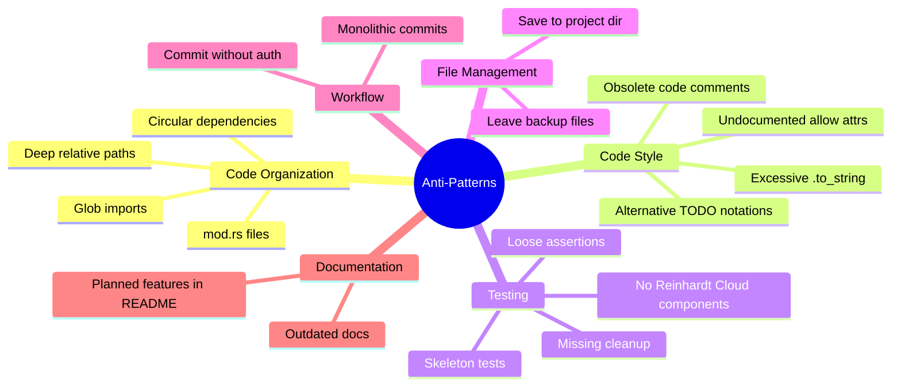

# Anti-Patterns and What NOT to Do

## Purpose

This document explicitly lists common mistakes, anti-patterns, and practices to
avoid in the Reinhardt Cloud project. Use this as a quick reference for code review
and development.

The following diagram provides a high-level overview of anti-pattern categories:



---

## Code Organization Anti-Patterns

### ❌ Using `mod.rs` Files

**DON'T:**

```
src/controller/mod.rs  // ❌ Old Rust 2015 style
```

**DO:**

```
src/controller.rs      // ✅ Rust 2024 style
```

**Why?** `mod.rs` is deprecated and makes file navigation harder. See
@instructions/MODULE_SYSTEM.md

### ❌ Glob Imports

**DON'T:**

```rust
pub use controller::*;  // ❌ Pollutes namespace
```

**DO:**

```rust
pub use controller::{AppController, AppContext, ControllerConfig};  // ✅ Explicit
```

**Exception**: Test modules may use `use super::*;` for convenience:

```rust
#[cfg(test)]
mod tests {
    use super::*;  // ✅ Acceptable in test modules
}
```

**Why?** Makes it unclear what's exported and causes naming conflicts.

### ❌ Circular Module Dependencies

**DON'T:**

```rust
// module_a.rs
use crate::module_b::TypeB;  // ❌ A → B

// module_b.rs
use crate::module_a::TypeA;  // ❌ B → A (circular!)
```

**DO:**

```rust
// types.rs - Extract common types
pub struct TypeA;
pub struct TypeB;

// module_a.rs
use crate::types::{TypeA, TypeB};  // ✅ No cycle

// module_b.rs
use crate::types::{TypeA, TypeB};  // ✅ No cycle
```

**Why?** Causes compilation errors and indicates poor module design.

### ❌ Excessive Flat Structure

**DON'T:**

```
src/
├── app_reconciler.rs      // ❌ Related files
├── app_controller.rs      // scattered across
├── ingress_reconciler.rs  // the same level
├── ingress_controller.rs
└── crd_types.rs
```

**DO:**

```
src/
├── app.rs                 // ✅ Grouped by
├── dashboard/             // feature/domain
│   ├── reconciler.rs
│   └── controller.rs
├── ingress.rs
└── ingress/
    ├── reconciler.rs
    └── controller.rs
```

**Why?** Grouping related files improves maintainability and navigation.

### ❌ Deep Relative Paths

**DON'T:**

```rust
use super::super::super::utils;  // ❌ Confusing
```

**DO:**

```rust
use crate::utils::helpers;  // ✅ Absolute from crate root
use super::sibling_module;  // ✅ One level up is OK
```

**Why?** Deep relative paths are hard to understand and maintain.

---

## Code Style Anti-Patterns

### ❌ Excessive `.to_string()` Calls

**DON'T:**

```rust
fn format_namespace(ns: &str) -> String {
    let label = format!("namespace={}", ns.to_string());  // ❌ Unnecessary
    label.to_string()  // ❌ Already a String!
}
```

**DO:**

```rust
fn format_namespace(ns: &str) -> String {
    format!("namespace={}", ns)  // ✅ ns is already &str
}
```

**Why?** Unnecessary allocations hurt performance. Prefer borrowing.

### ❌ Leaving Obsolete Code

**DON'T:**

```rust
// fn old_reconcile_v1() {  // ❌ Commented out code
//     // ...
// }

pub fn reconcile(obj: Arc<ReinhardtApp>, ctx: Arc<Context>) -> Result<Action> {
    // ...
}
```

**DO:**

```rust
pub fn reconcile(obj: Arc<ReinhardtApp>, ctx: Arc<Context>) -> Result<Action> {  // ✅ Old code deleted
    // ...
}
```

**Why?** Git history preserves old code. Commented code creates clutter.

### ❌ Deletion Record Comments

**DON'T:**

```rust
// Removed old_reconciler - deprecated  // ❌ Don't document deletions
// Deleted: v1_crd.rs (superseded)      // ❌ Git history has this

pub fn active_function() {
    // ...
}
```

**DO:**

```rust
pub fn active_function() {  // ✅ No deletion comments
    // ...
}
```

**Why?** Git history is the permanent record. Comments clutter the codebase.

### ❌ Using Alternative TODO Notations

**DON'T:**

```rust
// Implementation Note: This needs to be completed    // ❌ Custom notation
// FIXME: Add validation                              // ❌ Use TODO instead
// NOTE: Not implemented yet                          // ❌ NOTE is for info only
```

**DO:**

```rust
// TODO: Implement status condition update logic
fn update_status_conditions(obj: &mut ReinhardtApp) {
    todo!("Add condition management - planned for next sprint")
}

// Or for intentionally omitted features:
fn legacy_v1_reconciler() {
    unimplemented!("v1 reconciler is intentionally not supported")
}
```

**Why?** Standardized notation (`TODO`, `todo!()`, `unimplemented!()`) is
searchable and clear.

**CI Enforcement:**

The TODO Check CI workflow automatically detects TODO/FIXME comments and `todo!()` macros
in pull requests. PRs introducing new unresolved TODOs will fail the CI check.
Only `unimplemented!()` (for permanently excluded features) is permitted.

Additionally, Clippy enforces the following deny lints:
- `clippy::todo` - prevents `todo!()` macros
- `clippy::unimplemented` - prevents `unimplemented!()` macros (use `#[allow(clippy::unimplemented)]` with comment for intentional exclusions)
- `clippy::dbg_macro` - prevents `dbg!()` macros

### ❌ Unmarked Placeholder Implementations

**DON'T:**

```rust
pub fn get_operator_config() -> OperatorConfig {
    OperatorConfig::default()  // ❌ Looks like production code!
}

pub fn emit_event(obj: &ReinhardtApp, reason: &str) -> Result<()> {
    println!("Would emit: {}", reason);  // ❌ Mock without marker
    Ok(())
}
```

**DO:**

```rust
pub fn get_operator_config() -> OperatorConfig {
    todo!("Implement operator configuration loading from ConfigMap")
}

pub fn emit_event(obj: &ReinhardtApp, reason: &str) -> Result<()> {
    // TODO: Integrate with Kubernetes event recorder
    println!("Would emit: {}", reason);
    Ok(())
}
```

**Why?** Unmarked placeholders can be mistaken for production code.

### ❌ Undocumented `#[allow(...)]` Attributes

**DON'T:**

```rust
// No explanation why this is allowed
#[allow(dead_code)]
struct ReservedField {
	future_field: Option<String>,  // ❌ Why is this unused?
}
```

**DO:**

```rust
// Reserved for future CRD spec fields planned in the next operator version.
// These fields will be populated once the Kubernetes API group is stabilized.
#[allow(dead_code)]
struct ExtendedSpec {
	scaling_policy: Option<ScalingPolicy>,  // Will be used in future
}
```

**Why?** `#[allow(...)]` attributes suppress important compiler warnings. Every
suppression must be justified with a clear comment explaining:
- **For future implementation**: What will use it and when
- **For macro requirements**: Which macro needs it and why
- **For test code**: What test pattern requires it
- **For Clippy rules**: Why the rule doesn't apply here

---

## Kubernetes Anti-Patterns

### ❌ Raw `serde_json::Value` for CRD Spec/Status

**DON'T:**

```rust
// ❌ Untyped spec loses type safety
pub struct ReinhardtAppSpec {
    pub config: serde_json::Value,
}
```

**DO:**

```rust
// ✅ Strongly typed spec
pub struct ReinhardtAppSpec {
    pub image: String,
    pub replicas: Option<i32>,
    pub resources: Option<ResourceRequirements>,
}
```

**Why?** Raw `serde_json::Value` eliminates compile-time type checking, making bugs harder to detect.

### ❌ Panicking in Reconciler

**DON'T:**

```rust
async fn reconcile(obj: Arc<ReinhardtApp>, ctx: Arc<Context>) -> Result<Action> {
    let name = obj.name_any();
    let deployment = ctx.client.get_deployment(&name).await
        .unwrap();  // ❌ panics on transient error
    Ok(Action::await_change())
}
```

**DO:**

```rust
async fn reconcile(obj: Arc<ReinhardtApp>, ctx: Arc<Context>) -> Result<Action> {
    let name = obj.name_any();
    let deployment = ctx.client.get_deployment(&name).await
        .map_err(|e| Error::KubeError(e))?;  // ✅ propagate error
    Ok(Action::await_change())
}

fn error_policy(_obj: Arc<ReinhardtApp>, error: &Error, _ctx: Arc<Context>) -> Action {
    Action::requeue(Duration::from_secs(30))  // ✅ requeue on error
}
```

**Why?** Reconciler panics crash the operator process. All transient errors should be returned as `Err` for requeuing.

---

## Testing Anti-Patterns

### ❌ Skeleton Tests

Tests without meaningful assertions that always pass.

**Why?** Tests must be capable of failing. See @instructions/TESTING_STANDARDS.md TP-1
for detailed examples.

### ❌ Tests Without Reinhardt Cloud Components

Tests that only verify standard library or third-party behavior.

**Why?** Every test must verify at least one Reinhardt Cloud component. See
@instructions/TESTING_STANDARDS.md TP-2.

### ❌ Tests Without Cleanup

Tests that create files/resources without cleaning up.

**Why?** Test artifacts must be cleaned up. See @instructions/TESTING_STANDARDS.md TI-3
for cleanup techniques.

### ❌ Global State Tests Without Serialization

Tests modifying global state without `#[serial]` attribute.

**Why?** Global state tests can conflict if run in parallel. See
@instructions/TESTING_STANDARDS.md TI-4 for serial test patterns.

### ❌ Loose Assertions

Using `contains()`, range checks, or loose pattern matching instead of exact
value assertions.

**Why?** Loose assertions can pass with incorrect values. See
@instructions/TESTING_STANDARDS.md TI-5 for assertion strictness guidelines and
acceptable exceptions.

### ❌ Tests Without Clear AAA Structure

Tests that mix setup, execution, and verification without clear phase separation,
or use non-standard phase labels (`// Setup`, `// Execute`, `// Verify`).

**Why?** Clear Arrange-Act-Assert structure improves test readability and
maintainability. See @instructions/TESTING_STANDARDS.md TI-6.

---

## File Management Anti-Patterns

### ❌ Saving Files to Project Directory

**DON'T:**

```bash
./generate-manifests.sh > output.yaml   # ❌ Saved to project root
```

**DO:**

```bash
./generate-manifests.sh > /tmp/output.yaml   # ✅ Use /tmp

# Delete when done
rm /tmp/output.yaml
```

**Why?** Keeps project directory clean. Prevents accidental commits.

### ❌ Leaving Backup Files

**DON'T:**

```bash
ls
reconciler.rs
reconciler.rs.bak        # ❌ Backup file left behind
controller.rs.old        # ❌ Old version not deleted
```

**DO:**

```bash
# Clean up immediately
rm reconciler.rs.bak controller.rs.old  # ✅ Delete backups
```

**Why?** Backup files clutter the codebase and can be accidentally committed.

---

## Workflow Anti-Patterns

### ❌ Committing Without User Instruction

**DON'T:**

```bash
# ❌ AI creates commit automatically
git add .
git commit -m "feat: Add feature"
```

**DO:**

```bash
# ✅ Wait for explicit user instruction
# User: "Please commit these changes"
git add <specific files>
git commit -m "..."
```

**Why?** Commits should only be made with explicit user authorization.

### ❌ Monolithic Commits

**DON'T:**

```bash
# ❌ One huge commit for entire feature
git add .
git commit -m "feat(operator): Implement full operator"
# Changes: CRD types, reconciler, controller, RBAC, tests...
```

**DO:**

```bash
# ✅ Split into specific intents
git add crates/reinhardt-cloud-operator/src/crd.rs
git commit -m "feat(operator): add ReinhardtApp CRD type definition"

git add crates/reinhardt-cloud-operator/src/reconciler.rs
git commit -m "feat(operator): implement Deployment reconciler for ReinhardtApp"

git add manifests/rbac.yaml
git commit -m "feat(operator): add RBAC roles for operator service account"
```

**Why?** Small, focused commits make history easier to understand and review.

---

## Documentation Anti-Patterns

### ❌ Outdated Documentation After Code Changes

Always update documentation in the same workflow as code changes.

**Why?** Documentation must be updated with code changes in the same workflow.

### ❌ Planned Features in README

**DON'T:**

```markdown
<!-- README.md -->

### Planned Features

- MySQL support
- Multi-cluster federation
```

**DO:**

```rust
//! crates/reinhardt-cloud-operator/src/lib.rs
//!
//! ## Planned Features
//!
//! - MySQL database backend support
//! - Multi-cluster federation
```

**Why?** Planned features belong in `lib.rs`, README shows implemented features only.

---

## Related Documentation

- **Main Quick Reference**: @CLAUDE.md (see Quick Reference section)
- **Main standards**: @CLAUDE.md
- **Module system**: @instructions/MODULE_SYSTEM.md
- **Testing standards**: @instructions/TESTING_STANDARDS.md
- **Documentation standards**: @instructions/DOCUMENTATION_STANDARDS.md
- **Kubernetes patterns**: @instructions/KUBERNETES_PATTERNS.md
