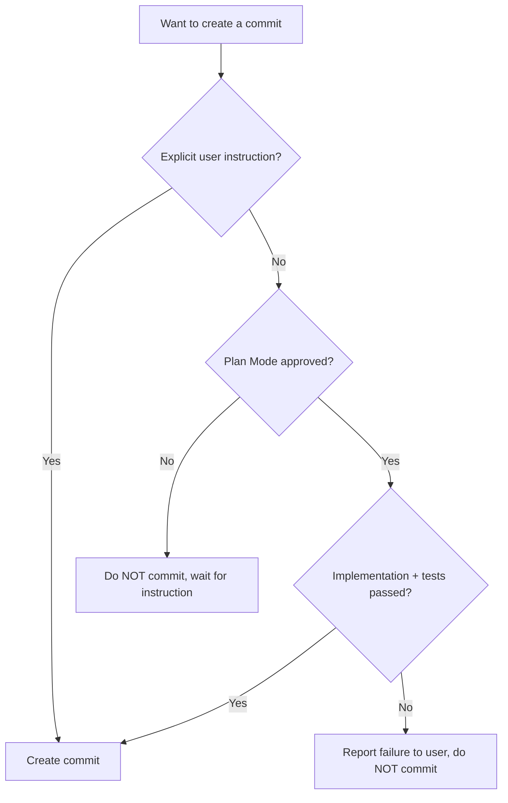

# Git Commit Guidelines

## Purpose

This file defines the git commit policy for the Reinhardt Cloud project. These rules ensure clear commit history, proper granularity, and consistent commit message formatting across the development lifecycle.

---

## Specification Reference

This document follows [Conventional Commits v1.0.0](https://www.conventionalcommits.org/en/v1.0.0/).

Key principles from the specification:
- Commit messages MUST be structured as: `<type>[optional scope]: <description>`
- The types `feat` and `fix` correlate with SemVer MINOR and PATCH respectively
- Breaking changes MUST be indicated with `!` after type/scope or via `BREAKING CHANGE:` footer

---

## Commit Execution Policy

### CE-1 (MUST): Explicit User Authorization

- **NEVER** create commits without explicit user instruction
- **NEVER** push commits without explicit user instruction
- Always wait for user confirmation before committing changes
- Prepare changes and inform the user, but let them decide when to commit

The following diagram summarizes the commit authorization decision flow:



**EXCEPTION: Plan Mode Approval**

When a user approves a plan by accepting Exit Plan Mode, this constitutes explicit authorization for both:
1. Implementation of the planned changes
2. Creation of all commits associated with the implementation

**Automatic Commit Workflow after Plan Mode Approval:**

1. **Success Case**: If implementation completes successfully and all tests pass:
   - Automatically create all commits as planned in the approved plan
   - NO additional user confirmation required for each commit
   - Follow commit granularity rules (CE-2) and commit message format (CM-1, CM-2, CM-3)
   - Commits are created sequentially in the logical order defined in the plan

2. **Failure Case**: If implementation fails or tests fail:
   - **DO NOT** create any commits
   - Report the failure to the user with detailed information
   - Wait for user instruction on how to proceed

**Important Notes:**

- Plan Mode approval does NOT authorize pushing commits to remote
- Pushing still requires explicit user instruction
- The approved plan should clearly outline the planned commits (number, scope, messages)
- If the implementation deviates significantly from the plan, seek user confirmation before committing
- Batch commits are still prohibited - commits are created one at a time, but automatically without confirmation

### CE-2 (MUST): Commit Granularity

- Commits **MUST** be split into developer-friendly, understandable units
- **Each commit should represent a specific intent to achieve a goal, NOT the goal itself**
  - ❌ Bad: Committing an entire "operator feature" in one commit (goal-level)
  - ✅ Good: Separate commits for each building block:
    - "add ReinhardtApp CRD type definition" (specific intent)
    - "implement Deployment reconciler" (specific intent)
    - "add RBAC roles for operator" (specific intent)
- **Each commit MUST be small enough to be explained in a single line**
- **Avoid monolithic commits at feature-level**
  - ❌ Bad Examples:
    - "feat(operator): Implement operator" (too broad, uppercase start)
    - "feat(crd): Add CRD, reconciler, and RBAC" (multiple intents)
  - ✅ Good Examples:
    - "feat(crd): add ReinhardtApp custom resource definition"
    - "feat(reconciler): implement deployment reconciliation loop"
    - "feat(rbac): add operator cluster role with required permissions"

### CE-3 (MUST): Partial File Commits

When a single file contains changes with different purposes, use one of the following methods for line-level commits:

#### Method 1: Editor-based Patch Editing (Recommended)

```bash
git add --patch <file>
```

#### Method 2: Patch File Approach (For Automation)

```bash
# Generate patch
git diff <file> > /tmp/changes.patch

# Edit patch file to keep only desired changes

# Apply to staging area
git apply --cached /tmp/changes.patch
```

### CE-4 (MUST): Respect .gitignore

- **NEVER** commit files specified in .gitignore
- Verify staged files before committing
- Use `git status` to confirm no ignored files are included

---

## Commit Message Structure

### Format

Commit messages consist of three parts:

1. **Subject line**
2. **Body**
3. **Footer**

### CM-1 (MUST): Subject Line Format

```
<type>[optional scope][optional !]: <description>

Examples:
feat(crd): add ReinhardtApp custom resource definition
fix(reconciler): resolve nil pointer dereference in status update
feat(operator)!: change CRD group from reinhardt-cloud.dev to paas.reinhardt-cloud.dev
```

**Requirements:**

- **Type**: One of the defined commit types (see Commit Types section below)
- **Scope**: Module or component name (e.g., `crd`, `reconciler`, `operator`, `rbac`)
  - Multiple scopes separated by commas: `(crd,reconciler)`
  - Scope is OPTIONAL but RECOMMENDED for clarity
- **Breaking Change Indicator**: Append `!` after type/scope to indicate breaking changes
- **Description**: Concise summary in English
  - **MUST** start with lowercase letter
  - **MUST** be specific, not vague
  - **MUST NOT** end with a period
  - ❌ Bad: "Improve operator" (Too vague, starts with uppercase)
  - ❌ Bad: "add feature." (Ends with period)
  - ✅ Good: "add exponential backoff to reconciler error policy"

### Commit Types

**Required Types (correlate with SemVer):**

| Type | Description | SemVer | CHANGELOG Section |
|------|-------------|--------|-------------------|
| `feat` | A new feature | MINOR | Added |
| `fix` | A bug fix | PATCH | Fixed |

**Recommended Types:**

| Type | Description | CHANGELOG Section |
|------|-------------|-------------------|
| `perf` | Performance improvements | Performance |
| `refactor` | Code change that neither fixes a bug nor adds a feature | Changed |
| `docs` | Documentation only changes | Documentation |
| `revert` | Reverts a previous commit | Reverted |
| `deprecated` | Marks features/APIs as deprecated | Deprecated |
| `security` | Security vulnerability fixes | Security |
| `chore` | Maintenance tasks (no production code change) | Maintenance |
| `ci` | CI configuration changes | Maintenance |
| `build` | Changes affecting build system or external dependencies | Maintenance |
| `test` | Adding or modifying tests | Testing |
| `style` | Code style changes (formatting, whitespace) | Styling |

### BREAKING CHANGE

Breaking changes introduce API incompatibility and correlate with SemVer MAJOR version bump.

**Indicating Breaking Changes:**

1. **Preferred: Using `!` notation** (concise and visible)
   ```
   feat!: change CRD API version from v1alpha1 to v1beta1
   feat(operator)!: rename ReinhardtApp spec field replicas to replicaCount
   ```

2. **Alternative: Using footer** (allows detailed explanation)
   ```
   feat(crd): migrate to structured status conditions

   BREAKING CHANGE: status.conditions replaces status.ready (bool).
   Users must update their tooling to read the new condition format.
   ```

3. **Combined: Both `!` and footer** (for maximum clarity)
   ```
   refactor(crd)!: change CRD group name

   BREAKING CHANGE: CRD group changed from reinhardt-cloud.dev to paas.reinhardt-cloud.dev.
   Existing CRD installations must be migrated before upgrading.
   ```

**Requirements:**

- Breaking changes MUST be indicated using `!` or `BREAKING CHANGE:` footer
- `BREAKING CHANGE` MUST be uppercase in footer

### Revert Commits

```
revert: <original commit subject>

Refs: <commit SHA(s)>
```

### CM-2 (MUST): Body Format

```
Brief summary paragraph explaining the changes.

Module/Component Section 1:
- file/path.rs: +XXX lines - Description
  - Sub-detail 1
  - Sub-detail 2
- file/path2.rs: Description

Module/Component Section 2:
- file/path.rs: Changes
- Removed: old_file.rs (reason)

Features:
- Feature 1
- Feature 2

Additional context or explanation.
```

**Requirements:**

- Write in English
- Organize changes by module or component
- List modified files with line count changes where significant
- Include "Removed:" entries for deleted files with reasons
- Provide context for complex changes

### CM-3 (MUST): Footer Format

Footers follow the [git trailer convention](https://git-scm.com/docs/git-interpret-trailers).

**Standard Footers:**

| Token | Description | Example |
|-------|-------------|---------|
| `BREAKING CHANGE` | Indicates breaking API change | `BREAKING CHANGE: remove deprecated method` |
| `Co-Authored-By` | Credit to co-authors | `Co-Authored-By: Name <email>` |
| `Refs` | Reference to issues/commits | `Refs: #123, #456` |
| `Closes` | Closes related issues | `Closes #123` |
| `Fixes` | Fixes related issues | `Fixes #789` |

**Required Footer for Claude Code:**

```

🤖 Generated with [Claude Code](https://claude.com/claude-code)

Co-Authored-By: Claude <noreply@anthropic.com>
```

**Requirements:**

- **EXACTLY one blank line** between body and footer section
- Footer tokens MUST use `-` in place of whitespace (except `BREAKING CHANGE`)
- Footer **MUST** include the Claude Code attribution when AI-assisted
- Footer **MUST** include Co-Authored-By line when AI-assisted

---

## Commit Message Style Guide

### Style Reference

- **ALWAYS** examine recent commit messages before writing new ones:
  ```bash
  git log --pretty=format:"%s%n%b" -10
  ```
- Match the style, tone, and structure of existing commits
- Maintain consistency across the project history

### Specificity Requirements

#### SR-1 (MUST): Concrete Descriptions

- Be specific about what changed and why
- ❌ Bad: "improve operator" (too vague)
- ✅ Good: "add exponential backoff to reconciler error policy for rate-limited API calls"

#### SR-2 (SHOULD): Context and Impact

- Explain the purpose of changes when not obvious
- Include impact on existing functionality if significant
- Mention related issues or PRs when applicable

---

## CG: CHANGELOG Generation Guidelines

### CG-1: Commit Type to CHANGELOG Section Mapping

Every commit type maps to a specific CHANGELOG section:

| Commit Type | CHANGELOG Section |
|-------------|-------------------|
| `feat` | Added |
| `fix` | Fixed |
| `perf` | Performance |
| `refactor` | Changed |
| `docs` | Documentation |
| `revert` | Reverted |
| `deprecated` | Deprecated |
| `security` | Security |
| `chore` | Maintenance |
| `ci` | Maintenance |
| `build` | Maintenance |
| `test` | Testing |
| `style` | Styling |

### CG-2: Writing CHANGELOG-Friendly Descriptions

Commit descriptions appear directly in the CHANGELOG. Write them so they make sense as standalone release note entries:

- ❌ Bad: `fix: resolve issue` (unclear without context)
- ❌ Bad: `refactor: clean up code` (too vague for release notes)
- ✅ Good: `fix(reconciler): resolve status update panic when deployment is missing`
- ✅ Good: `refactor(crd): extract condition builder into dedicated module`

---

## Related Documentation

- **Main Quick Reference**: @CLAUDE.md (see Quick Reference section)
- **Main Standards**: @CLAUDE.md
