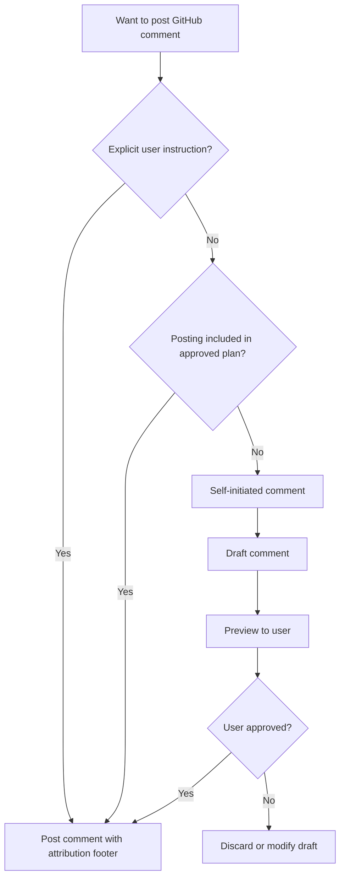

# GitHub Interaction Guidelines

## Purpose

This file defines the policy for coding agents to participate in GitHub discussions on existing pull requests and issues in the Reinhardt Cloud project. These rules ensure appropriate authorization, consistent formatting, and useful technical context when commenting on PRs and Issues.

---

## Language Requirements

### LR-1 (MUST): English-Only Comments

- **ALL** comments on PRs and Issues MUST be written in English
- Code references, file paths, and technical terms should use their original form
- This ensures accessibility for international contributors and maintainers

**Rationale:**
- Consistent with LR-1 in PR_GUIDELINE.md and ISSUE_GUIDELINES.md
- GitHub is an international platform
- English is the lingua franca of software development

---

## Posting Policy

### PP-1 (MUST): Posting Authorization Flow

Coding agents MUST follow this authorization model before posting any comment:

| Authorization Source | Action |
|---------------------|--------|
| Explicit user instruction | Post directly |
| Plan approval explicitly covering the comment/reply/review workflow | Post directly within that scope |
| Self-initiated (no instruction) | MUST preview and get user confirmation |

**Scope clarification (Reinhardt family Autonomous Operation Policy):** The Autonomous Operation Policy defined in `CLAUDE.md` / `AGENTS.md` does not authorize PR creation, Issue creation, comments, replies, or reviews without explicit user instruction. Posting comments, replies, or reviews on PRs/Issues still requires explicit user instruction or Plan Mode approval, even in the four repos covered by the autonomous policy.

Existing task authorization persists; do not request it again for the same scope.
PR creation alone does not authorize comments or thread resolution. If posting is
not authorized, finish independent local fixes and prepare concrete replies before
requesting the missing action. Approval of unrelated implementation work does not
authorize sending messages.

**Self-Initiated Comment Flow:**

1. Draft the comment content
2. Present the full preview to the user
3. Wait for explicit approval
4. Post only after confirmation

The following diagram summarizes the comment authorization decision flow:



### PP-2 (MUST): Content Preview Before Posting

Before posting any self-initiated comment:

1. Show the complete comment text to the user
2. Identify the target (PR number, Issue number, review thread)
3. Explain why this comment would be helpful
4. Wait for explicit approval or modification request

**Example Preview Format:**
```
Target: PR #42 - Review comment reply
Thread: crates/reinhardt-cloud-operator/src/reconciler.rs line 15

---
[Comment content here]
---

Shall I post this comment?
```

### PP-3 (MUST): Use GitHub CLI for Posting

Use `gh` for GitHub operations. If a previously selected GitHub MCP call fails,
switch to `gh` instead of repeatedly retrying it. Do not use browser automation or
raw HTTP as a substitute when the CLI is available.

Prepare multiline text in an owned temporary file and use `--body-file`; avoid
shell-interpolated comment bodies. Remove the file after it is no longer needed.

```bash
# After the corresponding posting action is authorized:
gh pr comment <number> --body-file /tmp/reinhardt-cloud-comment.md
gh issue comment <number> --body-file /tmp/reinhardt-cloud-comment.md
gh pr review <number> --comment --body-file /tmp/reinhardt-cloud-comment.md
```

---

## PR Review Response

### RR-1 (MUST): Responding to Review Comments

When responding to PR review comments:

1. Address the specific concern raised by the reviewer
2. Reference the exact code location being discussed
3. Provide technical justification for implementation decisions
4. Offer alternatives when the reviewer suggests changes

### RR-2 (SHOULD): Response Content Structure

Use this template for PR review responses:

```markdown
**Re: [Reviewer's concern summary]**

[Direct answer to the concern]

[Technical justification or explanation]

[Code reference if applicable]:
`path/to/file.rs:L42` - [Description of relevant code]

[Action taken or proposed]:
- [What was changed, or what will be changed]

🤖 Generated with [Claude Code](https://claude.com/claude-code)
```

### RR-3 (MUST): Code Reference Format

When referencing code in GitHub comments:

- **MUST** use repository-relative paths: `crates/reinhardt-cloud-operator/src/reconciler.rs`
- **MUST** include line numbers when referring to specific code: `crates/reinhardt-cloud-operator/src/reconciler.rs:L42`
- **MUST** use markdown code blocks with language specifiers for code snippets
- **NEVER** use absolute local paths (`/Users/...`, `/home/...`)

**Examples:**
```markdown
✅ Good: See `crates/reinhardt-cloud-operator/src/reconciler.rs:L150`
✅ Good: The implementation in `crates/reinhardt-cloud-operator/src/crd.rs:L42-L58`
❌ Bad: See `/Users/kent8192/Projects/reinhardt-cloud/crates/reinhardt-cloud-operator/src/reconciler.rs`
❌ Bad: Check line 150 (no file reference)
```

---

## PR Implementation Context

### PIC-1 (SHOULD): Providing Change Context for Reviewers

When providing implementation context on PRs, include:

```markdown
## Implementation Context

**Approach:** [Brief description of the approach taken]

**Key Changes:**
- `path/to/file.rs` - [What was changed and why]
- `path/to/other.rs` - [What was changed and why]

**Design Decisions:**
- [Decision 1]: [Rationale]
- [Decision 2]: [Rationale]

**Testing:**
- [What was tested and how]
- [Edge cases covered]

🤖 Generated with [Claude Code](https://claude.com/claude-code)
```

### PIC-2 (SHOULD): Impact Analysis Comments

When changes affect multiple crates or modules, provide impact analysis:

```markdown
## Impact Analysis

**Changed Crates:**
| Crate | Change Type | Impact |
|-------|------------|--------|
| `reinhardt-cloud-operator` | API addition | Non-breaking |
| `reinhardt-cloud-crd` | Behavior change | Breaking (see migration) |

**Cross-Crate Dependencies:**
- `reinhardt-cloud-operator` depends on `reinhardt-cloud-crd` — changes are forward-compatible

**Migration Required:** [Yes/No]
- [Migration steps if applicable]

🤖 Generated with [Claude Code](https://claude.com/claude-code)
```

---

## Copilot Review Handling

### CR-1 (MUST): Authorized Review Workflow

1. Collect the complete live inventory for the named PR and reviewer scope.
2. Evaluate each finding against the current code and project contracts.
3. Repair valid findings and run relevant checks in the authoritative worktree.
4. Commit and push only within existing authorization. Verify the local, upstream,
   remote branch, and PR head agree before describing a code fix as delivered.
5. Post an English reply with evidence before resolving each addressed thread,
   when both actions are authorized. Explain false positives or existing fixes.
6. After every push, collect a fresh full inventory. New actionable findings remain
   in scope; report the actual remaining count and CI state for the current head.

Do not resolve code findings whose fix is only local. Keep incomplete findings
open and identify the missing delivery or validation. Human feedback is not a bot
finding unless explicitly included in the task's review scope.

### CR-2 (MUST): Complete Review Inventory

Read inline threads, all comments in each thread, review bodies, and top-level
conversation comments. Never treat the first page as a complete inventory.
The installed review skill's inventory helper may provide this collection;
otherwise use `gh` pagination and retain IDs needed for replies/resolution.

This query paginates the outer thread connection:

```bash
gh api graphql --paginate -f owner='kent8192' -f repo='reinhardt-cloud' \
  -F pr=<PR_NUMBER> -f query='
query($owner: String!, $repo: String!, $pr: Int!, $endCursor: String) {
  repository(owner: $owner, name: $repo) {
    pullRequest(number: $pr) {
      headRefOid
      reviewThreads(first: 100, after: $endCursor) {
        pageInfo { hasNextPage endCursor }
        nodes {
          id
          isResolved
          isOutdated
          comments(first: 100) {
            pageInfo { hasNextPage endCursor }
            nodes { id author { login } body path line diffHunk }
          }
        }
      }
    }
  }
}'
```

Outer pagination does **not** paginate nested comments. For every thread whose
comment `hasNextPage` is true, retrieve that thread separately with the query below.
It starts from the first comment page; replace that thread's partial comment list
with the complete result, or deduplicate by comment ID.

```bash
gh api graphql --paginate -f threadId='<THREAD_ID>' -f query='
query($threadId: ID!, $endCursor: String) {
  node(id: $threadId) {
    ... on PullRequestReviewThread {
      comments(first: 100, after: $endCursor) {
        pageInfo { hasNextPage endCursor }
        nodes { id author { login } body path line diffHunk }
      }
    }
  }
}'

gh api --paginate 'repos/kent8192/reinhardt-cloud/pulls/<PR_NUMBER>/reviews'
gh api --paginate 'repos/kent8192/reinhardt-cloud/issues/<PR_NUMBER>/comments'
```

Match verified reviewer identities, such as `copilot-pull-request-reviewer[bot]`,
and track unresolved threads separately from body-level findings. An outdated
thread is not necessarily resolved. Reconcile summary/body duplicates with their
inline finding rather than counting them twice.

If a review has not appeared, report that once and continue independent work.
Use a persistent monitor only when future monitoring was requested; do not poll an
unchanged PR in a loop or imply that an absent review passed.

### CR-3 (MUST): Evaluating and Responding to Comments

Evaluate each Copilot comment against these categories:

| Category | Action | Response |
|----------|--------|----------|
| Valid concern | Fix, verify, and deliver when authorized | Reply with delivered fix evidence → Resolve |
| False positive | No code change | Reply with technical explanation → Resolve |
| Already addressed | No code change | Reply with reference to existing handling → Resolve |

**Response Template (extends RR-2):**

For valid concerns with code fix:
```markdown
**Fixed:** [Brief description of the fix]

[Technical explanation of the change]

Commit: [commit hash] — `path/to/file.rs:L42`

🤖 Generated with [Claude Code](https://claude.com/claude-code)
```

For false positives or already addressed:
```markdown
**Re: [Copilot's concern summary]**

[Technical explanation of why this is not an issue or is already handled]

Reference: `path/to/file.rs:L42` — [Description of existing handling]

🤖 Generated with [Claude Code](https://claude.com/claude-code)
```

**Guidelines:**
- Follow RR-3 for code reference format (repository-relative paths)
- Follow FF-1 for the actual agent attribution footer
- Follow CG-2 content restrictions (no absolute paths, no user request details)
- Every thread MUST receive a reply before being resolved (no silent resolves)

### CR-4 (MUST): Resolving Threads via GraphQL

Confirm reply/resolution authorization and delivered fix evidence first. Prepare
an English reply file with repository-relative references and actual-agent
attribution. Delete the owned temporary file after posting.

**Step 1: Reply to the thread**

```bash
gh api graphql -f query='
mutation($threadId: ID!, $body: String!) {
  addPullRequestReviewThreadReply(input: {
    pullRequestReviewThreadId: $threadId,
    body: $body
  }) {
    comment {
      id
    }
  }
}' -f threadId='<THREAD_ID>' -F body=@/tmp/reinhardt-cloud-review-reply.md
```

**Step 2: Resolve the thread**

```bash
gh api graphql -f query='
mutation($threadId: ID!) {
  resolveReviewThread(input: {
    threadId: $threadId
  }) {
    thread {
      isResolved
    }
  }
}' -f threadId='<THREAD_ID>'
```

**Rules:**
- **MUST** reply before resolving (CR-3 compliance)
- **NEVER** resolve a thread without posting a reply first
- Verify `isResolved: true` in the mutation response and re-read the full inventory before reporting completion

### CR-5 (SHOULD): Completion Summary

After processing all Copilot review threads, report a summary to the user:

**Summary Format:**

```markdown
## Copilot Review Handling Summary

| # | File | Line | Category | Action |
|---|------|------|----------|--------|
| 1 | `path/to/file.rs` | L42 | Valid concern | Fixed (commit abc1234) |
| 2 | `path/to/other.rs` | L15 | False positive | Explained |
| 3 | `path/to/third.rs` | L88 | Already addressed | Referenced |

**Commits created:** 1
**Threads resolved:** 3 / 3
```

---

## Issue Discussion

### ID-1 (MUST): Issue Comment Guidelines

When commenting on issues:

1. **Stay on topic** — address the specific issue being discussed
2. **Be actionable** — provide information that helps resolve the issue
3. **Reference code** — link to relevant source code using repository-relative paths
4. **Avoid noise** — do not post comments that add no value (e.g., "+1", "same here")

### ID-2 (SHOULD): Implementation Context for Issues

When providing implementation context for issue discussion:

```markdown
## Technical Analysis

**Current Behavior:**
[Description of current behavior with code references]

**Root Cause:**
[Analysis of why the issue occurs]
- `path/to/file.rs:L42` - [Relevant code explanation]

**Proposed Solution:**
[Description of proposed fix or implementation]

**Affected Components:**
- [Component 1]: [How it's affected]
- [Component 2]: [How it's affected]

**Estimated Scope:** [Small/Medium/Large]
- Files to modify: [count]
- Tests to add/update: [count]

🤖 Generated with [Claude Code](https://claude.com/claude-code)
```

---

## GitHub Discussions

### GD-1 (SHOULD): Discussions vs Issues

Use GitHub Discussions for:
- Usage questions and how-to inquiries
- Ideas and brainstorming
- General community discussion

Use Issues for:
- Bug reports with reproduction steps
- Feature requests with clear requirements
- Documentation errors
- Performance issues with benchmarks

**Discussion URL:** https://github.com/kent8192/reinhardt-cloud/discussions

### GD-2 (SHOULD): Redirecting Questions

When encountering question-type Issues that are better suited for Discussions:
- Politely suggest GitHub Discussions as a more appropriate venue
- Provide the Discussions URL
- Follow PP-1 authorization policy before posting redirect comments

---

## Agent Context Provision

### AC-1 (SHOULD): Structured Context for Coding Agents

When providing context for external coding agents on Issues or PRs, use structured formats that are easily parseable by both humans and machines.

### AC-2 (SHOULD): Agent Context Template

Use [TASK_PROMPTS.md](TASK_PROMPTS.md) for full task templates. When authorized to
provide implementation context on GitHub, include only the information relevant
to the task; examples are not blanket file restrictions or proof of test results.

```markdown
## Agent Context

- Outcome: [observable behavior]
- Entry points: [repository-relative files and symbols]
- Constraints: [version, compatibility, ownership, and explicit hard boundaries]
- Acceptance: [verifiable behavior and failure cases]
- Verification: [affected tests/targets; broaden only for stated impact]
- Delivery: [authorized local, push, PR, or review actions]
- Remaining dependencies: [concrete unresolved prerequisites, if any]
```

Keep credentials and local machine paths out of external context. Add the actual
agent's footer according to FF-1. A request for implementation does not implicitly
request another agent, publication, merge, or production deployment.

---

## Content Guidelines

### CG-1 (MUST): What to Include

- Technical explanations and justifications
- Code references with repository-relative paths and line numbers
- Relevant error messages or log output (wrapped in `<details>` if long)
- Links to related issues, PRs, or documentation
- Structured data (tables, lists) for complex information

### CG-2 (MUST): What to Avoid

- **User requests or AI interaction details** — never mention "user asked me to..." or "I was instructed to..."
- **Absolute local paths** — never include `/Users/...`, `/home/...`, or other machine-specific paths
- **Sensitive information** — never include credentials, tokens, API keys, or private configuration
- **Unfolded long output** — wrap long logs, stack traces, or code blocks in `<details>` tags

```markdown
<details>
<summary>Full error output</summary>

\`\`\`
[long output here]
\`\`\`

</details>
```

- **Speculation without evidence** — state uncertainty explicitly
- **Non-actionable comments** — every comment should provide value or move discussion forward

---

## Footer Format

### FF-1 (MUST): Actual Agent Attribution

For Codex-authored comments, replies, reviews, and PR content:

```markdown
🤖 Generated with [Codex](https://openai.com/codex)
```

For Claude Code-authored content, use its own footer instead:

```markdown
🤖 Generated with [Claude Code](https://claude.com/claude-code)
```

Match the authoring agent even when a template names a different one. Place the
footer at the end, separated by one blank line. `Co-Authored-By` belongs in commits,
not comments. Earlier examples illustrate Claude Code content; Codex replaces that
footer according to this rule.

---

## Quick Reference

### ✅ MUST DO

- Get authorization before posting (explicit instruction or Plan Mode approval)
- Preview self-initiated comments and wait for user confirmation
- Write ALL comments in English
- Use `gh` for authorized posting
- Include the actual agent attribution footer on all comments
- Use repository-relative paths for code references
- Include line numbers when referencing specific code
- Use markdown code blocks with language specifiers
- Wrap long output in `<details>` tags
- Stay on topic and be actionable
- Collect complete review inventories and handle in-scope feedback when authorized
- Evaluate Copilot suggestions against project conventions before accepting
- Resolve all Copilot review conversations before considering PR complete

### ❌ NEVER DO

- Post comments without authorization (explicit instruction or Plan Mode approval)
- Post self-initiated comments without previewing and getting confirmation
- Include absolute local paths (`/Users/...`, `/home/...`)
- Include user requests or AI interaction details in comments
- Include sensitive information (credentials, tokens, API keys)
- Post non-actionable or noise comments ("+1", "same here")
- Skip the actual agent attribution footer
- Post vague comments without code references or technical detail
- Use raw `curl` or browser automation for GitHub operations when `gh` is available
- Reference code without file path and line number

---

## Related Documentation

- **Pull Request Guidelines**: [PR_GUIDELINE.md](PR_GUIDELINE.md)
- **Issue Guidelines**: [ISSUE_GUIDELINES.md](ISSUE_GUIDELINES.md)
- **Commit Guidelines**: [COMMIT_GUIDELINE.md](COMMIT_GUIDELINE.md)
- **Documentation Standards**: [DOCUMENTATION_STANDARDS.md](DOCUMENTATION_STANDARDS.md)
- **Main Quick Reference**: [AGENTS.md](../AGENTS.md#quick-reference) / [CLAUDE.md](../CLAUDE.md#quick-reference)

---

**Note**: This document focuses on commenting and interacting with existing PRs and Issues. For creating PRs, see instructions/PR_GUIDELINE.md. For creating Issues, see instructions/ISSUE_GUIDELINES.md.
