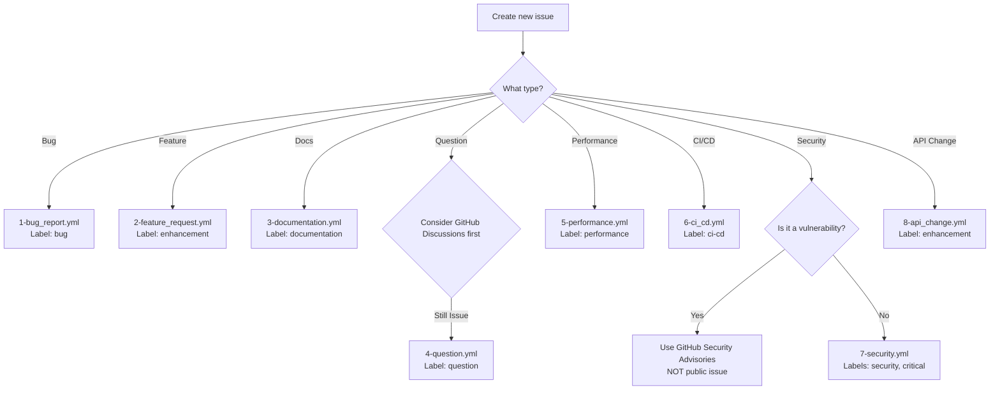
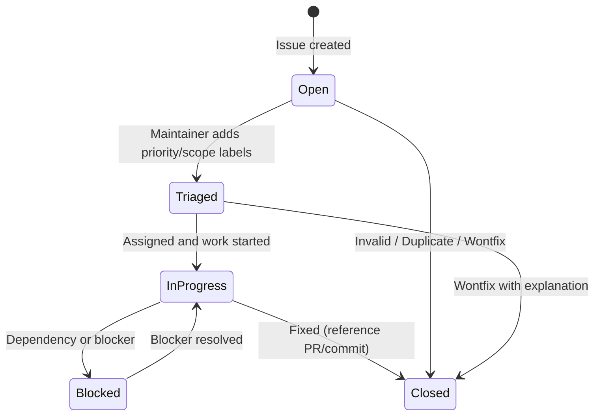

# Issue Guidelines

## Purpose

This file defines the issue policy for the Nuages project. These rules ensure clear issue tracking, proper labeling, and consistent issue management.

---

## Language Requirements

### LR-1 (MUST): English-Only Content

**ALL issue titles, descriptions, and comments MUST be written in English.**

- Issue titles MUST be in English
- Issue descriptions MUST be in English
- All comments within issues MUST be in English
- Code examples and error messages may use their original language

**Rationale:** English ensures accessibility for all contributors and maintainers worldwide.

---

## Issue Creation Policy

### IC-1 (MUST): Use GitHub Tools

Issues MUST be created using:
- GitHub Web Interface
- GitHub CLI (`gh issue create`)
- GitHub MCP server

**Example (GitHub CLI):**
```bash
gh issue create --title "Bug: Reconciler panics on missing Deployment" --body "Description..."
```

### IC-2 (MUST): Search Before Creating

**ALWAYS** search existing issues before creating a new one:
1. Search open and closed issues
2. Check if the issue has already been reported
3. Review related issues for context

**Example:**
```bash
gh issue list --search "reconciler panic"
gh issue list --state closed --search "deployment"
```

### IC-3 (MUST): Use Issue Templates

Issues MUST be created using the appropriate issue template:
- Bug Report (`.github/ISSUE_TEMPLATE/1-bug_report.yml`)
- Feature Request (`.github/ISSUE_TEMPLATE/2-feature_request.yml`)
- Documentation (`.github/ISSUE_TEMPLATE/3-documentation.yml`)
- Question (`.github/ISSUE_TEMPLATE/4-question.yml`)
- Performance Issue (`.github/ISSUE_TEMPLATE/5-performance.yml`)
- CI/CD Issue (`.github/ISSUE_TEMPLATE/6-ci_cd.yml`)
- Security Vulnerability (`.github/ISSUE_TEMPLATE/7-security.yml`)
- API Change Proposal (`.github/ISSUE_TEMPLATE/8-api_change.yml`)

**Template Selection:**
| Issue Type | Template File | Label Applied |
|------------|--------------|---------------|
| Bug report | `.github/ISSUE_TEMPLATE/1-bug_report.yml` | `bug` |
| Feature request | `.github/ISSUE_TEMPLATE/2-feature_request.yml` | `enhancement` |
| Documentation | `.github/ISSUE_TEMPLATE/3-documentation.yml` | `documentation` |
| Question | `.github/ISSUE_TEMPLATE/4-question.yml` | `question` |
| Performance | `.github/ISSUE_TEMPLATE/5-performance.yml` | `performance` |
| CI/CD | `.github/ISSUE_TEMPLATE/6-ci_cd.yml` | `ci-cd` |
| Security | `.github/ISSUE_TEMPLATE/7-security.yml` | `security`, `critical` |
| API change proposal | `.github/ISSUE_TEMPLATE/8-api_change.yml` | `enhancement` |

**CLI Template Usage:**

When creating issues via `gh issue create`, GitHub CLI does not automatically apply templates like the Web UI. Read the appropriate template file from `.github/ISSUE_TEMPLATE/` and include its structure in your `--body` content.

**Note:** For security vulnerabilities, ALWAYS use GitHub Security Advisories instead of public issues.

The following diagram illustrates the template selection decision tree:



---

## Issue Title Format

### IT-1 (MUST): Clear and Descriptive

Issue titles MUST be:
- **Specific**: Clearly describe the problem or request
- **Concise**: Maximum 72 characters for readability
- **Uppercase Start**: Begin with uppercase letter
- **Professional**: Use technical language

**Examples:**

| Type | Example Title |
|------|---------------|
| Bug | `Bug: Reconciler panics when Deployment is missing namespace` |
| Feature | `Feature: Add KEDA ScaledObject support for autoscaling` |
| Performance | `Performance: Slow reconciliation loop under high pod count` |
| Documentation | `Docs: Missing migration guide for CRD v1alpha1 to v1beta1` |
| CI/CD | `CI: Integration tests failing on Kubernetes 1.29` |
| Security | `Security: Operator service account has overly broad RBAC permissions` |
| Question | `Question: How to configure custom reconciliation interval?` |

**Title Quality:**

- ❌ Bad: "Fix bug" (too vague)
- ❌ Bad: "performance issue" (unclear what)
- ❌ Bad: "add feature" (which feature?)
- ✅ Good: "Bug: Reconciler panics when Deployment is missing namespace"
- ✅ Good: "Feature: Add KEDA ScaledObject reconciliation support"

---

## Issue Labels

### IL-1 (MUST): Apply Type Labels

**ALL issues MUST have at least one type label:**

| Label | Color | Description |
|-------|-------|-------------|
| `bug` | #d73a4a | Confirmed bug or unexpected behavior |
| `enhancement` | #a2eeef | New feature or improvement request |
| `documentation` | #0075ca | Documentation issues or improvements |
| `question` | #d876e3 | Questions about usage or implementation |
| `performance` | #fbca04 | Performance-related issues |
| `ci-cd` | #2cbe4e | CI/CD workflow issues |
| `security` | #ee0701 | Security vulnerabilities or concerns |

### IL-2 (SHOULD): Apply Priority and Scope Labels

**Priority Labels:**

| Label | Color | Description |
|-------|-------|-------------|
| `critical` | #b60205 | Blocks release or major functionality |
| `high` | #d93f0b | Important fix or feature |
| `medium` | #fbca04 | Normal priority |
| `low` | #0e8a16 | Minor fix or enhancement |

**Scope Labels:**

| Label | Color | Description |
|-------|-------|-------------|
| `operator` | #ededed | Kubernetes operator logic |
| `crd` | #ededed | Custom Resource Definitions |
| `reconciler` | #ededed | Reconciliation loop |
| `rbac` | #ededed | RBAC roles and permissions |
| `database` | #ededed | Database layer |
| `api` | #ededed | API layer |

**Status Labels:**

| Label | Color | Description |
|-------|-------|-------------|
| `good first issue` | #7057ff | Suitable for new contributors |
| `help wanted` | #008672 | Community contributions welcome |
| `duplicate` | #cfd3d7 | Duplicate of another issue |
| `invalid` | #e4e669 | Not a valid issue |
| `wontfix` | #ffffff | Will not be fixed (intentional) |
| `needs more info` | #fef2c0 | Awaiting additional information |

### IL-3 (MUST): Agent-Detected Issue Labels

Issues created by LLM agent bug discovery MUST include the `agent-suspect` label:

| Label | Color | Description |
|-------|-------|-------------|
| `agent-suspect` | #d4c5f9 | Agent-detected issue pending independent verification |

**Rules:**
- ALL agent-detected issues MUST have `agent-suspect` label at creation
- The label is removed ONLY after independent verification confirms the issue
- Independent verification requires a separate agent (with independent context) or human review
- The verifying entity MUST NOT have participated in the initial detection

---

## Issue Lifecycle

### LC-1 (MUST): Triage Process

**New Issues:**

1. **Automatic Labeling**: Issue template applies type label
2. **Maintainer Review**: Triage within 48 hours
3. **Label Enhancement**: Add priority and scope labels
4. **Assignment**: Assign to maintainer or contributor

The following diagram shows the issue lifecycle state transitions:



### LC-2 (MUST): Issue Hygiene

**Issue Closure:**

- **Fixed**: Close with comment describing fix and referencing PR/commit
- **Duplicate**: Close with reference to original issue
- **Wontfix**: Close with explanation of why it won't be fixed
- **Invalid**: Close with explanation

---

## Security Issues

### SEC-1 (MUST): Private Disclosure

**Security vulnerabilities MUST be reported privately:**

1. **DO NOT** create public issues for security vulnerabilities
2. **DO** use GitHub Security Advisories for private reporting

**How to Report:**

Via GitHub Security Advisories (Recommended):
```
https://github.com/kent8192/nuages/security/advisories
```

---

## Quick Reference

### ✅ MUST DO

- Write ALL issue content in English (no exceptions)
- Search existing issues before creating new ones
- Use appropriate issue templates for ALL issues
- Apply at least one type label to every issue
- Report security vulnerabilities privately via GitHub Security Advisories
- Provide minimal reproduction code for bug reports
- Include environment details (Rust version, Kubernetes version, OS)
- Be specific in issue titles (max 72 characters)
- Apply `agent-suspect` label to all agent-detected bug issues
- Verify agent-detected bugs independently before removing `agent-suspect` label
- Report upstream reinhardt-web issues immediately upon discovery (see instructions/UPSTREAM_ISSUE_REPORTING.md)

### ❌ NEVER DO

- Create public issues for security vulnerabilities
- Create duplicate issues without searching first
- Skip issue templates when creating issues
- Use non-English in issue titles or descriptions
- Create issues without appropriate labels
- Apply `release` label to issues (only for PRs)
- Submit bug reports without reproduction steps
- Leave issues inactive without response
- Remove `agent-suspect` label without independent verification

---

## Related Documentation

- **Pull Request Guidelines**: instructions/PR_GUIDELINE.md
- **Issue Handling Principles**: instructions/ISSUE_HANDLING.md
- **Upstream Issue Reporting**: instructions/UPSTREAM_ISSUE_REPORTING.md
- **Commit Guidelines**: instructions/COMMIT_GUIDELINE.md
- **Security Policy**: SECURITY.md
- **Label Definitions**: .github/labels.yml

---

**Note**: This document focuses on issue creation and management. For pull request guidelines, see instructions/PR_GUIDELINE.md.
