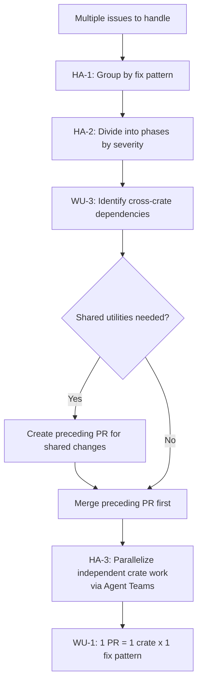
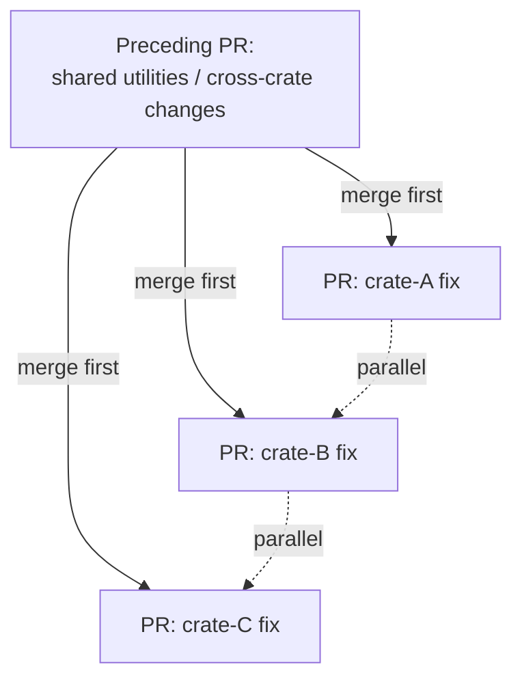

# Issue Handling Principles

## Purpose

This file defines strategic principles for handling multiple issues efficiently. While instructions/ISSUE_GUIDELINES.md covers individual issue creation and management, this document provides workflow-level guidance for planning, batching, and parallelizing issue resolution across the Nuages project's multi-crate workspace.

---

## Handling Approach

The following diagram summarizes the batch issue processing workflow:



### HA-1 (SHOULD): Fix Pattern Batch Processing

Group issues by fix pattern (the technique or approach used to resolve them) and process them as a batch.

**Rationale:** When multiple issues require the same type of fix (e.g., error handling improvement, RBAC permission update, CRD validation), addressing them together reduces context-switching overhead and ensures consistency.

**Example:**

| Fix Pattern | Issues |
|-------------|--------|
| Error handling | #101 (reconciler panic), #103 (nil pointer), #107 (missing error context) |
| RBAC | #102 (overly broad permissions), #105 (missing watch verb) |
| Dependency update | #104 (outdated kube-rs), #106 (vulnerable serde version) |

**Application:**
1. Categorize open issues by their fix approach
2. Identify common patterns that span multiple issues
3. Address each pattern group as a cohesive work unit

### HA-2 (SHOULD): Phase Division by Severity

Divide batch work into phases ordered by severity and exploitability, addressing the most critical issues first.

**Phase Example:**

| Phase | Severity | Description | Issues |
|-------|----------|-------------|--------|
| Phase 1 | Critical | Actively exploitable vulnerabilities or production crashes | #101, #103 |
| Phase 2 | High | Significant risk but harder to exploit | #107, #102 |
| Phase 3 | Medium | Important improvements | #104, #105, #106 |

### HA-3 (SHOULD): Agent Team Parallel Work

Use Agent Teams to parallelize work across independent crates within the same phase.

**Rationale:** When fixes in different crates are independent (no shared code changes required), they can be implemented simultaneously by different agents, reducing total elapsed time.

**Prerequisites for parallelization:**
- Fixes are in separate crates with no shared dependencies being modified
- No cross-crate utility or shared code changes are needed
- Each agent can complete its work independently

**Example:**
```
Phase 1 (parallel work):
  Agent A → nuages-operator (fix #101)
  Agent B → nuages-crd (fix #103)
  Agent C → nuages-webhook (fix #107)
```

### HA-4 (MUST): Branch Organization

Organize work into branches with descriptive names. Each work unit MUST produce logically grouped PRs.

**Branch naming:**
```
<type>/<description>

Examples:
fix/reconciler-panic-on-missing-deployment
fix/rbac-least-privilege
security/operator-permission-hardening
```

**Rules:**
- One branch per logical work unit (see WU-1)
- Branch names MUST NOT include internal metadata such as phase numbers, agent states, or workflow identifiers
- Branch names MUST be descriptive and understandable to other developers without project-specific context
- Branches may contain multiple commits if they follow commit guidelines (@instructions/COMMIT_GUIDELINE.md)

---

## Work Unit Principles

### WU-1 (MUST): Basic Work Unit

**1 PR = 1 crate × 1 fix pattern** is the basic work unit for batch issue handling.

**Rationale:** This granularity ensures PRs are focused, reviewable, and independently mergeable.

**Examples:**

| PR | Crate | Fix Pattern | Issues Addressed |
|----|-------|-------------|------------------|
| PR #1 | nuages-operator | Error handling | #101 |
| PR #2 | nuages-crd | Error handling | #103 |
| PR #3 | nuages-webhook | Error handling | #107 |

### WU-2 (SHOULD): Same-Crate Combination

Related issues within the same crate MAY be combined into a single PR when they share context or the fixes are interrelated.

**When to combine:**
- Fixes touch the same files or modules
- One fix naturally addresses another issue
- Fixes are tightly related (e.g., two RBAC permission issues in the same role)

**When NOT to combine:**
- Fixes are in different modules with no shared context
- Combining would make the PR too large (>400 lines)
- Fixes are for different severity levels

### WU-3 (MUST): Cross-Crate Preceding PRs

When batch fixes require shared utilities or cross-crate changes, these MUST be created as preceding PRs before per-crate fix PRs.

**Rationale:** Shared changes must be merged first to avoid merge conflicts and ensure each per-crate PR has a stable foundation.

**Workflow:**
```
Step 1: PR "feat(crd): add shared error type for operator errors"
  → Merged first

Step 2 (parallel, after Step 1 merge):
  PR "fix(operator): apply structured error handling to reconciler"
  PR "fix(webhook): apply structured error handling to admission webhook"
  PR "fix(controller): apply structured error handling to controller"
```

**Rules:**
- Preceding PRs MUST be merged before dependent PRs
- Preceding PRs SHOULD be minimal — only the shared code needed
- Per-crate PRs MUST reference the preceding PR in their description
- Never duplicate shared logic across crate-specific PRs

The following diagram illustrates the WU-3 dependency structure:



---

## Workflow Example

**Scenario:** 6 issues identified across 3 crates.

**Step 1: Categorize by fix pattern (HA-1)**

| Fix Pattern | Issues | Crates Affected |
|-------------|--------|-----------------|
| Error handling | #101, #103, #107 | operator, crd, webhook |
| RBAC | #102, #105 | operator, webhook |
| Dependency update | #104 | (workspace-level) |

**Step 2: Divide into phases by severity (HA-2)**

| Phase | Issues | Fix Pattern |
|-------|--------|-------------|
| Phase 1 | #101, #103, #107 | Error handling (critical) |
| Phase 2 | #102, #105 | RBAC (high) |
| Phase 3 | #104 | Dependency update (medium) |

**Step 3: Identify cross-crate dependencies (WU-3)**

Phase 1 requires shared error types → preceding PR needed.

**Step 4: Execute Phase 1**

```
Commit 1 (preceding): "feat(crd): add structured error types for operator errors"
  → PR #A, merge first

Commits 2-4 (parallel via Agent Team, HA-3):
  "fix(operator): apply structured error handling to reconciler"   → PR #B
  "fix(crd): apply structured error handling to validation"       → PR #C
  "fix(webhook): apply structured error handling to admission"    → PR #D
```

---

## Upstream Issue Reporting

When issues in upstream dependencies (e.g., reinhardt-web) are discovered during Nuages development, they MUST be reported immediately to the upstream repository. See **instructions/UPSTREAM_ISSUE_REPORTING.md** for the full policy, including:

- Immediate reporting requirement (UR-1)
- GitHub CLI usage with `-R` flag (UR-2)
- Cross-referencing between Nuages and upstream issues (UR-4)
- Workaround policy (WP-1, WP-2)

---

## Quick Reference

### ✅ MUST DO
- Use 1 PR = 1 crate × 1 fix pattern as the basic work unit (WU-1)
- Create preceding PRs for cross-crate shared changes before per-crate fix PRs (WU-3)
- Use descriptive branch names without internal metadata (HA-4)
- Merge preceding PRs before dependent per-crate PRs (WU-3)
- Report upstream issues in reinhardt-web immediately upon discovery (UR-1)

### ❌ NEVER DO
- Mix changes to unrelated crates in a single issue-fix PR
- Mix unrelated fix patterns in a single PR
- Skip preceding PRs for cross-crate shared utilities
- Duplicate shared logic across crate-specific PRs instead of extracting to a preceding PR
- Delay reporting upstream issues discovered during Nuages development
- Implement workarounds without creating an upstream issue first

---

## Related Documentation

- **Issue Guidelines**: instructions/ISSUE_GUIDELINES.md
- **Upstream Issue Reporting**: instructions/UPSTREAM_ISSUE_REPORTING.md
- **Pull Request Guidelines**: instructions/PR_GUIDELINE.md
- **Commit Guidelines**: instructions/COMMIT_GUIDELINE.md
- **GitHub Interaction**: instructions/GITHUB_INTERACTION.md

---

**Note**: This document provides strategic guidance for batch issue handling. For individual issue creation and management, see instructions/ISSUE_GUIDELINES.md. For PR formatting and review process, see instructions/PR_GUIDELINE.md.
