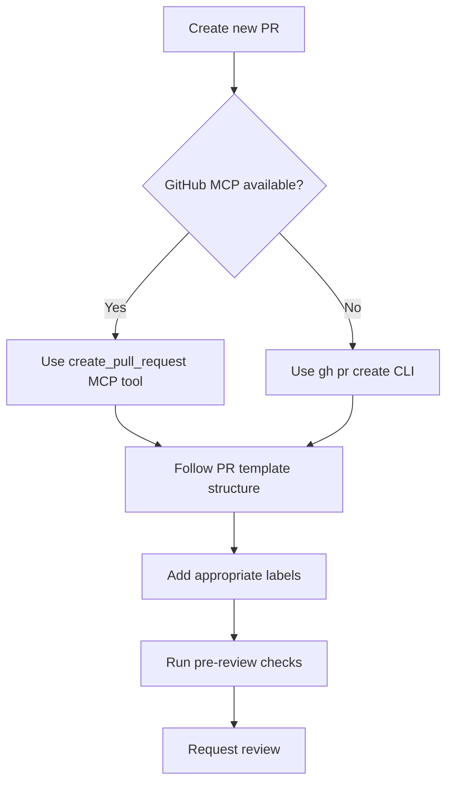
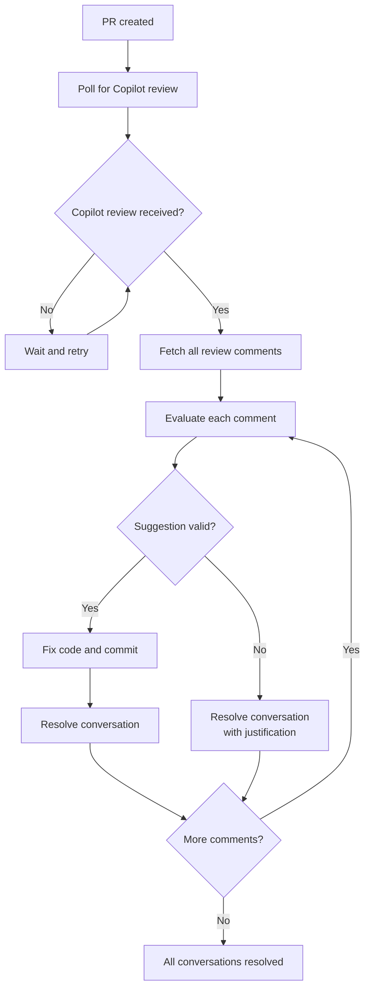
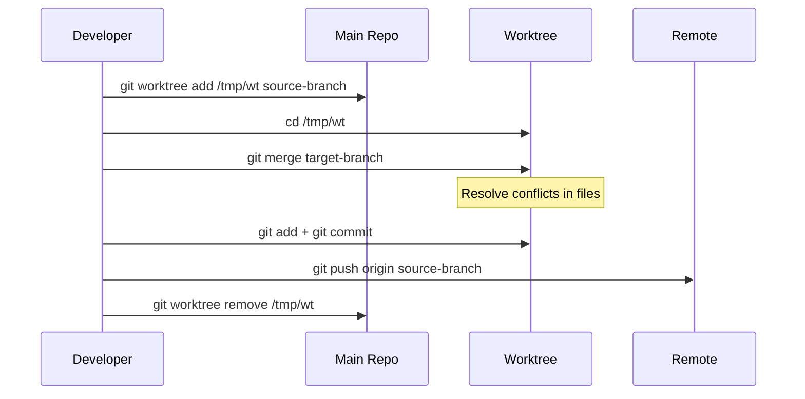

# Pull Request Guidelines

## Purpose

This file defines the pull request (PR) policy for the Reinhardt Cloud project. These rules ensure clear communication, proper review process, and consistent PR formatting across the development lifecycle.

---

## Language Requirements

### LR-1 (MUST): English-Only Policy

- **ALL** PR titles MUST be written in English
- **ALL** PR descriptions MUST be written in English
- **ALL** PR comments and discussions MUST be written in English
- This ensures accessibility for international contributors and maintainers

---

## PR Creation Policy

### PC-1 (MUST): Use GitHub MCP or CLI

- **MUST** prefer GitHub MCP tools (`create_pull_request`) for creating pull requests when available
- **Fallback**: Use GitHub CLI (`gh pr create`) when GitHub MCP is not available
- **NEVER** use web browser UI for PR creation when MCP or CLI is available
- **Autonomy (Reinhardt family)**: Creating a **Draft** PR is authorized without further user confirmation in `reinhardt-web` / `reinhardt-cloud` / `awesome-delions` / `reinhardt-cc` (see Autonomous Operation Policy in `CLAUDE.md` / `AGENTS.md`); the Draft PR body MUST still follow `.github/PULL_REQUEST_TEMPLATE.md` and `--draft` MUST be passed. Marking a PR as Ready for Review is also authorized autonomously once the implementation is complete (CI completion is **not** required).

The following diagram summarizes the PR creation flow:



**PR Template Location:** `.github/PULL_REQUEST_TEMPLATE.md`

**Example:**
```bash
gh pr create --title "feat(reconciler): add exponential backoff to error policy" \
  --body "$(cat <<'EOF'
## Summary

- Implement exponential backoff in reconciler error policy
- Add configurable max retry duration
- Include unit tests for backoff calculation

## Test plan

- [x] `cargo make test` passes
- [x] All existing tests pass
- [x] Manual testing with simulated API errors

🤖 Generated with [Claude Code](https://claude.com/claude-code)
EOF
)"
```

### PC-2 (MUST): Follow PR Template Structure

**PR Template Location:** `.github/PULL_REQUEST_TEMPLATE.md`

When creating PRs via `gh pr create`, the `--body` content MUST follow the PR template structure defined in `.github/PULL_REQUEST_TEMPLATE.md`.

**CLI Note:** GitHub CLI does not automatically apply the PR template like the Web UI. Read the template file and include its structure in your `--body` content.

### PC-3 (MUST): Branch Naming

- Branch names SHOULD follow the pattern: `<type>/<scope>-<short-description>`
- Types: `feature`, `fix`, `refactor`, `docs`, `test`, `chore`, etc.
- Scope: Module or component name
- Short description: Kebab-case brief summary

**Examples:**
```
feature/crd-project-definition
fix/reconciler-nil-pointer-on-missing-deployment
refactor/operator-controller-structure
docs/api-crd-reference
test/operator-integration-tests
chore/ci-update-kubernetes-version
```

### PC-4 (SHOULD): Draft PRs for Work in Progress

- Use draft PRs for incomplete work
- Convert to Ready for Review **once the implementation is complete** — CI completion is **not** a prerequisite (the Reinhardt-family Autonomous Operation Policy in `CLAUDE.md` / `AGENTS.md` overrides any "wait for all tests to pass" criterion for the Draft→Ready transition)
- Draft PRs allow early feedback without formal review requests

**Example:**
```bash
gh pr create --draft --title "feat(crd): add Project CRD (WIP)"

# Convert to Ready once implementation is complete (no need to wait for CI):
gh pr ready <number>
```

### PC-5 (MUST): PR Labels

- **MUST** add appropriate labels to every PR
- Use GitHub MCP, GitHub CLI, or web UI to add labels

**Required Labels by PR Type:**

| PR Type | Required Label | Additional Labels |
|---------|---------------|-------------------|
| New feature | `enhancement` | Scope-specific labels |
| Bug fix | `bug` | Severity labels if available |
| Documentation | `documentation` | - |
| Dependency updates | `dependencies` | - |

**Label Application Examples:**

```bash
# Feature PR with label
gh pr create --title "feat(crd): add Project CRD" \
  --label enhancement

# Bug fix PR with label
gh pr create --title "fix(reconciler): resolve nil pointer on missing deployment" \
  --label bug

# Documentation PR with label
gh pr create --title "docs(crd): update CRD API reference" \
  --label documentation

# Dependency update PR with label
gh pr create --title "chore(deps): bump kube-rs from 0.88 to 0.89" \
  --label dependencies
```

**Adding Labels to Existing PR:**

```bash
# Add single label
gh pr edit <number> --add-label enhancement

# Add multiple labels
gh pr edit <number> --add-label bug,help wanted

# Remove label
gh pr edit <number> --remove-label invalid
```

---

## PR Title Format

### TF-1 (MUST): Follow Conventional Commits

PR titles MUST follow the same format as commit messages:

```
<type>[optional scope][optional !]: <description>

Examples:
feat(crd): add Project custom resource definition
fix(reconciler): resolve nil pointer dereference in status update
feat(operator)!: change CRD group from reinhardt-cloud.dev to paas.reinhardt-cloud.dev
```

**Requirements:**
- **Type**: One of the defined types (feat, fix, refactor, docs, etc.)
- **Scope**: Module or component name (OPTIONAL but RECOMMENDED)
- **Breaking Change Indicator**: Append `!` for breaking changes
- **Description**: Concise summary in English
  - **MUST** start with lowercase letter
  - **MUST** be specific and descriptive
  - **MUST NOT** end with a period
  - Keep under 72 characters for readability

**See**: @instructions/COMMIT_GUIDELINE.md for detailed commit type definitions

---

## PR Description Format

### DF-1 (MUST): Standard Structure

PR descriptions MUST follow the structure defined in `.github/PULL_REQUEST_TEMPLATE.md`.

**Required Sections:** Summary, Type of Change, Motivation and Context, How Was This Tested, Checklist, Labels to Apply

**Optional Sections:** Performance Impact, Breaking Changes, Screenshots, Related Issues, Additional Context

**Footer:** Include Claude Code attribution for AI-assisted PRs

### DF-2 (MUST): Linking PRs to Issues

PRs should be linked to related issues using GitHub's supported keywords:
- `close`, `closes`, `closed`
- `fix`, `fixes`, `fixed`
- `resolve`, `resolves`, `resolved`

**Examples:**
```markdown
## Related Issues

Fixes #42
Closes #43, closes #44
Refs #50 (related but not closed)
```

**Important Notes:**
- Keywords only work when PR targets the **default branch** (main)
- Use `Refs #N` for related issues that should NOT be auto-closed

### DF-3 (SHOULD): Additional Context

Include additional sections when relevant:

- **Migration Guide**: For breaking changes with complex migration
- **Performance Impact**: For performance-related changes
- **Security Considerations**: For security-related changes
- **Kubernetes Compatibility**: Note minimum Kubernetes version if applicable

---

## PR Review Process

### RP-1 (MUST): Pre-Review Checklist

Before requesting review, ensure:

- [ ] All CI checks pass
- [ ] All tests pass locally
- [ ] Code follows project style guidelines
- [ ] Documentation is updated
- [ ] Commit history is clean and logical
- [ ] PR description is complete and accurate

**Commands to run:**
```bash
cargo check --workspace --all --all-features
cargo make test
cargo make fmt-check
cargo make clippy-check
```

### RP-2 (SHOULD): Self-Review

- Review your own PR before requesting review from others
- Check for:
  - Unnecessary debug code or comments
  - Proper error handling (no panics in reconcilers)
  - Test coverage
  - Documentation completeness
  - Code clarity and readability

### RP-3 (MUST): Address Review Comments

- Respond to all review comments
- Mark conversations as resolved when addressed
- Request re-review after making changes
- Be respectful and constructive in discussions

### RP-6 (MUST): Copilot Review Workflow

After creating a PR, Claude Code MUST wait for GitHub Copilot's automated review and handle it as part of the PR completion process.

**Workflow:**

1. **Wait for Copilot review** — After PR creation, poll for Copilot's review using `gh pr checks` and `gh api` to monitor review status
2. **Retrieve review comments** — Once Copilot review arrives, fetch all review comments using `gh pr view <number> --comments` and `gh api repos/{owner}/{repo}/pulls/{number}/comments`
3. **Evaluate each comment** — For each Copilot suggestion:
   - Assess whether the suggestion is valid and improves code quality
   - Check if the suggestion aligns with project conventions (CLAUDE.md, instructions/)
   - Determine if the change is necessary or cosmetic
4. **Act on evaluation:**
   - **Valid suggestion** → Fix the code, commit the change, then resolve the conversation
   - **Invalid or unnecessary suggestion** → Resolve the conversation without changes (reply with brief technical justification if needed)
5. **Verify completion** — Ensure all Copilot review conversations are resolved before considering the PR ready

The following diagram summarizes the Copilot review handling flow:



**Polling Commands:**
```bash
# Check PR review status
gh pr checks <number>

# List reviews on a PR
gh api repos/{owner}/{repo}/pulls/{number}/reviews

# Get review comments
gh api repos/{owner}/{repo}/pulls/{number}/comments

# Resolve a review thread (GraphQL)
gh api graphql -f query='
  mutation {
    resolveReviewThread(input: {threadId: "<thread_id>"}) {
      thread { isResolved }
    }
  }
'
```

**Important Notes:**
- Copilot review is treated as automated feedback, NOT as a blocking human review
- Plan Mode approval authorizes handling Copilot review comments (no additional user confirmation needed)
- Fixes for Copilot suggestions follow the same commit policy as other changes
- If Copilot review does not arrive within a reasonable time, proceed without it

### RP-4 (SHOULD): Keep PRs Small

- Aim for PRs under 400 lines of changes
- Split large features into multiple PRs
- Each PR should have a single, clear purpose
- Smaller PRs are easier to review and less risky to merge

### RP-5 (MUST): Use Three-Dot Diff for PR Verification

- **MUST** use three-dot diff (`...`) to verify PR changes from the merge base
- Three-dot diff excludes merge history noise and shows only changes introduced by the PR

**Commands:**
```bash
# Three-dot diff: shows changes from merge base (CORRECT)
git diff main...feature-branch

# GitHub CLI (uses three-dot diff by default)
gh pr diff <number>
```

---

## PR Conflict Resolution

### CR-1 (MUST): Worktree-Based Merge Strategy

PR conflicts MUST be resolved using a worktree-based merge strategy. Rebase and force-push are NOT allowed for conflict resolution.

**Procedure:**

1. Create a worktree for the source branch:
   ```bash
   git worktree add /tmp/<worktree-name> <source-branch>
   ```
2. In the worktree, merge the target branch:
   ```bash
   cd /tmp/<worktree-name>
   git merge <target-branch>
   ```
3. Resolve conflicts and commit:
   ```bash
   # Resolve conflicts in files
   git add <resolved-files>
   git commit
   ```
4. Push and clean up:
   ```bash
   git push origin <source-branch>
   cd -
   git worktree remove /tmp/<worktree-name>
   ```

The following sequence diagram shows the worktree-based conflict resolution workflow:



### CR-2 (NEVER): Prohibited Approaches

- **NEVER** use `git rebase` to resolve PR conflicts
- **NEVER** use `git push --force` or `git push --force-with-lease` for conflict resolution
- **NEVER** use `git reset --hard` as part of conflict resolution workflow

---

## PR Merge Policy

### MP-1 (MUST): Merge Requirements

A PR can only be merged when:

- All CI checks pass
- All conversations are resolved
- At least one approval from a maintainer (if required by repo settings)
- No merge conflicts with base branch
- All commits follow commit guidelines (@instructions/COMMIT_GUIDELINE.md)

### MP-2 (MUST): Merge Strategy

**Squash and Merge** (Default):
- Combine all PR commits into a single commit
- Use PR title as commit message
- Use for feature branches with multiple interim commits

**Rebase and Merge**:
- Preserve individual commits
- Prefer for PRs with clean, logical commit history

**Merge Commit** (Avoid for features):
- Only use for merging long-lived branches

### MP-3 (SHOULD): Delete Branch After Merge

- Delete feature branches after successful merge
- Keeps repository clean

---

## Special Cases

### Documentation-Only PRs

For documentation changes:

**Title Format:**
```
docs(<scope>): <description>

Example:
docs(crd): add Project API reference
docs(operator): update deployment guide for Kubernetes 1.29
```

---

## Quick Reference

### ✅ MUST DO
- Write all PR content in English
- Use GitHub MCP (`create_pull_request`) or `gh pr create` for creating PRs
- Follow PR template structure from `.github/PULL_REQUEST_TEMPLATE.md`
- Follow Conventional Commits format for titles
- Include Summary, Type of Change, Motivation and Context, How Was This Tested, Checklist sections
- Include Labels to Apply section with appropriate type and scope labels
- Run all checks before requesting review
- Address all review comments
- Wait for Copilot review after PR creation and handle all comments (RP-6)
- Resolve all Copilot review conversations before considering PR complete
- Ensure all CI checks pass before merge
- Use three-dot diff (`main...branch`) for PR verification to exclude merge history noise

### ❌ NEVER DO
- Write PR titles or descriptions in non-English languages
- Create PRs without following PR template structure
- Create PRs without proper description
- Skip required sections (Summary, Type of Change, Motivation and Context, How Was This Tested, Checklist)
- Skip Labels to Apply section
- Merge with failing CI checks
- Leave unresolved review comments (including Copilot review)
- Force push after review has started (unless explicitly requested)
- Use rebase or force-push to resolve PR conflicts (use worktree merge instead)
- Use two-dot diff (`main..branch`) for PR verification (includes merge history noise)

---

## Related Documentation

- **Main Quick Reference**: @CLAUDE.md (see Quick Reference section)
- **Issue Handling Principles**: instructions/ISSUE_HANDLING.md
- **Commit Guidelines**: instructions/COMMIT_GUIDELINE.md
- **GitHub Interaction**: instructions/GITHUB_INTERACTION.md
