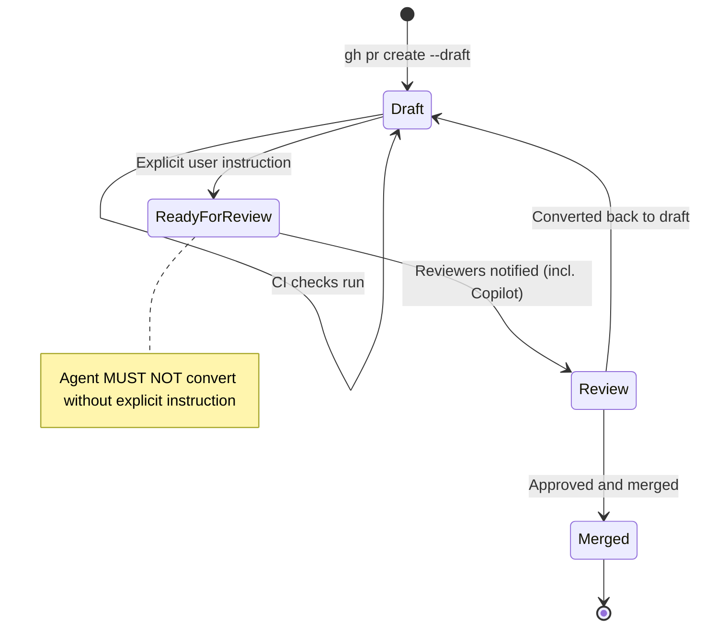
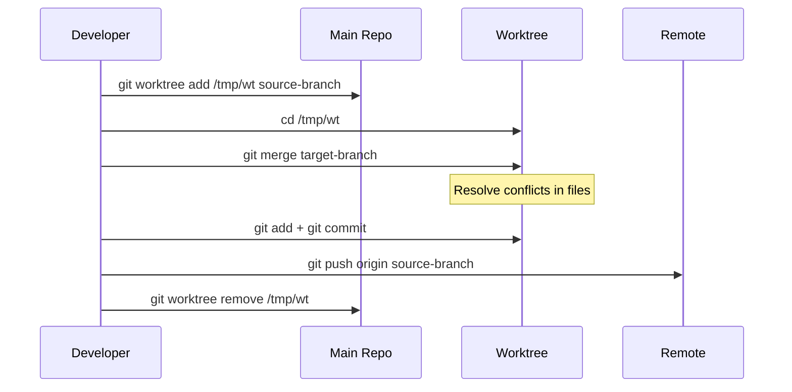

# Pull Request Guidelines

## Purpose

This file defines the pull request (PR) policy for the Reinhardt Cloud project. These rules ensure clear communication, proper review process, and consistent PR formatting across the development lifecycle.

---

## Language Requirements

### LR-1 (MUST): English-Only Policy

- **ALL** PR titles MUST be written in English
- **ALL** PR descriptions MUST be written in English
- **ALL** PR comments and discussions MUST be written in English
- This ensures accessibility for international contributors and maintainers

---

## PR Creation Policy

### PC-1 (MUST): Use GitHub CLI with Task Authorization

Use `gh` for PR operations. Creation and readiness changes require explicit task
authorization; local implementation or commit permission alone is insufficient.
Reuse authorization already supplied and preserve an explicit Draft/Ready choice.
Default new PRs to Draft unless a Ready PR was requested and PC-4a is satisfied.

Read [.github/PULL_REQUEST_TEMPLATE.md](../.github/PULL_REQUEST_TEMPLATE.md), write
the complete body to a temporary file, and pass it with `--body-file`. Inspect the
base, source branch, title, labels, and body before publishing. Remove the owned
temporary file once it is no longer needed.

```bash
# After PR creation is authorized and the complete template body is prepared:
gh pr create --draft --base <base> --head <source-branch> \
  --title 'feat(reconciler): add exponential backoff to error policy' \
  --body-file /tmp/reinhardt-cloud-pr-body.md
```

### PC-2 (MUST): Follow PR Template Structure

**PR Template Location:** `.github/PULL_REQUEST_TEMPLATE.md`

When creating PRs via `gh pr create`, the `--body-file` content MUST follow the PR template structure defined in `.github/PULL_REQUEST_TEMPLATE.md`.

**CLI Note:** GitHub CLI does not automatically apply the PR template like the Web UI. Read the template file and include its structure in the file passed to `--body-file`.

### PC-3 (MUST): Branch Naming

- Branch names SHOULD follow the pattern: `<type>/<scope>-<short-description>`
- Types: `feature`, `fix`, `refactor`, `docs`, `test`, `chore`, etc.
- Scope: Module or component name
- Short description: Kebab-case brief summary

**Examples:**
```
feature/crd-project-definition
fix/reconciler-nil-pointer-on-missing-deployment
refactor/operator-controller-structure
docs/api-crd-reference
test/operator-integration-tests
chore/ci-update-kubernetes-version
```

### PC-4 (SHOULD): Draft PRs for Work in Progress

- Use draft PRs for incomplete work
- **MUST NOT** convert to Ready for Review without explicit user instruction
- Draft PRs allow early feedback without formal review requests

**Example:**
```bash
gh pr create --draft --title "feat(crd): add Project CRD (WIP)"

# Convert to Ready only after explicit user instruction:
gh pr ready <number>
```

### PC-4a (MUST): Draft → Ready Conversion Requires Explicit Instruction

Converting a Draft PR to Ready for Review requires explicit user instruction. Implementation completion alone does not authorize conversion, because Ready-for-Review can trigger review workflows and privileged CI behavior.

**Rules:**
- The agent **MUST NOT** convert a Draft PR to Ready for Review without explicit user instruction
- The agent **MUST** convert when explicitly instructed only if the PC-4a readiness criteria are met, unless the user explicitly overrides the unmet criteria
- The agent **MUST NOT** convert when the requested action conflicts with protected-branch, release, or safety policies
- Use `gh pr ready <number>` for conversion and verify the resulting PR state

**Readiness Criteria (verify before recommending conversion):**
- [ ] Implementation is complete (no remaining `todo!()` or `// TODO:` introduced by this PR)
- [ ] PR description follows `.github/PULL_REQUEST_TEMPLATE.md`
- [ ] Relevant fmt/clippy/test checks have passed, or any limitations are documented
- [ ] Documentation is updated when required

**Example:**
```bash
# Convert only after explicit user instruction
gh pr ready 123

# Verify PR status after conversion
gh pr view 123 --json isDraft
```

**Authorization Comparison:**

| Action | Explicit Instruction | Plan Mode Approval | Implementation Complete |
|--------|---------------------|-------------------|--------------------------|
| Commit | ✅ Authorized | ✅ Authorized within the approved scope | Local exception only after relevant checks and diff review; see CE-1 |
| Push | ✅ Authorized | ❌ Not authorized | ❌ Not authorized |
| GitHub Comments | ✅ Authorized | ✅ Only when included in the approved scope | ❌ Not authorized |
| Draft PR → Ready | ✅ Authorized if PC-4a passes or the instruction explicitly overrides unmet criteria | ❌ Not authorized | ❌ Not authorized |

The following diagram illustrates the Draft PR lifecycle:


```mermaid
stateDiagram-v2
    [*] --> Draft: gh pr create --draft
    Draft --> Draft: Implementation continues
    Draft --> Draft: CI checks run
    Draft --> ReadyForReview: Explicit user instruction
    note right of ReadyForReview: Agent MUST NOT convert without explicit instruction
    ReadyForReview --> Review: Reviewers notified (incl. Copilot)
    Review --> Merged: Approved and merged
    Review --> Draft: Converted back to draft
    Merged --> [*]
```

### PC-5 (MUST): PR Labels

- **MUST** add appropriate labels to every PR
- Use `gh` to apply labels within the authorized PR operation

**Required Labels by PR Type:**

| PR Type | Required Label | Additional Labels |
|---------|---------------|-------------------|
| New feature | `enhancement` | Scope-specific labels |
| Bug fix | `bug` | Severity labels if available |
| Documentation | `documentation` | - |
| Dependency updates | `dependencies` | - |

**Label Application Examples:**

```bash
# Feature PR with label
gh pr create --title "feat(crd): add Project CRD" \
  --label enhancement

# Bug fix PR with label
gh pr create --title "fix(reconciler): resolve nil pointer on missing deployment" \
  --label bug

# Documentation PR with label
gh pr create --title "docs(crd): update CRD API reference" \
  --label documentation

# Dependency update PR with label
gh pr create --title "chore(deps): bump kube-rs from 0.88 to 0.89" \
  --label dependencies
```

**Adding Labels to Existing PR:**

```bash
# Add single label
gh pr edit <number> --add-label enhancement

# Add multiple labels
gh pr edit <number> --add-label bug,help wanted

# Remove label
gh pr edit <number> --remove-label invalid
```

---

## PR Title Format

### TF-1 (MUST): Follow Conventional Commits

PR titles MUST follow the same format as commit messages:

```
<type>[optional scope][optional !]: <description>

Examples:
feat(crd): add Project custom resource definition
fix(reconciler): resolve nil pointer dereference in status update
feat(operator)!: change CRD group from reinhardt-cloud.dev to paas.reinhardt-cloud.dev
```

**Requirements:**
- **Type**: One of the defined types (feat, fix, refactor, docs, etc.)
- **Scope**: Module or component name (OPTIONAL but RECOMMENDED)
- **Breaking Change Indicator**: Append `!` for breaking changes
- **Description**: Concise summary in English
  - **MUST** start with lowercase letter
  - **MUST** be specific and descriptive
  - **MUST NOT** end with a period
  - Keep under 72 characters for readability

**See**: @instructions/COMMIT_GUIDELINE.md for detailed commit type definitions

---

## PR Description Format

### DF-1 (MUST): Standard Structure

PR descriptions MUST follow the structure defined in `.github/PULL_REQUEST_TEMPLATE.md`.

**Required Sections:** Summary, Type of Change, Motivation and Context, How Was This Tested, Checklist, Labels to Apply

**Optional Sections:** Performance Impact, Breaking Changes, Screenshots, Related Issues, Additional Context

**Footer:** Attribute the actual authoring agent using [GITHUB_INTERACTION.md](GITHUB_INTERACTION.md#footer-format); replace a template's Claude Code footer with Codex attribution for Codex-authored PRs.

### DF-2 (MUST): Linking PRs to Issues

PRs should be linked to related issues using GitHub's supported keywords:
- `close`, `closes`, `closed`
- `fix`, `fixes`, `fixed`
- `resolve`, `resolves`, `resolved`

**Examples:**
```markdown
## Related Issues

Fixes #42
Closes #43, closes #44
Refs #50 (related but not closed)
```

**Important Notes:**
- Keywords only work when PR targets the **default branch** (main)
- Use `Refs #N` for related issues that should NOT be auto-closed

### DF-3 (SHOULD): Additional Context

Include additional sections when relevant:

- **Migration Guide**: For breaking changes with complex migration
- **Performance Impact**: For performance-related changes
- **Security Considerations**: For security-related changes
- **Kubernetes Compatibility**: Note minimum Kubernetes version if applicable

---

## PR Review Process

### RP-1 (MUST): Pre-Merge Checklist

Before **merging**, ensure the following. Draft → Ready conversion is governed separately by § PC-4a and requires explicit user instruction plus satisfied readiness criteria unless the user explicitly overrides them.

- [ ] All CI checks pass
- [ ] Relevant local checks pass; any limitations are explicitly reported
- [ ] Code follows project style guidelines
- [ ] Documentation is updated
- [ ] Commit history is clean and logical
- [ ] PR description is complete and accurate

Choose local commands using [AGENT_WORKFLOW.md](AGENT_WORKFLOW.md#verification).
Documentation-only instruction edits need structural checks rather than a full
Rust build. Broad code changes may require workspace check/build/test and all
relevant format/lint tasks. This does not waive required remote CI or authorize a
merge; MP-1 applies separately.

### RP-2 (SHOULD): Self-Review

- Review your own PR before requesting review from others
- Check for:
  - Unnecessary debug code or comments
  - Proper error handling (no panics in reconcilers)
  - Test coverage
  - Documentation completeness
  - Code clarity and readability

### RP-3 (MUST): Address Review Comments

Evaluate all in-scope feedback against the current code. Complete authorized local
fixes even when posting is outside scope, then prepare replies and report pending
external actions. Reply and resolve only when authorized by
[GITHUB_INTERACTION.md](GITHUB_INTERACTION.md#posting-policy). PR creation alone
does not authorize review replies or resolution.

### RP-6 (MUST): Copilot Review Workflow

Use the complete inventory and delivery order in
[GITHUB_INTERACTION.md](GITHUB_INTERACTION.md#copilot-review-handling): fetch every
page, evaluate findings, fix and verify, publish when authorized, reply with
evidence, resolve, then re-audit the current head. Each thread needs a reply before
resolution. Do not mark a code finding fixed while the repair exists only locally.

Report an absent review once. Continue other work without waiting for an unrequested
future review. Scheduled monitoring requires an explicitly requested monitor.
Distinguish actionable findings from false positives with code-specific evidence.

### RP-4 (SHOULD): Keep PRs Small

- Aim for PRs under 400 lines of changes
- Split large features into multiple PRs
- Each PR should have a single, clear purpose
- Smaller PRs are easier to review and less risky to merge

### RP-5 (MUST): Use Three-Dot Diff for PR Verification

- **MUST** use three-dot diff (`...`) to verify PR changes from the merge base
- Three-dot diff excludes merge history noise and shows only changes introduced by the PR

**Commands:**
```bash
# Three-dot diff: shows changes from merge base (CORRECT)
git diff main...feature-branch

# GitHub CLI (uses three-dot diff by default)
gh pr diff <number>
```

---

## PR Conflict Resolution

### CR-1 (MUST): Worktree-Based Merge Strategy

PR conflicts MUST be resolved using a worktree-based merge strategy. Rebase and force-push are NOT allowed for conflict resolution.

**Procedure:**

1. Reuse the authoritative source-branch worktree, or create one if absent after checking branch/worktree state:
   ```bash
   git worktree add /tmp/<worktree-name> <source-branch>
   ```
2. In the worktree, merge the target branch:
   ```bash
   cd /tmp/<worktree-name>
   git merge <target-branch>
   ```
3. Resolve conflicts and commit:
   ```bash
   # Resolve conflicts in files
   git add <resolved-files>
   git commit
   ```
4. Push only when authorized. Remove only a task-created worktree whose owned changes are delivered or otherwise durably preserved; keep existing worktrees and uncommitted work:
   ```bash
   git push origin <source-branch>
   cd -
   git worktree remove /tmp/<worktree-name>
   ```

The following sequence diagram shows the worktree-based conflict resolution workflow:


```mermaid
sequenceDiagram
    participant D as Developer
    participant M as Main Repo
    participant W as Worktree
    participant R as Remote

    D->>M: git worktree add /tmp/wt source-branch
    D->>W: cd /tmp/wt
    D->>W: git merge target-branch
    Note over W: Resolve conflicts in files
    D->>W: git add + git commit
    D->>R: git push origin source-branch
    D->>M: git worktree remove /tmp/wt
```

### CR-2 (NEVER): Prohibited Approaches

- **NEVER** use `git rebase` to resolve PR conflicts
- **NEVER** use `git push --force` or `git push --force-with-lease` for conflict resolution
- **NEVER** use `git reset --hard` as part of conflict resolution workflow

---

## PR Merge Policy

### MP-1 (MUST): Merge Requirements

A PR can only be merged with explicit merge authorization and when:

- All CI checks pass
- All conversations are resolved
- At least one approval from a maintainer (if required by repo settings)
- No merge conflicts with base branch
- All commits follow commit guidelines (@instructions/COMMIT_GUIDELINE.md)

### MP-2 (MUST): Merge Strategy

**Squash and Merge** (Default):
- Combine all PR commits into a single commit
- Use PR title as commit message
- Use for feature branches with multiple interim commits

**Rebase and Merge**:
- Preserve individual commits
- Prefer for PRs with clean, logical commit history

**Merge Commit** (Avoid for features):
- Only use for merging long-lived branches

### MP-3 (SHOULD): Delete Branch After Merge

- Delete feature branches after successful merge only when cleanup is authorized and the branch has no undelivered work
- Keeps repository clean

---

## Special Cases

### Documentation-Only PRs

For documentation changes, use the prose/example checks in [AGENT_WORKFLOW.md](AGENT_WORKFLOW.md#verification).

**Title Format:**
```
docs(<scope>): <description>

Example:
docs(crd): add Project API reference
docs(operator): update deployment guide for Kubernetes 1.29
```

---

## Quick Reference

### ✅ MUST DO
- Write all PR content in English
- Use `gh pr create` for authorized PR creation
- Follow PR template structure from `.github/PULL_REQUEST_TEMPLATE.md`
- Follow Conventional Commits format for titles
- Include Summary, Type of Change, Motivation and Context, How Was This Tested, Checklist sections
- Include Labels to Apply section with appropriate type and scope labels
- Complete required remote checks and relevant local validation before **merging**; verify PC-4a before recommending Draft → Ready conversion
- Address all review comments
- Handle Copilot review comments according to RP-6 when authorized
- Resolve all Copilot review conversations before considering PR complete
- Ensure all CI checks pass before merge
- Use three-dot diff (`main...branch`) for PR verification to exclude merge history noise
- **MUST NOT** convert Draft PRs to Ready for Review without explicit user instruction (see § PC-4a)

### ❌ NEVER DO
- Write PR titles or descriptions in non-English languages
- Create PRs without following PR template structure
- Create PRs without proper description
- Skip required sections (Summary, Type of Change, Motivation and Context, How Was This Tested, Checklist)
- Skip Labels to Apply section
- Merge with failing CI checks
- Leave unresolved review comments (including Copilot review)
- Force push after review has started (unless explicitly requested)
- Use rebase or force-push to resolve PR conflicts (use worktree merge instead)
- Use two-dot diff (`main..branch`) for PR verification (includes merge history noise)
- Convert Draft PRs to Ready for Review without explicit user instruction
- Recommend converting a PR to Ready for Review while the implementation is incomplete (`todo!()` or `// TODO:` introduced by the PR still present), without explicit user override

---

## Related Documentation

- **Main Quick Reference**: [AGENTS.md](../AGENTS.md#quick-reference) / [CLAUDE.md](../CLAUDE.md#quick-reference)
- **Issue Handling Principles**: [ISSUE_HANDLING.md](ISSUE_HANDLING.md)
- **Commit Guidelines**: [COMMIT_GUIDELINE.md](COMMIT_GUIDELINE.md)
- **GitHub Interaction**: [GITHUB_INTERACTION.md](GITHUB_INTERACTION.md)
