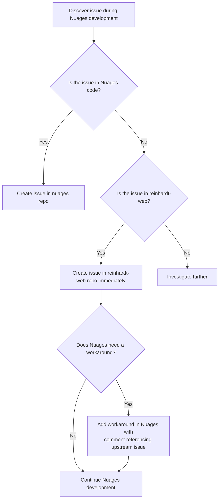

# Upstream Issue Reporting

## Purpose

This file defines the policy for reporting issues discovered in upstream dependencies during Nuages development. Nuages is a PaaS built on top of [reinhardt-web](https://github.com/kent8192/reinhardt-web), and issues found in reinhardt-web during Nuages work MUST be reported immediately to the upstream repository.

---

## Scope

### US-1 (MUST): Target Repositories

This policy applies to the following upstream repositories:

| Repository | URL | Relationship |
|------------|-----|-------------|
| reinhardt-web | `https://github.com/kent8192/reinhardt-web` | Core web framework that Nuages deploys |

**Future upstream dependencies** should be added to this table as the project grows.

---

## Reporting Policy

### UR-1 (MUST): Immediate Reporting

When a bug, missing feature, documentation gap, or unexpected behavior in reinhardt-web is discovered during Nuages development, an issue MUST be created in the reinhardt-web repository **immediately** upon discovery.

**Rationale:** Delaying upstream issue reporting increases the risk of:
- Forgetting the issue details
- Building workarounds that mask the root cause
- Other contributors hitting the same problem without context

The following diagram summarizes the upstream issue reporting flow:



### UR-2 (MUST): Use GitHub CLI with Repository Flag

Issues in upstream repositories MUST be created using `gh issue create` with the `-R` flag:

```bash
# Create issue in reinhardt-web
gh issue create -R kent8192/reinhardt-web \
  --title "Bug: description of the issue" \
  --body "$(cat <<'EOF'
## Description

[Clear description of the issue]

## Reproduction Steps

1. [Step 1]
2. [Step 2]

## Expected Behavior

[What should happen]

## Actual Behavior

[What actually happens]

## Context

Discovered during Nuages development while [brief context].

See also: https://github.com/kent8192/nuages/issues/N (if related Nuages issue exists)

🤖 Generated with [Claude Code](https://claude.com/claude-code)
EOF
)"
```

### UR-3 (MUST): Issue Content Requirements

Upstream issues MUST:
- Be written in **English**
- Follow the upstream repository's issue templates if available
- Include clear reproduction steps
- Include the discovery context (e.g., "discovered during Nuages operator reconciler implementation")
- Reference related Nuages issues or PRs if applicable
- Include Claude Code attribution footer
- **NOT** include absolute local paths or user-specific information

### UR-4 (MUST): Cross-Referencing

When an upstream issue is created:

1. **In the upstream issue**: Reference the Nuages issue/PR where the problem was discovered (if applicable)
2. **In the Nuages codebase**: Add a comment referencing the upstream issue where a workaround is applied

**Workaround comment format:**
```rust
// Workaround for kent8192/reinhardt-web#42
// Remove this workaround when the upstream issue is resolved.
```

### UR-5 (SHOULD): Label Application

Apply appropriate labels to upstream issues based on the issue type:

| Issue Type | Labels |
|------------|--------|
| Bug | `bug` |
| Missing feature | `enhancement` |
| Documentation gap | `documentation` |
| Performance issue | `performance` |

**Note:** Available labels depend on the upstream repository's configuration. Check available labels before applying.

---

## Issue Categories

### IC-1: What Qualifies as an Upstream Issue

Report to the upstream repository when:

- A reinhardt-web API behaves unexpectedly or inconsistently
- A reinhardt-web feature is missing that Nuages requires
- reinhardt-web documentation is incorrect, incomplete, or misleading
- A reinhardt-web dependency causes a conflict or vulnerability
- reinhardt-web build or test infrastructure has issues that affect downstream consumers
- reinhardt-web type signatures or trait implementations are incorrect

### IC-2: What Does NOT Qualify

Do **NOT** report to the upstream repository when:

- The issue is in Nuages-specific code (report in Nuages repo)
- The issue is a Nuages design decision that differs from reinhardt-web conventions
- The issue is a feature request specific to Nuages's PaaS use case with no general applicability
- The issue is a misunderstanding of reinhardt-web's intended behavior (use Discussions instead)

---

## Workaround Policy

### WP-1 (SHOULD): Temporary Workarounds

When an upstream issue blocks Nuages development:

1. Create the upstream issue first (UR-1)
2. Implement a minimal workaround in Nuages
3. Mark the workaround with a comment referencing the upstream issue (UR-4)
4. Track the upstream issue for resolution

**Workaround rules:**
- Keep workarounds minimal and isolated
- Document the workaround clearly
- Remove the workaround when the upstream issue is resolved

### WP-2 (MUST): No Silent Workarounds

**NEVER** implement workarounds for upstream issues without:
1. Creating an upstream issue first
2. Adding a reference comment in the workaround code

---

## Quick Reference

### ✅ MUST DO
- Create issues in reinhardt-web immediately upon discovering upstream bugs (UR-1)
- Use `gh issue create -R kent8192/reinhardt-web` for upstream issue creation (UR-2)
- Write all upstream issues in English (UR-3)
- Follow upstream repository's issue templates when available (UR-3)
- Cross-reference between Nuages and upstream issues (UR-4)
- Add workaround comments referencing upstream issues (UR-4)
- Create upstream issue before implementing any workaround (WP-2)

### ❌ NEVER DO
- Delay reporting upstream issues discovered during Nuages development
- Implement workarounds without creating upstream issues first (WP-2)
- Include absolute local paths in upstream issues (UR-3)
- Report Nuages-specific issues to the reinhardt-web repository (IC-2)
- Forget to cross-reference between Nuages and upstream issues (UR-4)

---

## Related Documentation

- **Issue Guidelines**: instructions/ISSUE_GUIDELINES.md
- **Issue Handling**: instructions/ISSUE_HANDLING.md
- **GitHub Interaction**: instructions/GITHUB_INTERACTION.md
- **Main Quick Reference**: CLAUDE.md (see Quick Reference section)
- **reinhardt-web Repository**: <https://github.com/kent8192/reinhardt-web>

---

**Note**: This document focuses on reporting issues to upstream dependencies. For Nuages-specific issue management, see instructions/ISSUE_GUIDELINES.md. For batch issue handling strategy, see instructions/ISSUE_HANDLING.md.
